# GPT-2 Layer Value Distribution Report

A simple first-pass report showing the raw value distribution of each stored GPT-2 tensor.

- Model: `openai-community/gpt2`
- Tensors included: `160`
- Images directory: `layer_value_distribution_images`

## Layers

### `h.0.attn.bias`

- Shape: `(1, 1, 1024, 1024)`
- Dtype: `torch.float32`
- Numel: `1048576`
- Min: `0.000000`
- Max: `1.000000`
- Mean: `0.500488`
- Std: `0.500000`

### `h.0.attn.c_attn.bias`

- Shape: `(2304,)`
- Dtype: `torch.float32`
- Numel: `2304`
- Min: `-1.337075`
- Max: `1.174925`
- Mean: `-0.000707`
- Std: `0.225921`

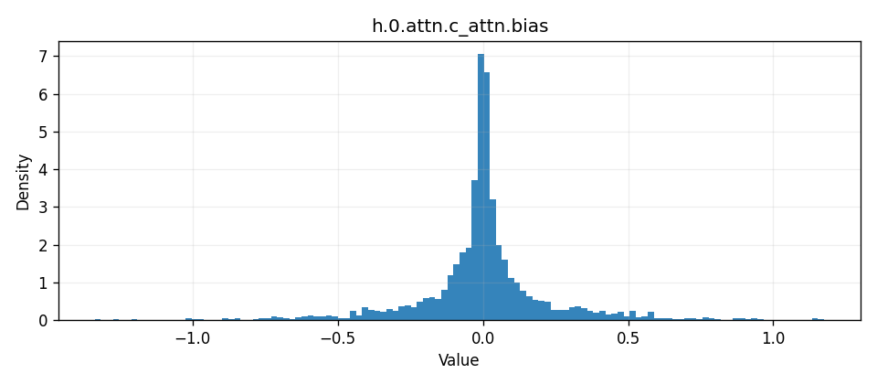

### `h.0.attn.c_attn.weight`

- Shape: `(768, 2304)`
- Dtype: `torch.float32`
- Numel: `1769472`
- Min: `-2.843634`
- Max: `2.795630`
- Mean: `0.000053`
- Std: `0.199620`

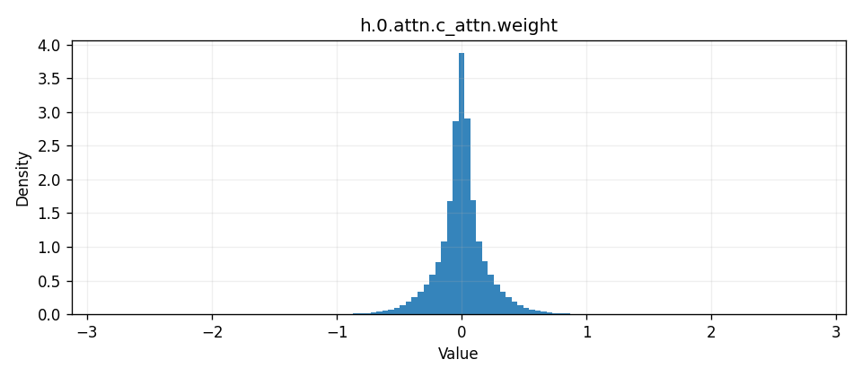

### `h.0.attn.c_proj.bias`

- Shape: `(768,)`
- Dtype: `torch.float32`
- Numel: `768`
- Min: `-2.684416`
- Max: `2.030316`
- Mean: `-0.006910`
- Std: `0.258798`

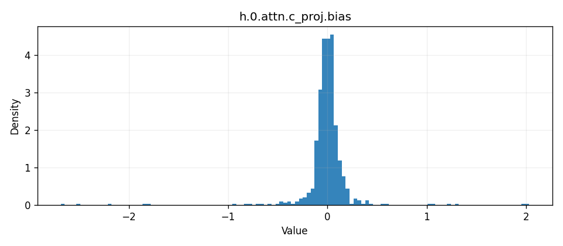

### `h.0.attn.c_proj.weight`

- Shape: `(768, 768)`
- Dtype: `torch.float32`
- Numel: `589824`
- Min: `-3.317139`
- Max: `3.060772`
- Mean: `-0.000161`
- Std: `0.147461`

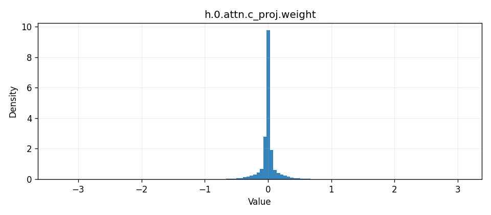

### `h.0.ln_1.bias`

- Shape: `(768,)`
- Dtype: `torch.float32`
- Numel: `768`
- Min: `-0.258883`
- Max: `0.201929`
- Mean: `-0.006593`
- Std: `0.035778`

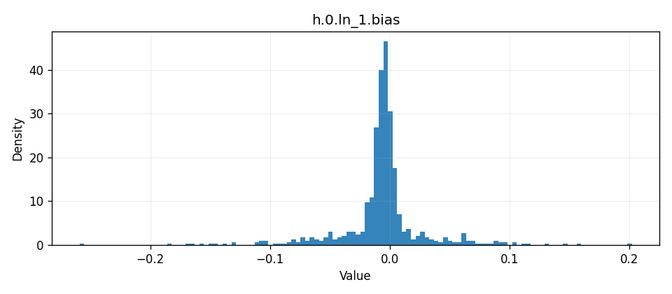

### `h.0.ln_1.weight`

- Shape: `(768,)`
- Dtype: `torch.float32`
- Numel: `768`
- Min: `0.041861`
- Max: `0.252667`
- Mean: `0.180359`
- Std: `0.041288`

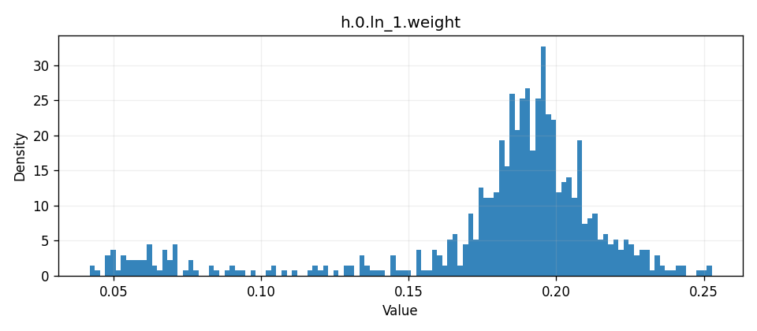

### `h.0.ln_2.bias`

- Shape: `(768,)`
- Dtype: `torch.float32`
- Numel: `768`
- Min: `-0.664760`
- Max: `0.739382`
- Mean: `0.009204`
- Std: `0.070051`

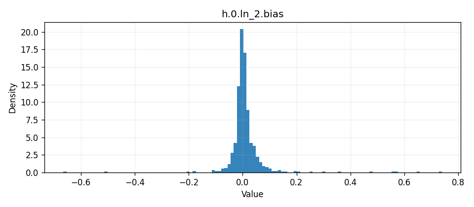

### `h.0.ln_2.weight`

- Shape: `(768,)`
- Dtype: `torch.float32`
- Numel: `768`
- Min: `0.045286`
- Max: `1.511035`
- Mean: `0.867830`
- Std: `0.484632`

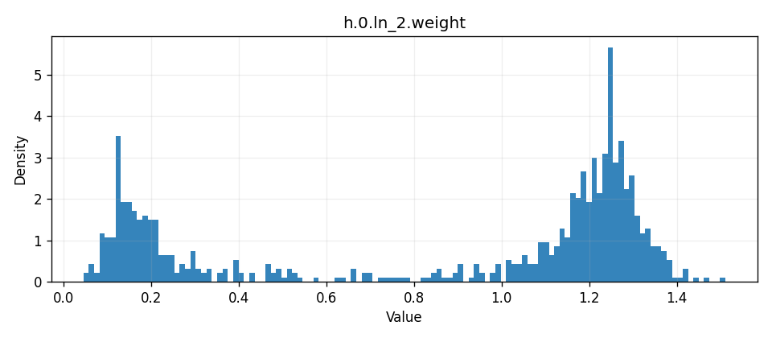

### `h.0.mlp.c_fc.bias`

- Shape: `(3072,)`
- Dtype: `torch.float32`
- Numel: `3072`
- Min: `-0.746166`
- Max: `0.332310`
- Mean: `-0.093162`
- Std: `0.132336`

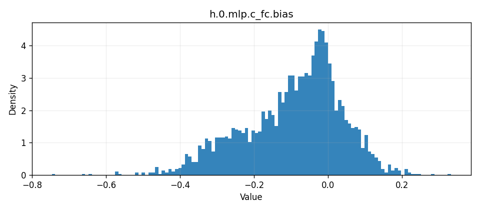

### `h.0.mlp.c_fc.weight`

- Shape: `(768, 3072)`
- Dtype: `torch.float32`
- Numel: `2359296`
- Min: `-2.313081`
- Max: `4.587719`
- Mean: `-0.000749`
- Std: `0.141169`

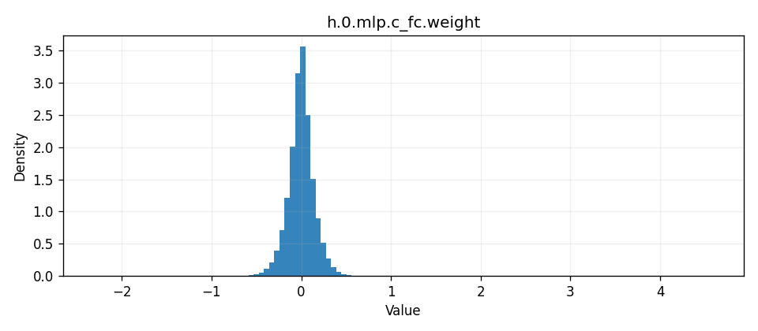

### `h.0.mlp.c_proj.bias`

- Shape: `(768,)`
- Dtype: `torch.float32`
- Numel: `768`
- Min: `-1.028801`
- Max: `1.479362`
- Mean: `-0.000423`
- Std: `0.101634`

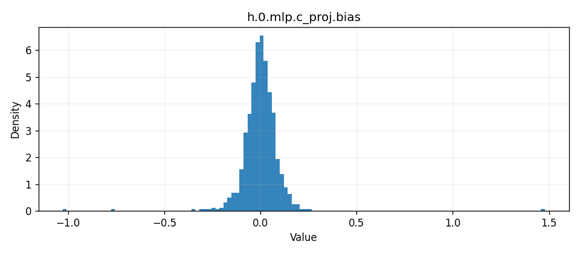

### `h.0.mlp.c_proj.weight`

- Shape: `(3072, 768)`
- Dtype: `torch.float32`
- Numel: `2359296`
- Min: `-6.143252`
- Max: `6.064670`
- Mean: `0.000008`
- Std: `0.087965`

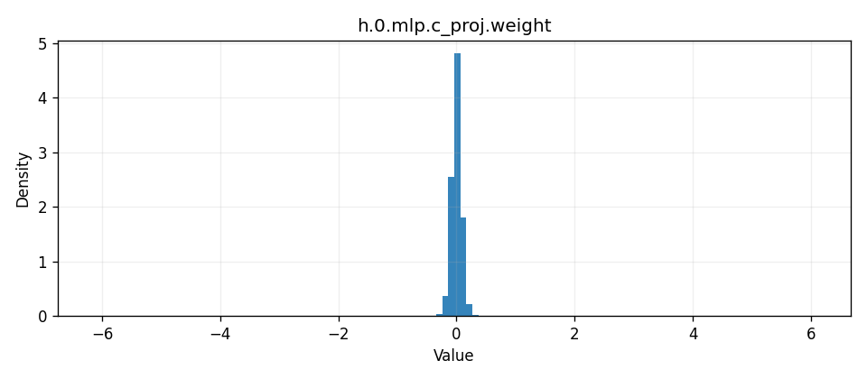

### `h.1.attn.bias`

- Shape: `(1, 1, 1024, 1024)`
- Dtype: `torch.float32`
- Numel: `1048576`
- Min: `0.000000`
- Max: `1.000000`
- Mean: `0.500488`
- Std: `0.500000`

### `h.1.attn.c_attn.bias`

- Shape: `(2304,)`
- Dtype: `torch.float32`
- Numel: `2304`
- Min: `-1.815081`
- Max: `1.939461`
- Mean: `0.000800`
- Std: `0.211011`

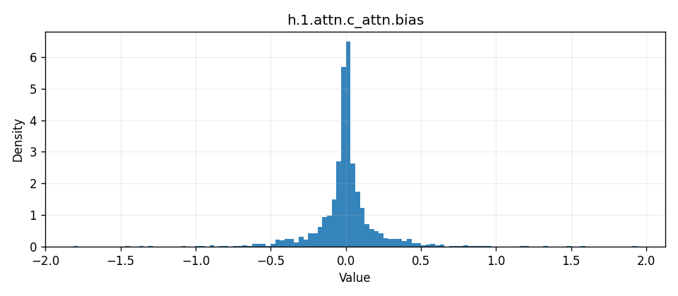

### `h.1.attn.c_attn.weight`

- Shape: `(768, 2304)`
- Dtype: `torch.float32`
- Numel: `1769472`
- Min: `-1.077073`
- Max: `1.238285`
- Mean: `0.000028`
- Std: `0.140058`

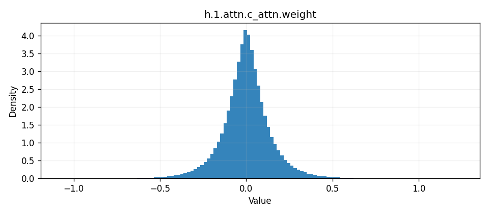

### `h.1.attn.c_proj.bias`

- Shape: `(768,)`
- Dtype: `torch.float32`
- Numel: `768`
- Min: `-0.534646`
- Max: `1.250699`
- Mean: `-0.001073`
- Std: `0.104740`

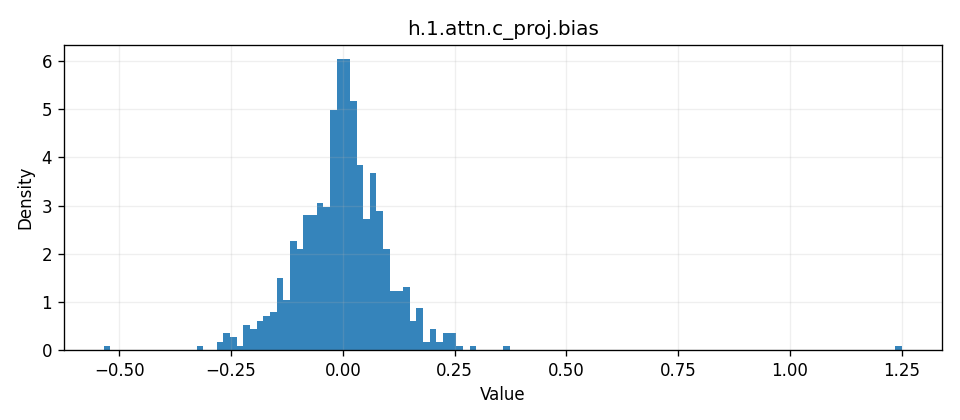

### `h.1.attn.c_proj.weight`

- Shape: `(768, 768)`
- Dtype: `torch.float32`
- Numel: `589824`
- Min: `-4.726238`
- Max: `3.985948`
- Mean: `-0.000083`
- Std: `0.101918`

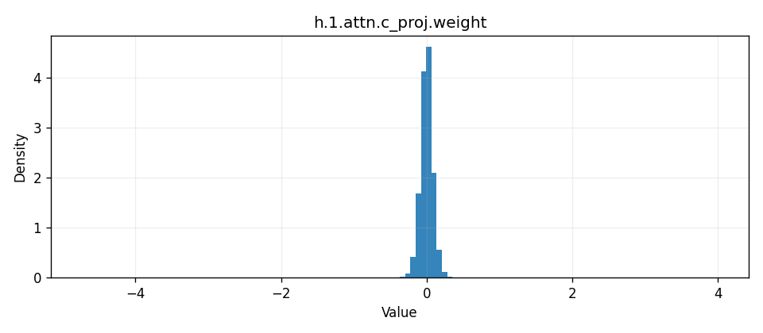

### `h.1.ln_1.bias`

- Shape: `(768,)`
- Dtype: `torch.float32`
- Numel: `768`
- Min: `-0.664517`
- Max: `0.533174`
- Mean: `-0.005023`
- Std: `0.052402`

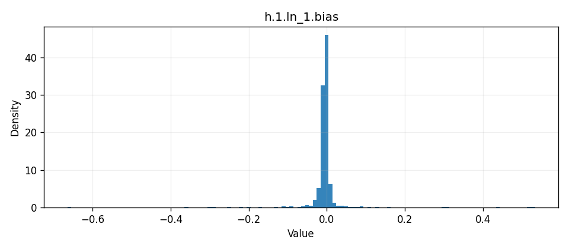

### `h.1.ln_1.weight`

- Shape: `(768,)`
- Dtype: `torch.float32`
- Numel: `768`
- Min: `0.072509`
- Max: `0.655334`
- Mean: `0.222841`
- Std: `0.051274`

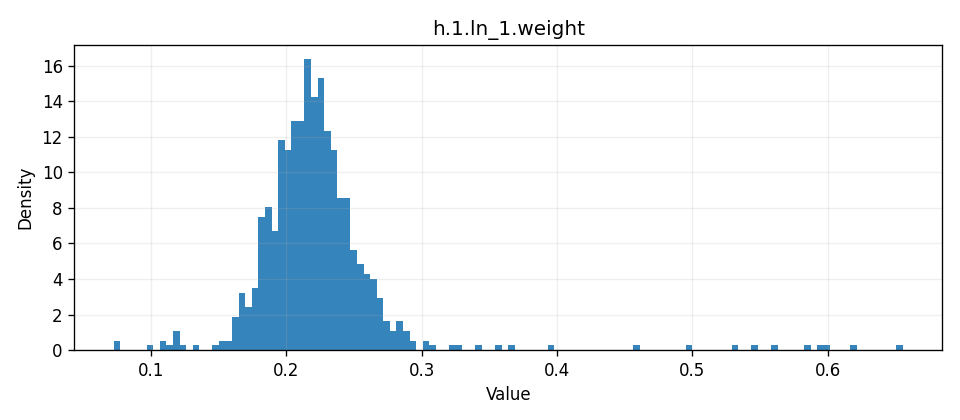

### `h.1.ln_2.bias`

- Shape: `(768,)`
- Dtype: `torch.float32`
- Numel: `768`
- Min: `-0.586610`
- Max: `0.456503`
- Mean: `-0.004074`
- Std: `0.039170`

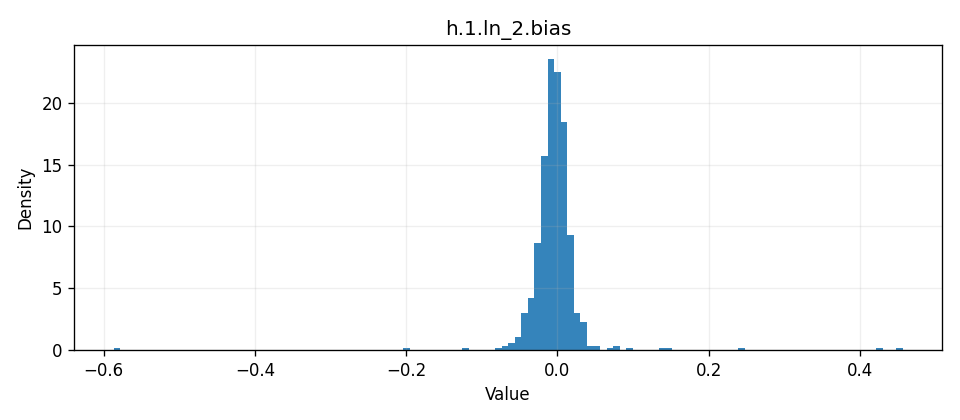

### `h.1.ln_2.weight`

- Shape: `(768,)`
- Dtype: `torch.float32`
- Numel: `768`
- Min: `0.056036`
- Max: `0.452295`
- Mean: `0.242694`
- Std: `0.031625`

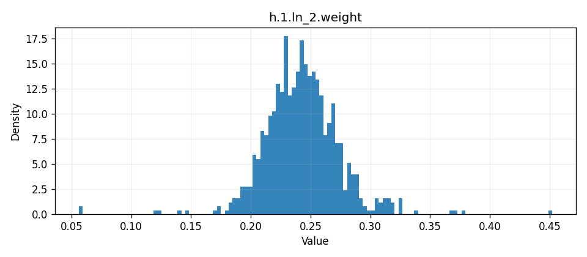

### `h.1.mlp.c_fc.bias`

- Shape: `(3072,)`
- Dtype: `torch.float32`
- Numel: `3072`
- Min: `-0.656283`
- Max: `0.265056`
- Mean: `-0.072198`
- Std: `0.094896`

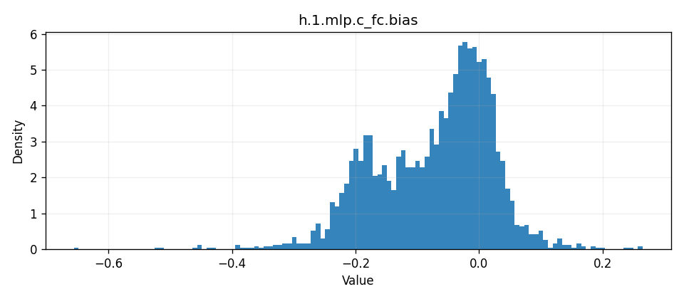

### `h.1.mlp.c_fc.weight`

- Shape: `(768, 3072)`
- Dtype: `torch.float32`
- Numel: `2359296`
- Min: `-1.872847`
- Max: `2.289217`
- Mean: `0.000642`
- Std: `0.130721`

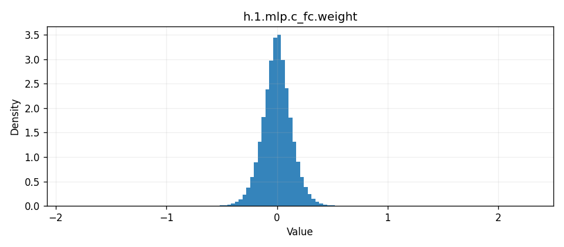

### `h.1.mlp.c_proj.bias`

- Shape: `(768,)`
- Dtype: `torch.float32`
- Numel: `768`
- Min: `-0.699094`
- Max: `1.594377`
- Mean: `0.000251`
- Std: `0.100364`

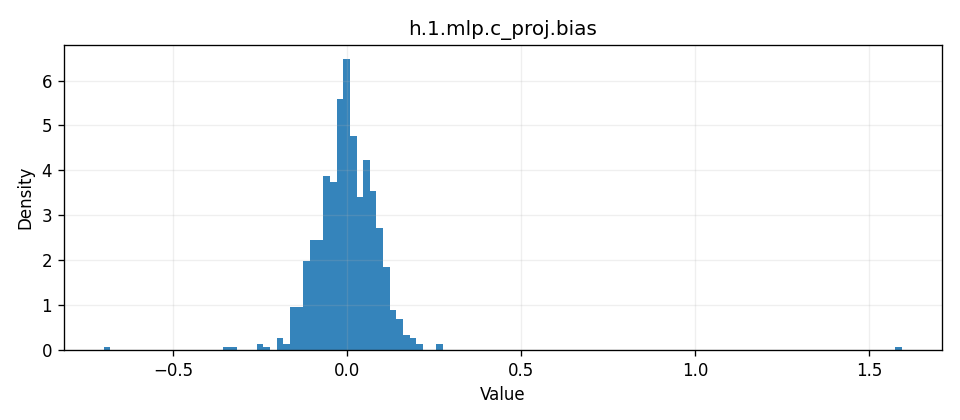

### `h.1.mlp.c_proj.weight`

- Shape: `(3072, 768)`
- Dtype: `torch.float32`
- Numel: `2359296`
- Min: `-4.930515`
- Max: `13.736218`
- Mean: `0.000098`
- Std: `0.087191`

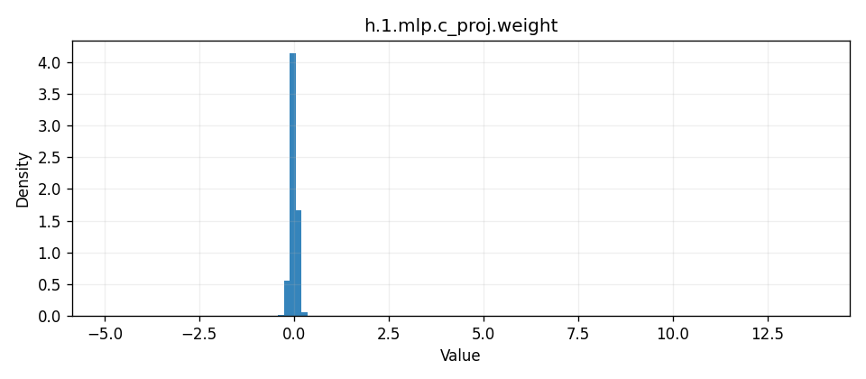

### `h.10.attn.bias`

- Shape: `(1, 1, 1024, 1024)`
- Dtype: `torch.float32`
- Numel: `1048576`
- Min: `0.000000`
- Max: `1.000000`
- Mean: `0.500488`
- Std: `0.500000`

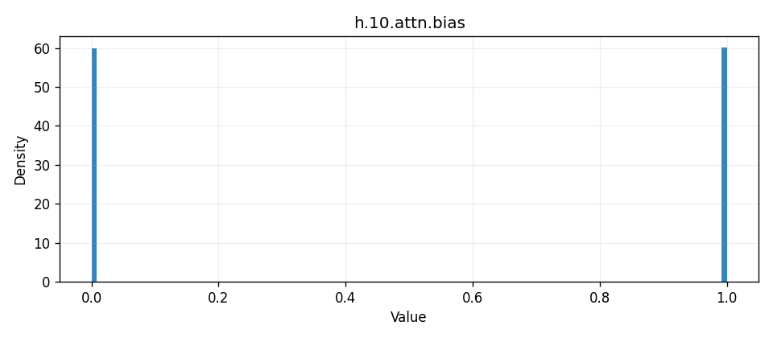

### `h.10.attn.c_attn.bias`

- Shape: `(2304,)`
- Dtype: `torch.float32`
- Numel: `2304`
- Min: `-0.916228`
- Max: `0.771001`
- Mean: `0.001611`
- Std: `0.145229`

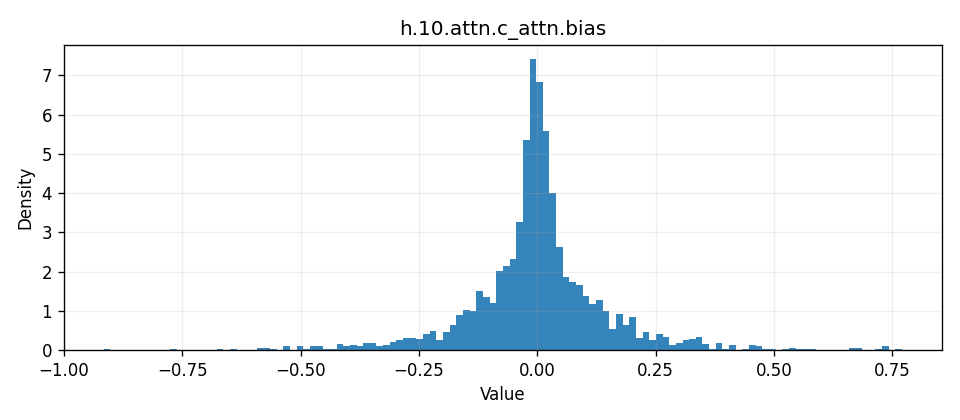

### `h.10.attn.c_attn.weight`

- Shape: `(768, 2304)`
- Dtype: `torch.float32`
- Numel: `1769472`
- Min: `-1.893795`
- Max: `1.795872`
- Mean: `0.000093`
- Std: `0.126674`

### `h.10.attn.c_proj.bias`

- Shape: `(768,)`
- Dtype: `torch.float32`
- Numel: `768`
- Min: `-2.987883`
- Max: `3.849068`
- Mean: `0.002024`
- Std: `0.232058`

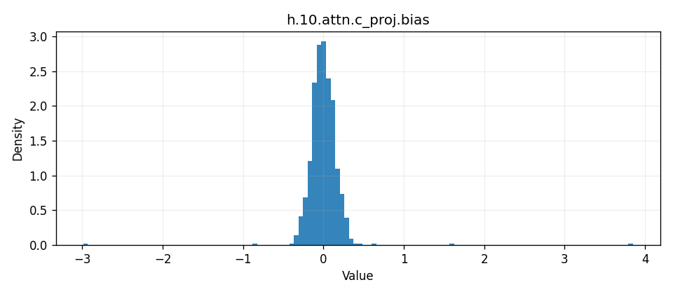

### `h.10.attn.c_proj.weight`

- Shape: `(768, 768)`
- Dtype: `torch.float32`
- Numel: `589824`
- Min: `-4.075379`
- Max: `4.212167`
- Mean: `-0.000001`
- Std: `0.146627`

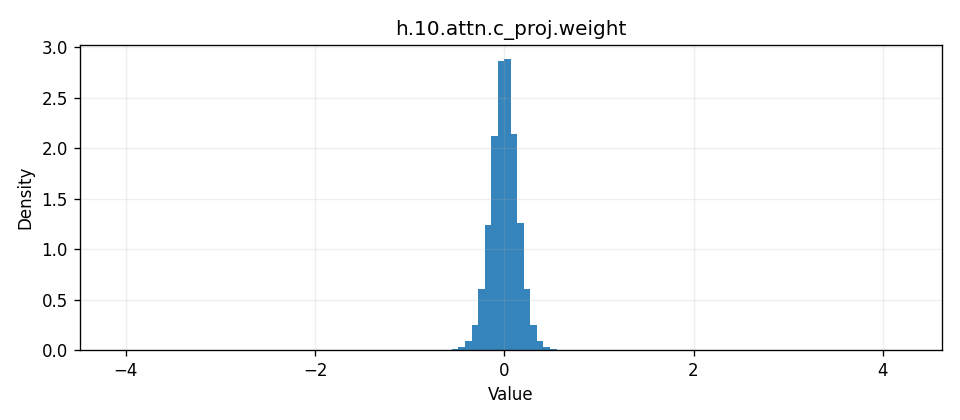

### `h.10.ln_1.bias`

- Shape: `(768,)`
- Dtype: `torch.float32`
- Numel: `768`
- Min: `-0.652762`
- Max: `1.089505`
- Mean: `0.018613`
- Std: `0.055025`

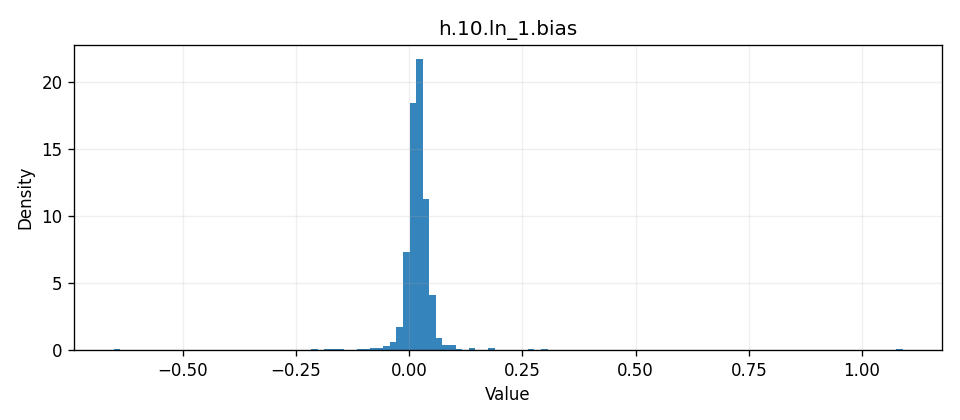

### `h.10.ln_1.weight`

- Shape: `(768,)`
- Dtype: `torch.float32`
- Numel: `768`
- Min: `0.075063`
- Max: `0.921372`
- Mean: `0.378208`
- Std: `0.055663`

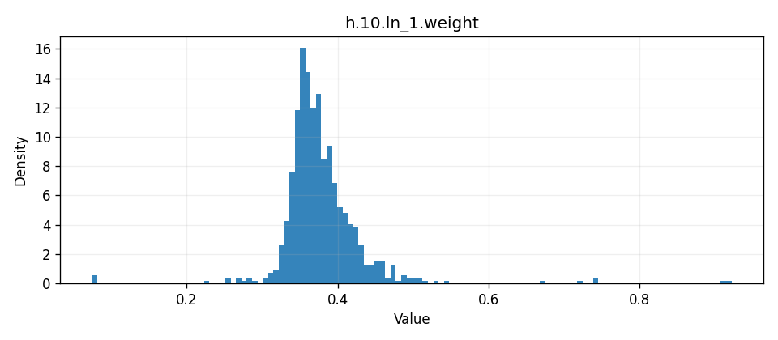

### `h.10.ln_2.bias`

- Shape: `(768,)`
- Dtype: `torch.float32`
- Numel: `768`
- Min: `-0.600510`
- Max: `0.691362`
- Mean: `0.021159`
- Std: `0.044845`

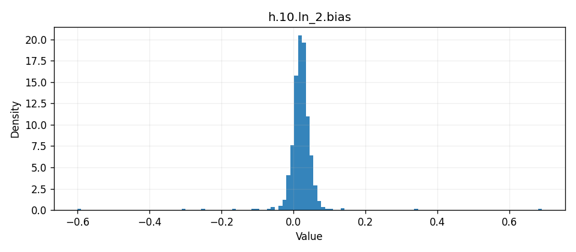

### `h.10.ln_2.weight`

- Shape: `(768,)`
- Dtype: `torch.float32`
- Numel: `768`
- Min: `0.020090`
- Max: `1.095057`
- Mean: `0.289694`
- Std: `0.051144`

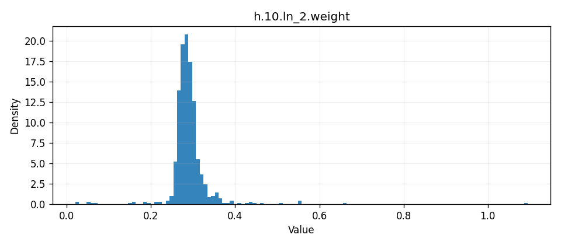

### `h.10.mlp.c_fc.bias`

- Shape: `(3072,)`
- Dtype: `torch.float32`
- Numel: `3072`
- Min: `-1.072833`
- Max: `0.724733`
- Mean: `-0.076525`
- Std: `0.091214`

### `h.10.mlp.c_fc.weight`

- Shape: `(768, 3072)`
- Dtype: `torch.float32`
- Numel: `2359296`
- Min: `-2.553544`
- Max: `2.132820`
- Mean: `-0.003208`
- Std: `0.127648`

### `h.10.mlp.c_proj.bias`

- Shape: `(768,)`
- Dtype: `torch.float32`
- Numel: `768`
- Min: `-1.076765`
- Max: `1.340406`
- Mean: `0.001659`
- Std: `0.193914`

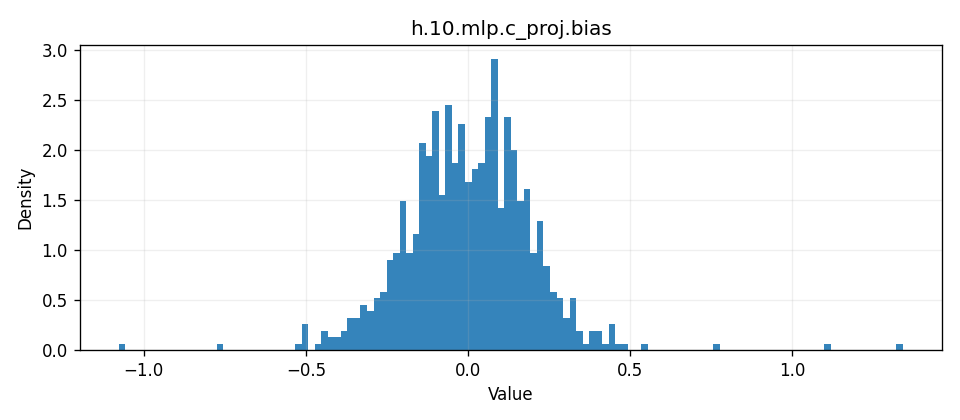

### `h.10.mlp.c_proj.weight`

- Shape: `(3072, 768)`
- Dtype: `torch.float32`
- Numel: `2359296`
- Min: `-11.050447`
- Max: `9.301322`
- Mean: `0.000006`
- Std: `0.178145`

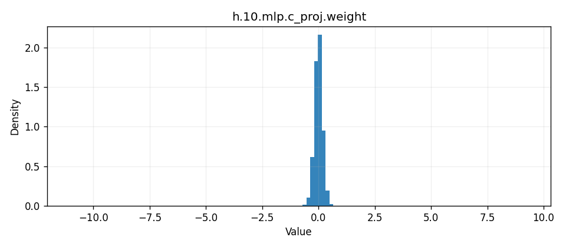

### `h.11.attn.bias`

- Shape: `(1, 1, 1024, 1024)`
- Dtype: `torch.float32`
- Numel: `1048576`
- Min: `0.000000`
- Max: `1.000000`
- Mean: `0.500488`
- Std: `0.500000`

### `h.11.attn.c_attn.bias`

- Shape: `(2304,)`
- Dtype: `torch.float32`
- Numel: `2304`
- Min: `-0.804596`
- Max: `0.599210`
- Mean: `0.000732`
- Std: `0.121013`

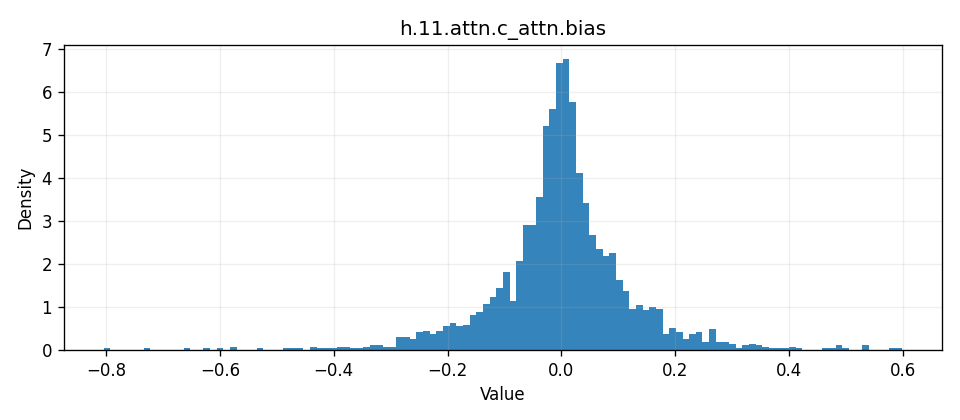

### `h.11.attn.c_attn.weight`

- Shape: `(768, 2304)`
- Dtype: `torch.float32`
- Numel: `1769472`
- Min: `-2.263774`
- Max: `2.307142`
- Mean: `0.000054`
- Std: `0.128475`

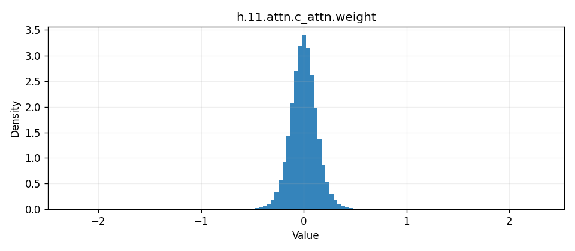

### `h.11.attn.c_proj.bias`

- Shape: `(768,)`
- Dtype: `torch.float32`
- Numel: `768`
- Min: `-5.372884`
- Max: `3.635926`
- Mean: `-0.021505`
- Std: `0.468642`

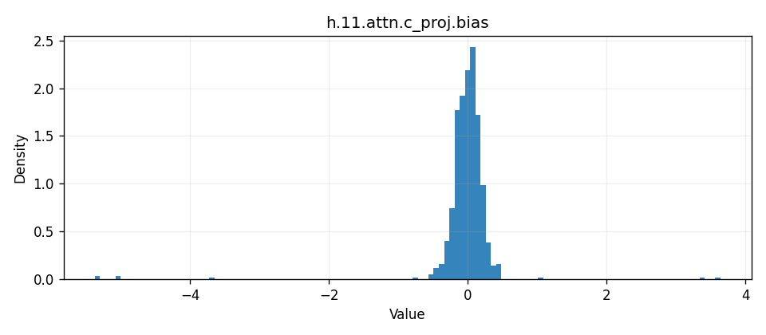

### `h.11.attn.c_proj.weight`

- Shape: `(768, 768)`
- Dtype: `torch.float32`
- Numel: `589824`
- Min: `-8.881818`
- Max: `8.703431`
- Mean: `-0.000054`
- Std: `0.181927`

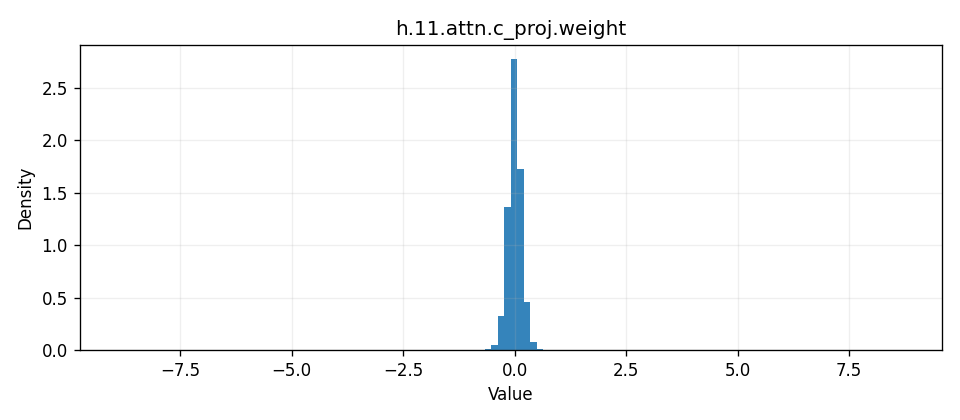

### `h.11.ln_1.bias`

- Shape: `(768,)`
- Dtype: `torch.float32`
- Numel: `768`
- Min: `-0.330357`
- Max: `1.003907`
- Mean: `0.023284`
- Std: `0.056705`

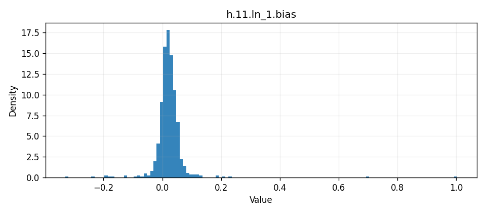

### `h.11.ln_1.weight`

- Shape: `(768,)`
- Dtype: `torch.float32`
- Numel: `768`
- Min: `0.106145`
- Max: `0.957660`
- Mean: `0.478693`
- Std: `0.065124`

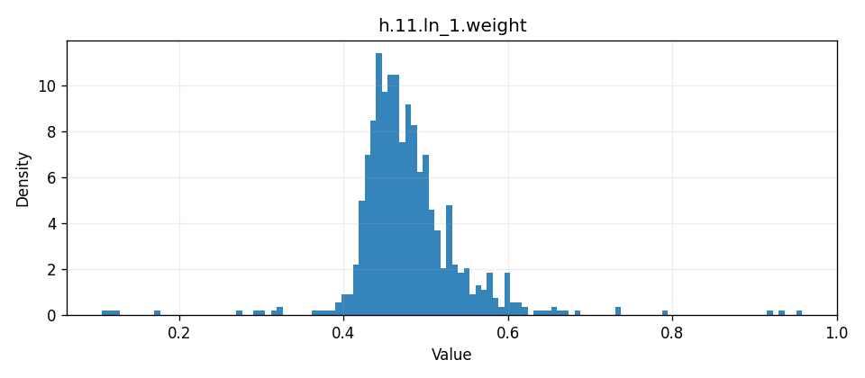

### `h.11.ln_2.bias`

- Shape: `(768,)`
- Dtype: `torch.float32`
- Numel: `768`
- Min: `-0.209325`
- Max: `0.424659`
- Mean: `0.009193`
- Std: `0.039138`

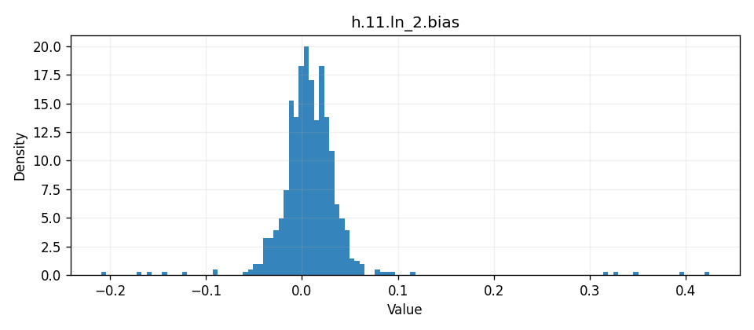

### `h.11.ln_2.weight`

- Shape: `(768,)`
- Dtype: `torch.float32`
- Numel: `768`
- Min: `0.027847`
- Max: `1.233015`
- Mean: `0.504106`
- Std: `0.089952`

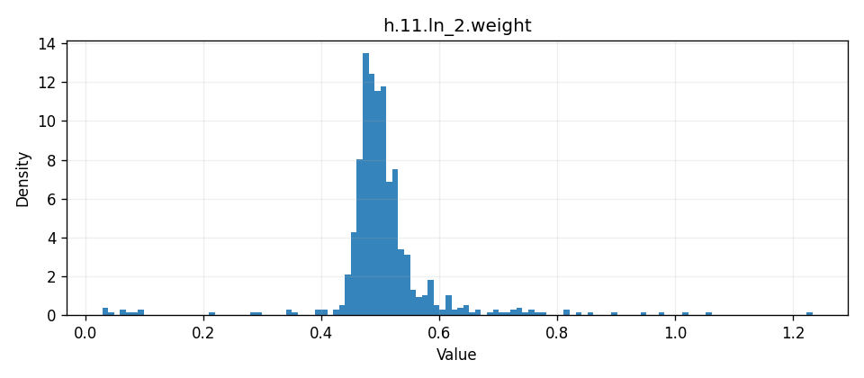

### `h.11.mlp.c_fc.bias`

- Shape: `(3072,)`
- Dtype: `torch.float32`
- Numel: `3072`
- Min: `-1.208217`
- Max: `0.514845`
- Mean: `-0.064114`
- Std: `0.093026`

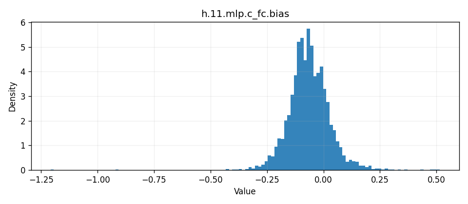

### `h.11.mlp.c_fc.weight`

- Shape: `(768, 3072)`
- Dtype: `torch.float32`
- Numel: `2359296`
- Min: `-1.964867`
- Max: `1.692595`
- Mean: `-0.001846`
- Std: `0.130004`

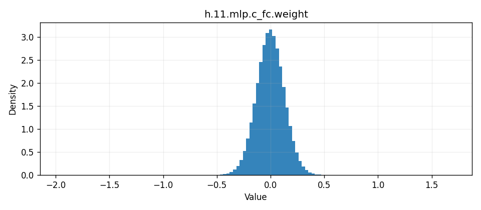

### `h.11.mlp.c_proj.bias`

- Shape: `(768,)`
- Dtype: `torch.float32`
- Numel: `768`
- Min: `-0.383504`
- Max: `0.437348`
- Mean: `0.000972`
- Std: `0.108176`

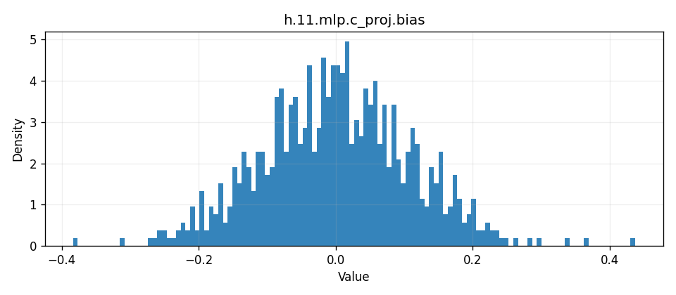

### `h.11.mlp.c_proj.weight`

- Shape: `(3072, 768)`
- Dtype: `torch.float32`
- Numel: `2359296`
- Min: `-9.211532`
- Max: `9.146134`
- Mean: `-0.000435`
- Std: `0.198219`

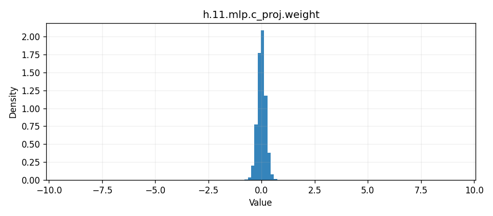

### `h.2.attn.bias`

- Shape: `(1, 1, 1024, 1024)`
- Dtype: `torch.float32`
- Numel: `1048576`
- Min: `0.000000`
- Max: `1.000000`
- Mean: `0.500488`
- Std: `0.500000`

### `h.2.attn.c_attn.bias`

- Shape: `(2304,)`
- Dtype: `torch.float32`
- Numel: `2304`
- Min: `-1.462998`
- Max: `1.177357`
- Mean: `-0.003877`
- Std: `0.164809`

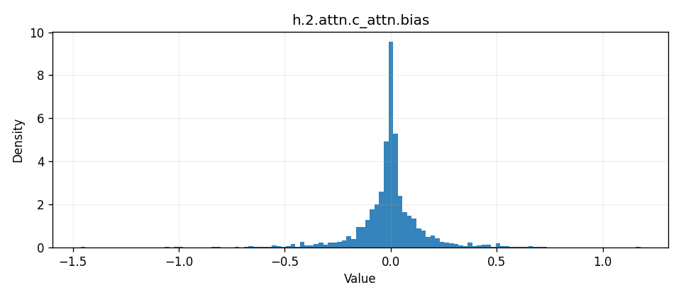

### `h.2.attn.c_attn.weight`

- Shape: `(768, 2304)`
- Dtype: `torch.float32`
- Numel: `1769472`
- Min: `-1.677415`
- Max: `1.576612`
- Mean: `0.000082`
- Std: `0.152669`

### `h.2.attn.c_proj.bias`

- Shape: `(768,)`
- Dtype: `torch.float32`
- Numel: `768`
- Min: `-0.477517`
- Max: `0.514864`
- Mean: `0.003376`
- Std: `0.145017`

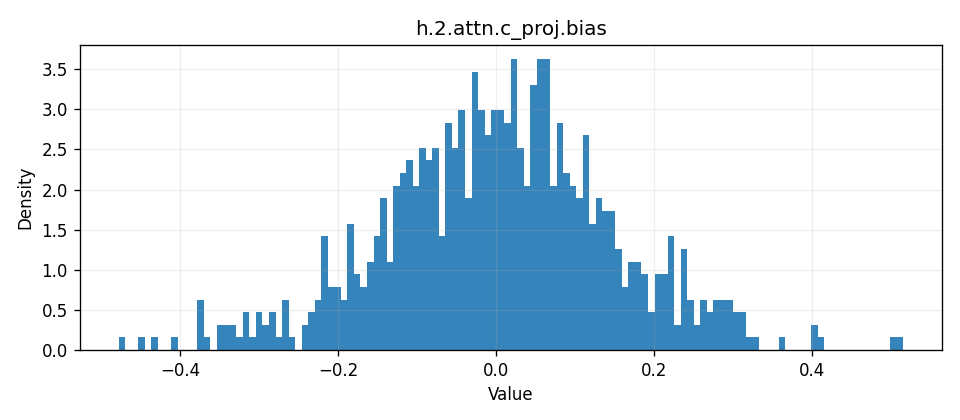

### `h.2.attn.c_proj.weight`

- Shape: `(768, 768)`
- Dtype: `torch.float32`
- Numel: `589824`
- Min: `-2.295547`
- Max: `2.218779`
- Mean: `-0.000033`
- Std: `0.081035`

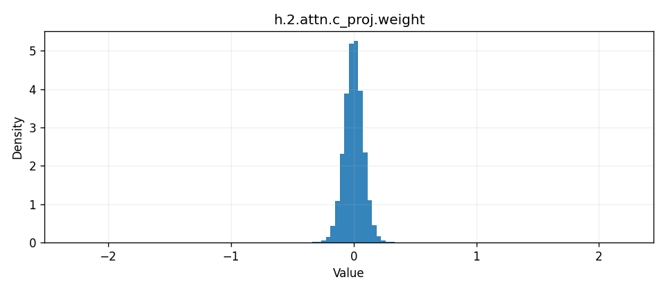

### `h.2.ln_1.bias`

- Shape: `(768,)`
- Dtype: `torch.float32`
- Numel: `768`
- Min: `-0.562486`
- Max: `1.093588`
- Mean: `-0.000360`
- Std: `0.070513`

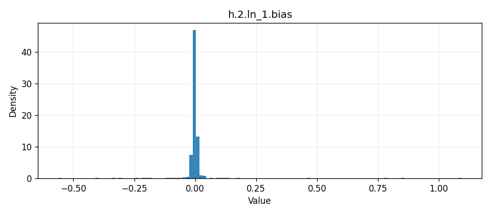

### `h.2.ln_1.weight`

- Shape: `(768,)`
- Dtype: `torch.float32`
- Numel: `768`
- Min: `0.045986`
- Max: `0.944322`
- Mean: `0.240770`
- Std: `0.075224`

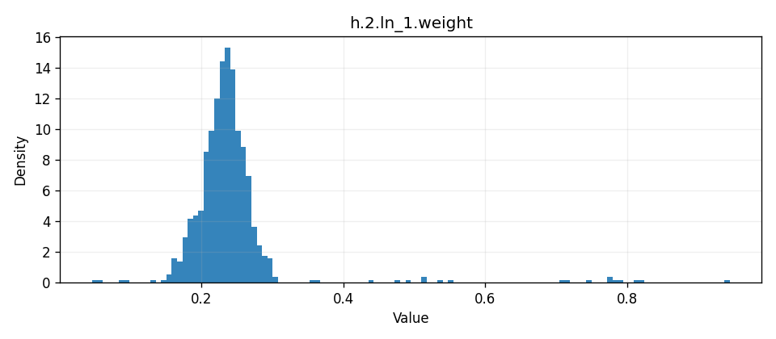

### `h.2.ln_2.bias`

- Shape: `(768,)`
- Dtype: `torch.float32`
- Numel: `768`
- Min: `-0.646987`
- Max: `0.369997`
- Mean: `0.006348`
- Std: `0.043904`

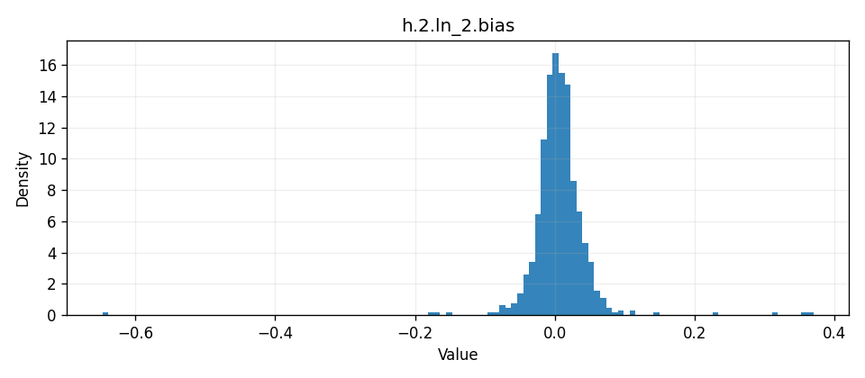

### `h.2.ln_2.weight`

- Shape: `(768,)`
- Dtype: `torch.float32`
- Numel: `768`
- Min: `0.042114`
- Max: `0.729613`
- Mean: `0.292587`
- Std: `0.045376`

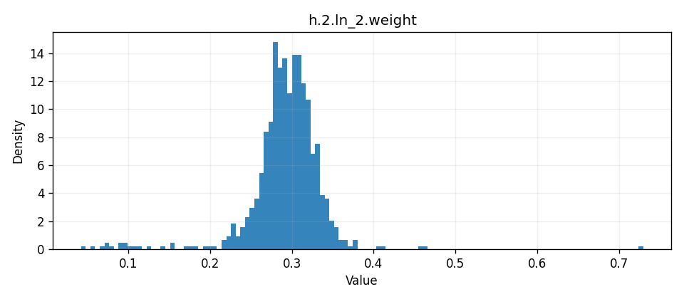

### `h.2.mlp.c_fc.bias`

- Shape: `(3072,)`
- Dtype: `torch.float32`
- Numel: `3072`
- Min: `-0.659830`
- Max: `1.731481`
- Mean: `-0.092822`
- Std: `0.106653`

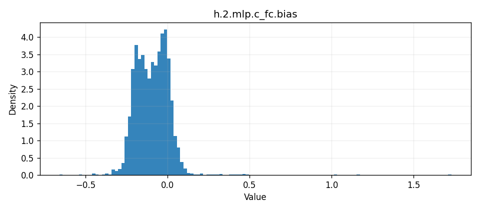

### `h.2.mlp.c_fc.weight`

- Shape: `(768, 3072)`
- Dtype: `torch.float32`
- Numel: `2359296`
- Min: `-5.874013`
- Max: `10.555802`
- Mean: `-0.005061`
- Std: `0.133527`

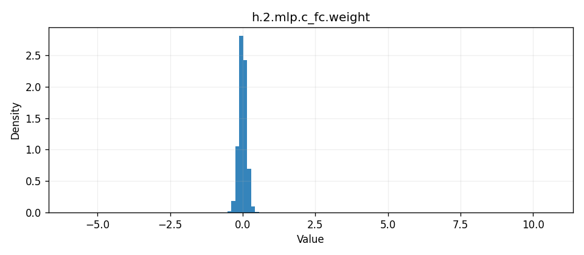

### `h.2.mlp.c_proj.bias`

- Shape: `(768,)`
- Dtype: `torch.float32`
- Numel: `768`
- Min: `-0.452780`
- Max: `1.567660`
- Mean: `0.002819`
- Std: `0.112356`

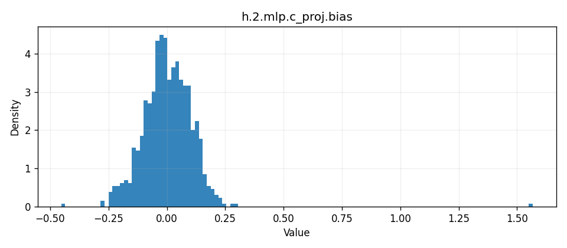

### `h.2.mlp.c_proj.weight`

- Shape: `(3072, 768)`
- Dtype: `torch.float32`
- Numel: `2359296`
- Min: `-2.873831`
- Max: `15.068067`
- Mean: `0.000197`
- Std: `0.093087`

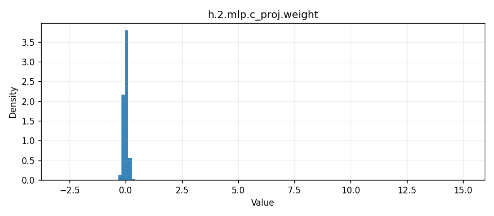

### `h.3.attn.bias`

- Shape: `(1, 1, 1024, 1024)`
- Dtype: `torch.float32`
- Numel: `1048576`
- Min: `0.000000`
- Max: `1.000000`
- Mean: `0.500488`
- Std: `0.500000`

### `h.3.attn.c_attn.bias`

- Shape: `(2304,)`
- Dtype: `torch.float32`
- Numel: `2304`
- Min: `-0.668766`
- Max: `0.711817`
- Mean: `-0.000889`
- Std: `0.141738`

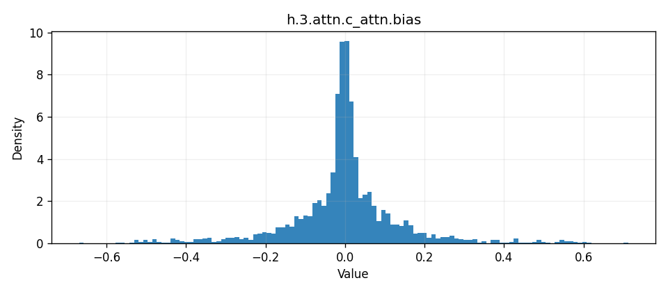

### `h.3.attn.c_attn.weight`

- Shape: `(768, 2304)`
- Dtype: `torch.float32`
- Numel: `1769472`
- Min: `-1.715412`
- Max: `1.896003`
- Mean: `-0.000024`
- Std: `0.141807`

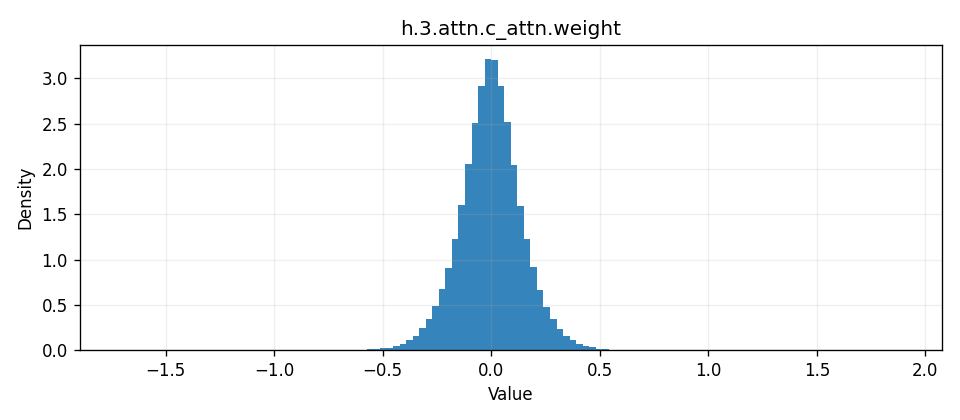

### `h.3.attn.c_proj.bias`

- Shape: `(768,)`
- Dtype: `torch.float32`
- Numel: `768`
- Min: `-1.027223`
- Max: `0.518168`
- Mean: `-0.001561`
- Std: `0.107840`

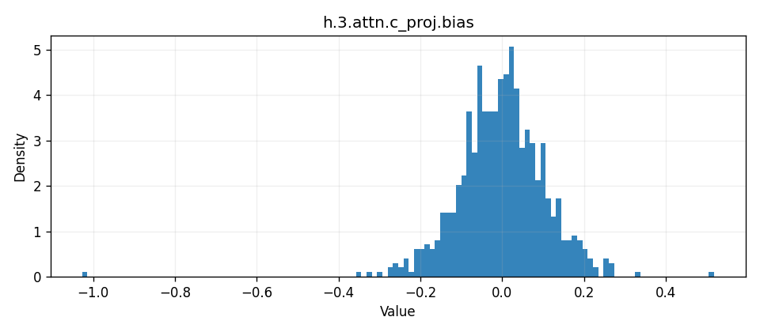

### `h.3.attn.c_proj.weight`

- Shape: `(768, 768)`
- Dtype: `torch.float32`
- Numel: `589824`
- Min: `-2.093752`
- Max: `1.228478`
- Mean: `0.000034`
- Std: `0.084125`

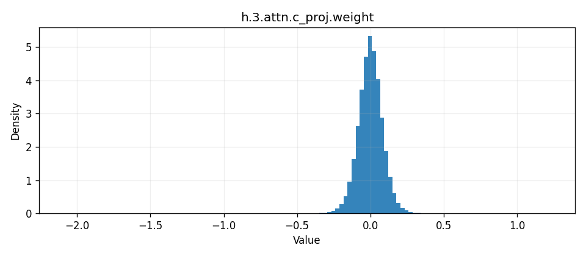

### `h.3.ln_1.bias`

- Shape: `(768,)`
- Dtype: `torch.float32`
- Numel: `768`
- Min: `-0.433549`
- Max: `1.737336`
- Mean: `0.005448`
- Std: `0.070112`

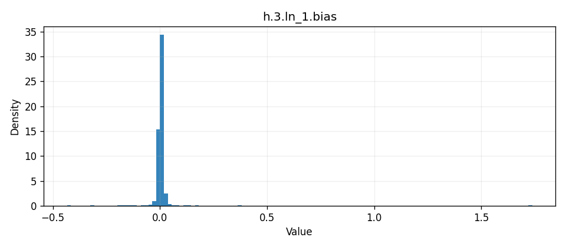

### `h.3.ln_1.weight`

- Shape: `(768,)`
- Dtype: `torch.float32`
- Numel: `768`
- Min: `0.056518`
- Max: `0.767670`
- Mean: `0.301098`
- Std: `0.053478`

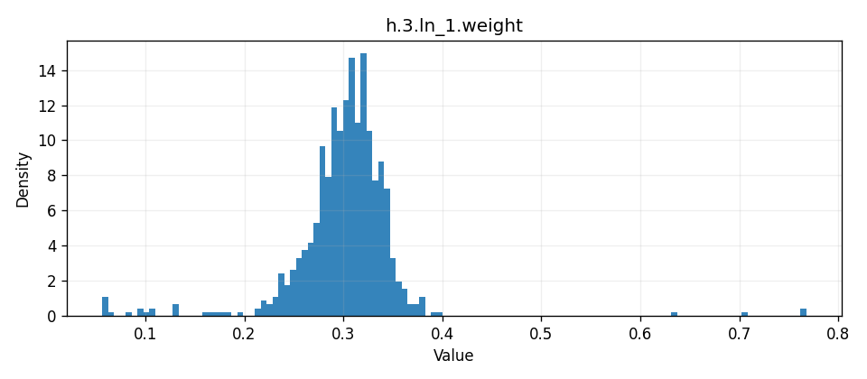

### `h.3.ln_2.bias`

- Shape: `(768,)`
- Dtype: `torch.float32`
- Numel: `768`
- Min: `-0.437476`
- Max: `0.434899`
- Mean: `0.009965`
- Std: `0.043548`

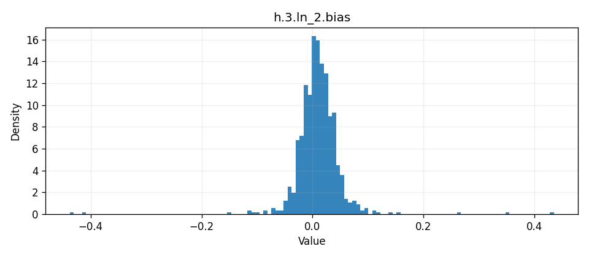

### `h.3.ln_2.weight`

- Shape: `(768,)`
- Dtype: `torch.float32`
- Numel: `768`
- Min: `-0.000256`
- Max: `1.160434`
- Mean: `0.306508`
- Std: `0.052619`

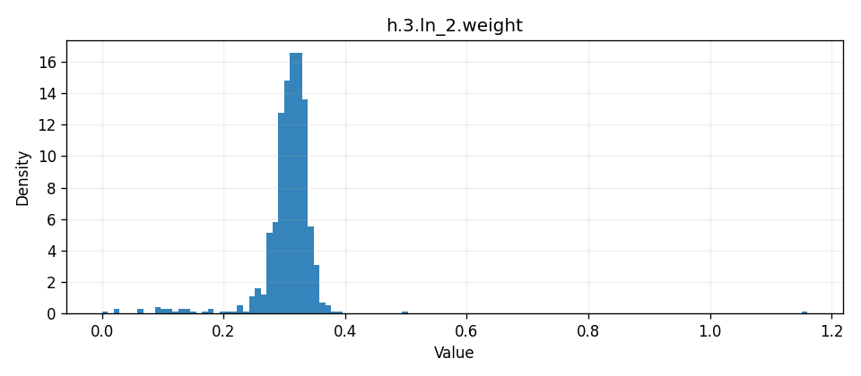

### `h.3.mlp.c_fc.bias`

- Shape: `(3072,)`
- Dtype: `torch.float32`
- Numel: `3072`
- Min: `-1.226228`
- Max: `0.516790`
- Mean: `-0.092532`
- Std: `0.085645`

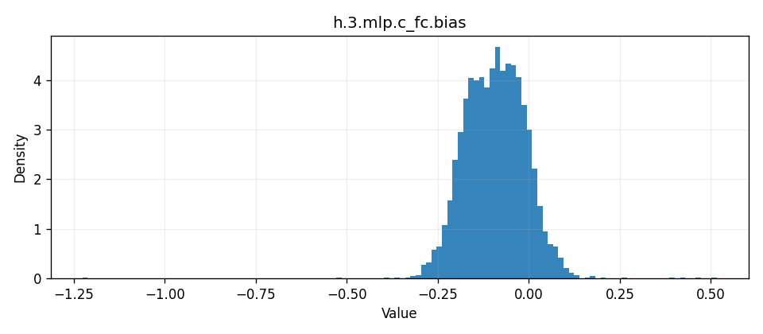

### `h.3.mlp.c_fc.weight`

- Shape: `(768, 3072)`
- Dtype: `torch.float32`
- Numel: `2359296`
- Min: `-2.643747`
- Max: `2.284240`
- Mean: `-0.005950`
- Std: `0.129530`

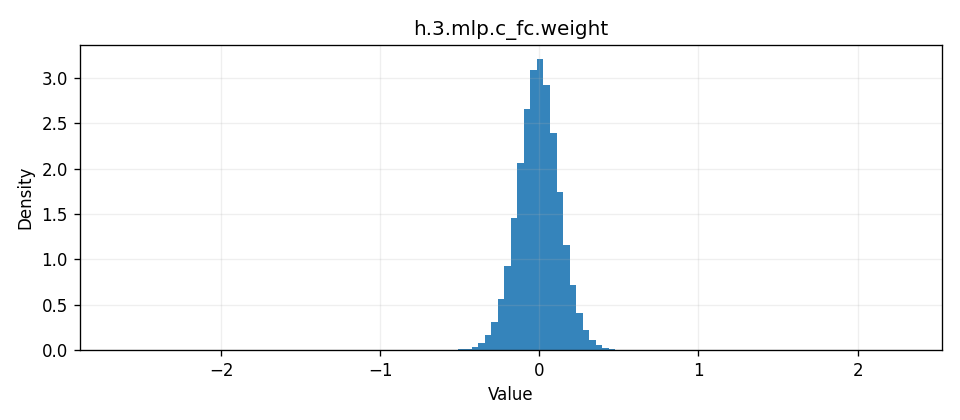

### `h.3.mlp.c_proj.bias`

- Shape: `(768,)`
- Dtype: `torch.float32`
- Numel: `768`
- Min: `-0.666141`
- Max: `1.863750`
- Mean: `0.002102`
- Std: `0.115044`

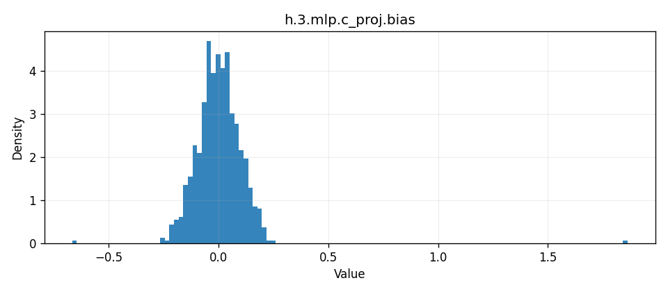

### `h.3.mlp.c_proj.weight`

- Shape: `(3072, 768)`
- Dtype: `torch.float32`
- Numel: `2359296`
- Min: `-4.139147`
- Max: `17.102329`
- Mean: `0.000176`
- Std: `0.091806`

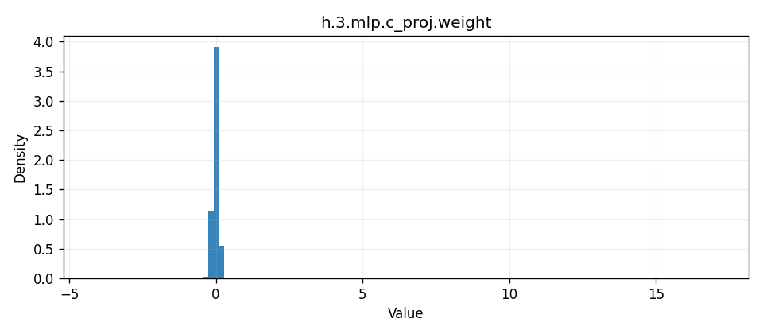

### `h.4.attn.bias`

- Shape: `(1, 1, 1024, 1024)`
- Dtype: `torch.float32`
- Numel: `1048576`
- Min: `0.000000`
- Max: `1.000000`
- Mean: `0.500488`
- Std: `0.500000`

### `h.4.attn.c_attn.bias`

- Shape: `(2304,)`
- Dtype: `torch.float32`
- Numel: `2304`
- Min: `-2.612281`
- Max: `2.745676`
- Mean: `0.005201`
- Std: `0.239486`

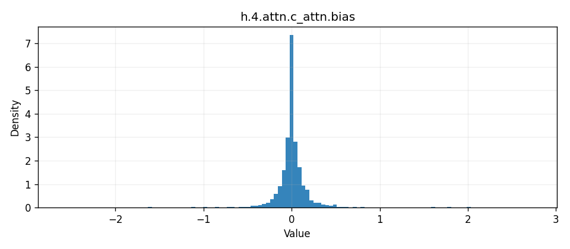

### `h.4.attn.c_attn.weight`

- Shape: `(768, 2304)`
- Dtype: `torch.float32`
- Numel: `1769472`
- Min: `-3.334057`
- Max: `3.099849`
- Mean: `0.000152`
- Std: `0.146438`

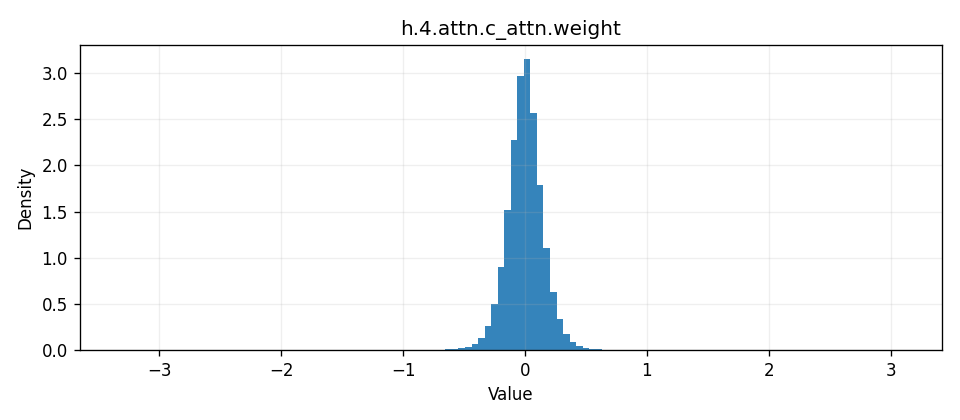

### `h.4.attn.c_proj.bias`

- Shape: `(768,)`
- Dtype: `torch.float32`
- Numel: `768`
- Min: `-0.643004`
- Max: `0.515838`
- Mean: `-0.000901`
- Std: `0.100433`

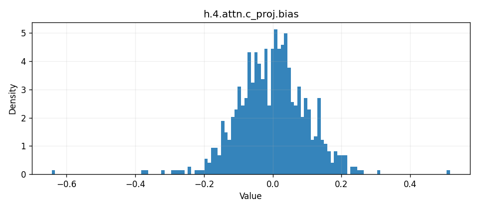

### `h.4.attn.c_proj.weight`

- Shape: `(768, 768)`
- Dtype: `torch.float32`
- Numel: `589824`
- Min: `-1.838755`
- Max: `1.835988`
- Mean: `-0.000011`
- Std: `0.092979`

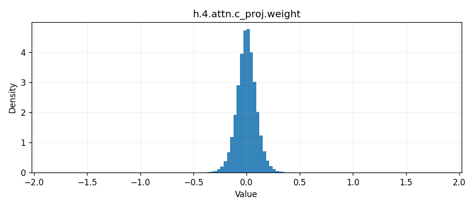

### `h.4.ln_1.bias`

- Shape: `(768,)`
- Dtype: `torch.float32`
- Numel: `768`
- Min: `-0.544566`
- Max: `1.550781`
- Mean: `0.007916`
- Std: `0.067449`

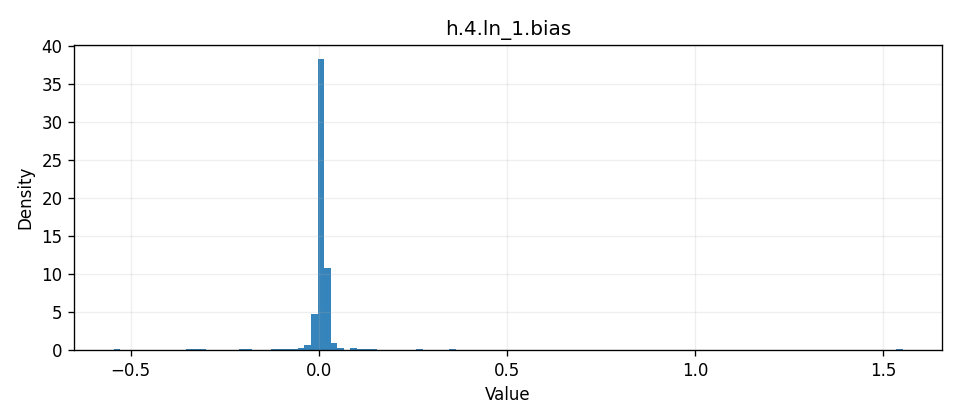

### `h.4.ln_1.weight`

- Shape: `(768,)`
- Dtype: `torch.float32`
- Numel: `768`
- Min: `0.057976`
- Max: `0.670462`
- Mean: `0.319345`
- Std: `0.047360`

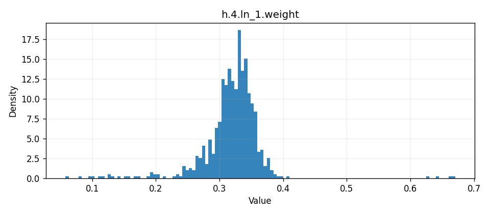

### `h.4.ln_2.bias`

- Shape: `(768,)`
- Dtype: `torch.float32`
- Numel: `768`
- Min: `-0.142091`
- Max: `0.142941`
- Mean: `0.000960`
- Std: `0.026866`

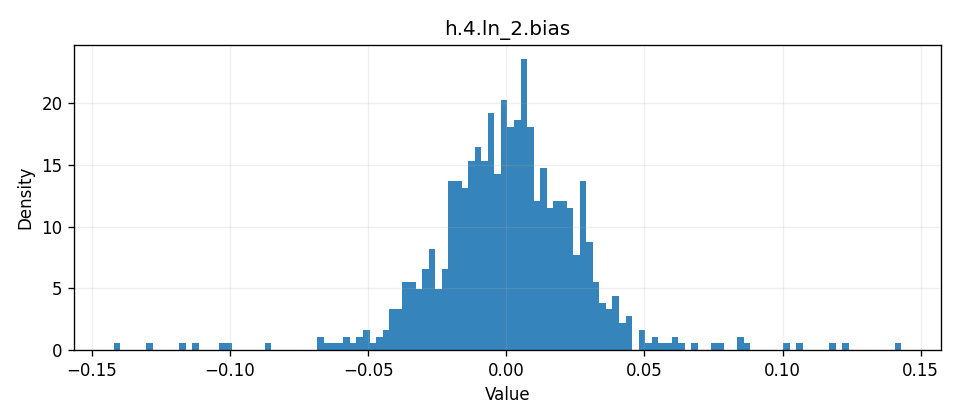

### `h.4.ln_2.weight`

- Shape: `(768,)`
- Dtype: `torch.float32`
- Numel: `768`
- Min: `0.070068`
- Max: `1.132185`
- Mean: `0.272582`
- Std: `0.043868`

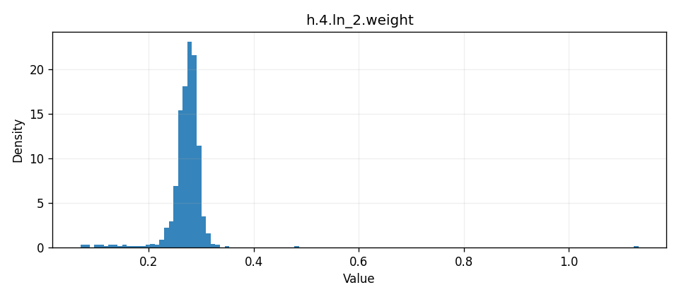

### `h.4.mlp.c_fc.bias`

- Shape: `(3072,)`
- Dtype: `torch.float32`
- Numel: `3072`
- Min: `-0.452961`
- Max: `0.741710`
- Mean: `-0.086126`
- Std: `0.093187`

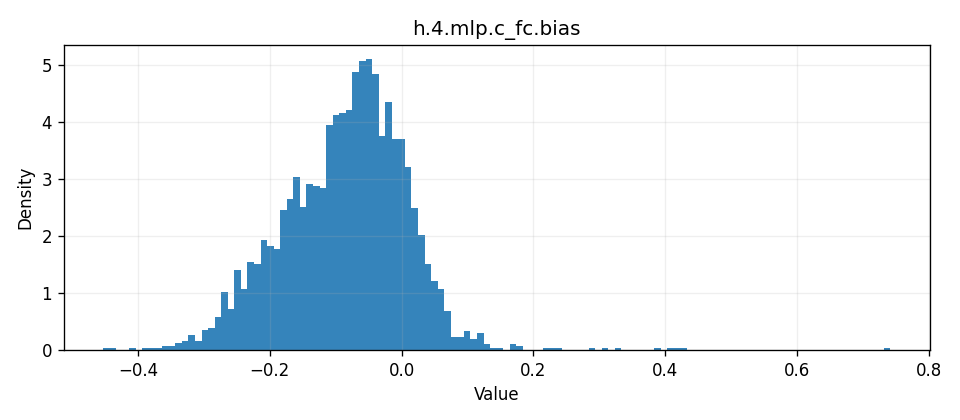

### `h.4.mlp.c_fc.weight`

- Shape: `(768, 3072)`
- Dtype: `torch.float32`
- Numel: `2359296`
- Min: `-2.161365`
- Max: `2.020135`
- Mean: `-0.003264`
- Std: `0.129713`

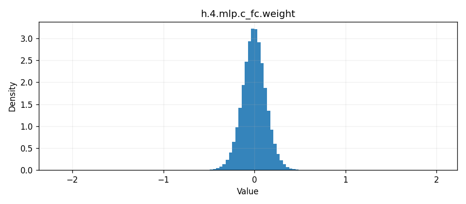

### `h.4.mlp.c_proj.bias`

- Shape: `(768,)`
- Dtype: `torch.float32`
- Numel: `768`
- Min: `-0.668307`
- Max: `1.568591`
- Mean: `0.001606`
- Std: `0.136771`

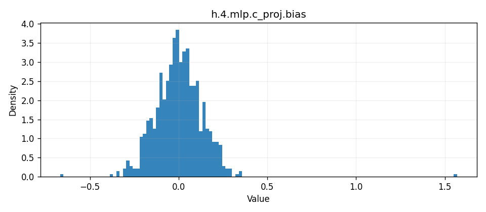

### `h.4.mlp.c_proj.weight`

- Shape: `(3072, 768)`
- Dtype: `torch.float32`
- Numel: `2359296`
- Min: `-3.742591`
- Max: `4.777113`
- Mean: `0.000180`
- Std: `0.090999`

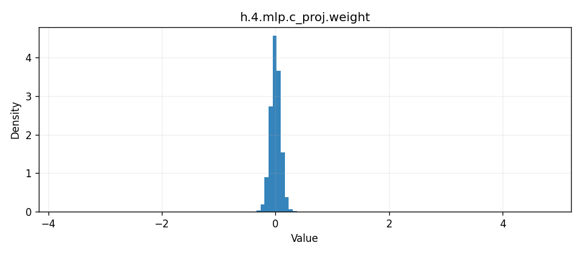

### `h.5.attn.bias`

- Shape: `(1, 1, 1024, 1024)`
- Dtype: `torch.float32`
- Numel: `1048576`
- Min: `0.000000`
- Max: `1.000000`
- Mean: `0.500488`
- Std: `0.500000`

### `h.5.attn.c_attn.bias`

- Shape: `(2304,)`
- Dtype: `torch.float32`
- Numel: `2304`
- Min: `-0.559392`
- Max: `0.474422`
- Mean: `0.001046`
- Std: `0.099215`

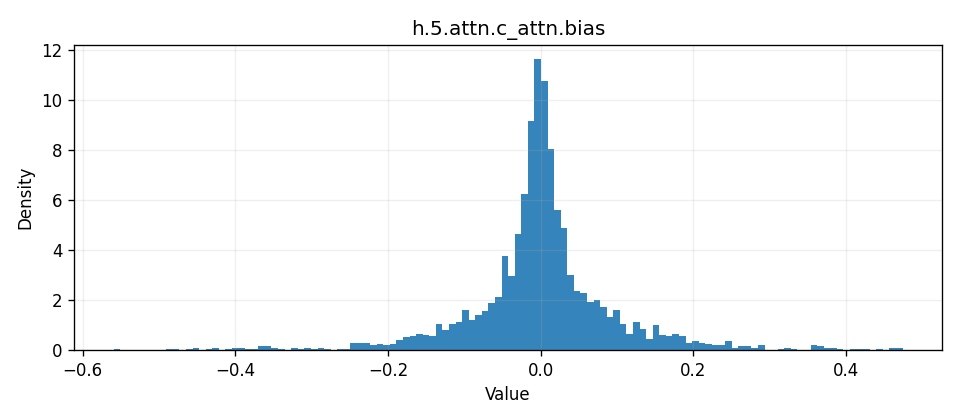

### `h.5.attn.c_attn.weight`

- Shape: `(768, 2304)`
- Dtype: `torch.float32`
- Numel: `1769472`
- Min: `-1.392387`
- Max: `1.331609`
- Mean: `-0.000108`
- Std: `0.128013`

### `h.5.attn.c_proj.bias`

- Shape: `(768,)`
- Dtype: `torch.float32`
- Numel: `768`
- Min: `-0.702985`
- Max: `0.593903`
- Mean: `-0.001168`
- Std: `0.110732`

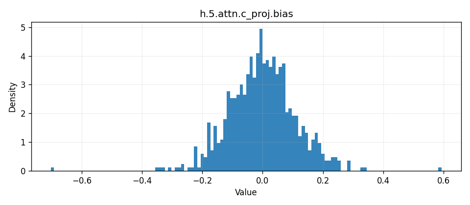

### `h.5.attn.c_proj.weight`

- Shape: `(768, 768)`
- Dtype: `torch.float32`
- Numel: `589824`
- Min: `-1.983336`
- Max: `1.689298`
- Mean: `0.000011`
- Std: `0.093775`

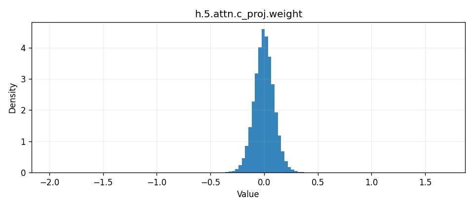

### `h.5.ln_1.bias`

- Shape: `(768,)`
- Dtype: `torch.float32`
- Numel: `768`
- Min: `-0.450638`
- Max: `1.079457`
- Mean: `0.011876`
- Std: `0.049034`

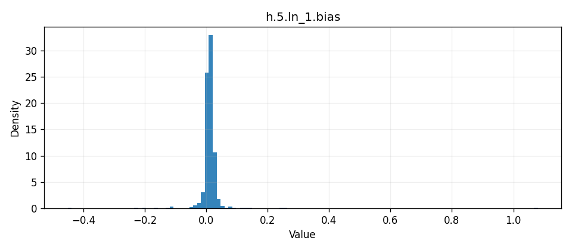

### `h.5.ln_1.weight`

- Shape: `(768,)`
- Dtype: `torch.float32`
- Numel: `768`
- Min: `0.086377`
- Max: `0.768703`
- Mean: `0.373119`
- Std: `0.044997`

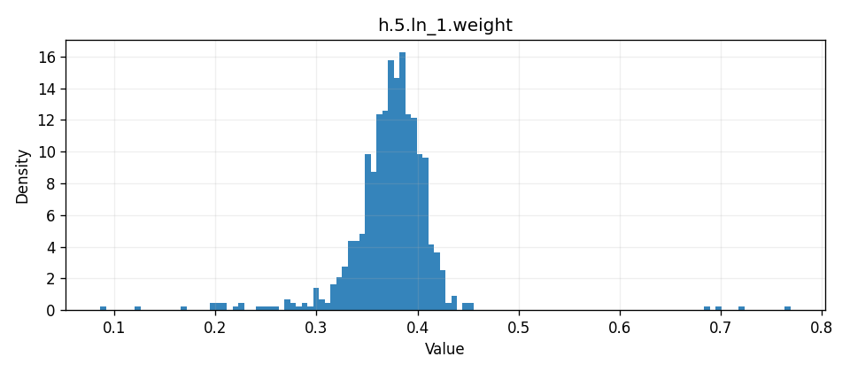

### `h.5.ln_2.bias`

- Shape: `(768,)`
- Dtype: `torch.float32`
- Numel: `768`
- Min: `-0.304539`
- Max: `0.317820`
- Mean: `0.008152`
- Std: `0.032779`

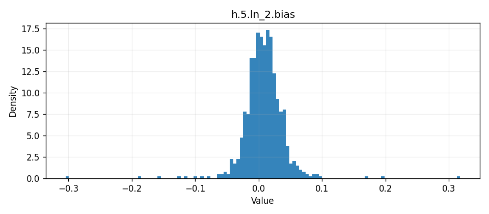

### `h.5.ln_2.weight`

- Shape: `(768,)`
- Dtype: `torch.float32`
- Numel: `768`
- Min: `0.042847`
- Max: `1.417968`
- Mean: `0.279002`
- Std: `0.051443`

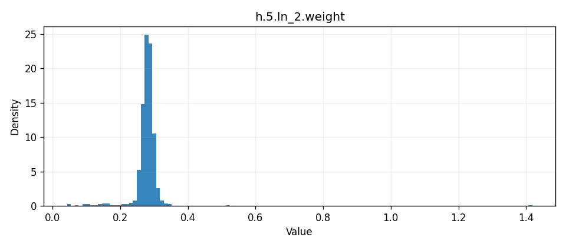

### `h.5.mlp.c_fc.bias`

- Shape: `(3072,)`
- Dtype: `torch.float32`
- Numel: `3072`
- Min: `-0.433505`
- Max: `0.670098`
- Mean: `-0.085025`
- Std: `0.088994`

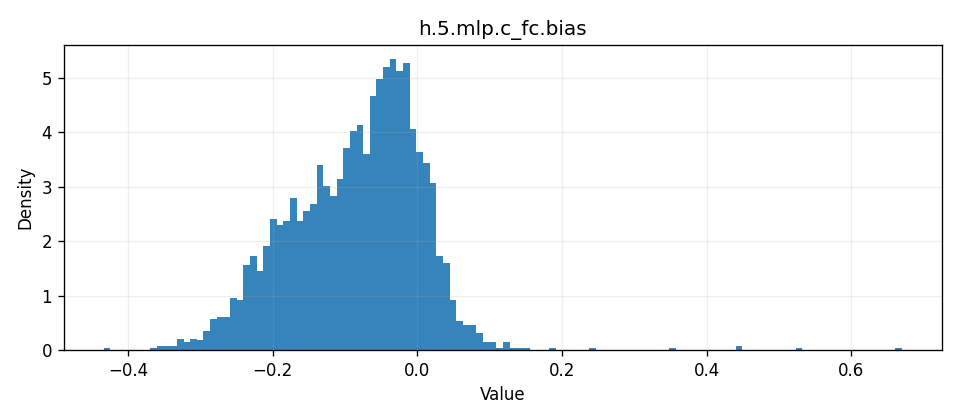

### `h.5.mlp.c_fc.weight`

- Shape: `(768, 3072)`
- Dtype: `torch.float32`
- Numel: `2359296`
- Min: `-1.964561`
- Max: `1.761719`
- Mean: `-0.004194`
- Std: `0.126707`

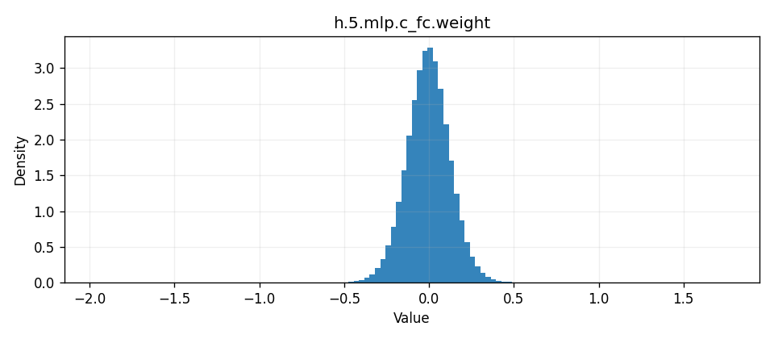

### `h.5.mlp.c_proj.bias`

- Shape: `(768,)`
- Dtype: `torch.float32`
- Numel: `768`
- Min: `-0.712006`
- Max: `1.252571`
- Mean: `0.000953`
- Std: `0.106384`

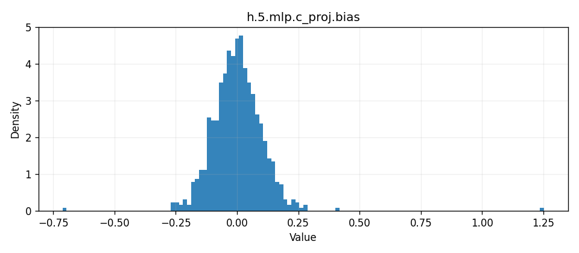

### `h.5.mlp.c_proj.weight`

- Shape: `(3072, 768)`
- Dtype: `torch.float32`
- Numel: `2359296`
- Min: `-2.840672`
- Max: `2.732892`
- Mean: `0.000116`
- Std: `0.097357`

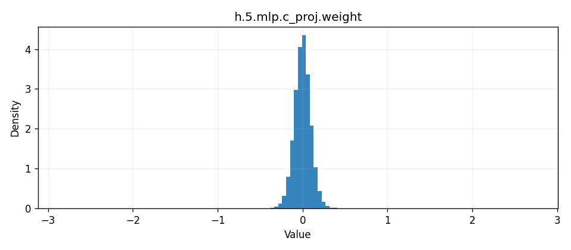

### `h.6.attn.bias`

- Shape: `(1, 1, 1024, 1024)`
- Dtype: `torch.float32`
- Numel: `1048576`
- Min: `0.000000`
- Max: `1.000000`
- Mean: `0.500488`
- Std: `0.500000`

### `h.6.attn.c_attn.bias`

- Shape: `(2304,)`
- Dtype: `torch.float32`
- Numel: `2304`
- Min: `-0.811435`
- Max: `0.724342`
- Mean: `0.001821`
- Std: `0.122960`

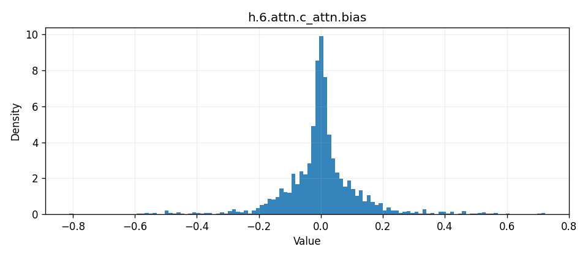

### `h.6.attn.c_attn.weight`

- Shape: `(768, 2304)`
- Dtype: `torch.float32`
- Numel: `1769472`
- Min: `-1.387697`
- Max: `1.626133`
- Mean: `0.000112`
- Std: `0.126860`

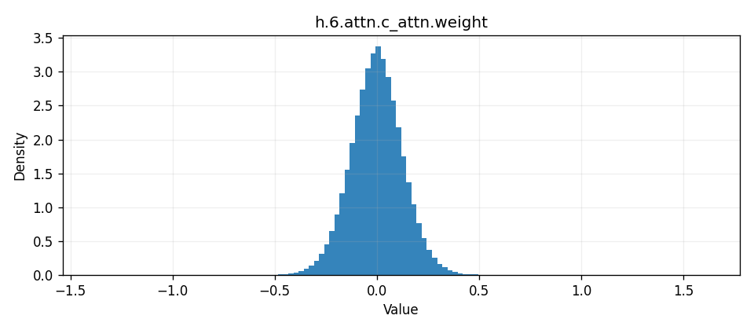

### `h.6.attn.c_proj.bias`

- Shape: `(768,)`
- Dtype: `torch.float32`
- Numel: `768`
- Min: `-0.312414`
- Max: `0.395968`
- Mean: `-0.000436`
- Std: `0.105985`

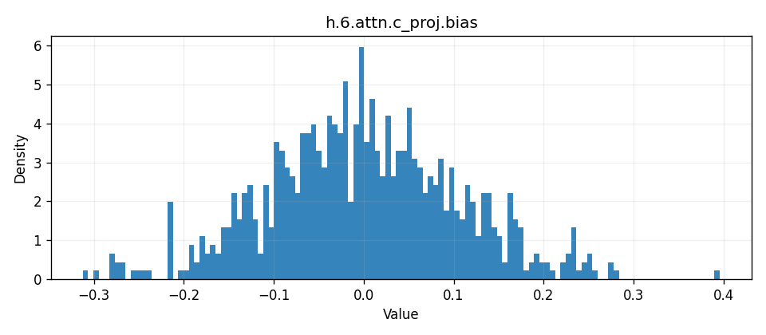

### `h.6.attn.c_proj.weight`

- Shape: `(768, 768)`
- Dtype: `torch.float32`
- Numel: `589824`
- Min: `-1.724002`
- Max: `1.858313`
- Mean: `0.000037`
- Std: `0.113690`

### `h.6.ln_1.bias`

- Shape: `(768,)`
- Dtype: `torch.float32`
- Numel: `768`
- Min: `-0.635373`
- Max: `1.521540`
- Mean: `0.011822`
- Std: `0.066163`

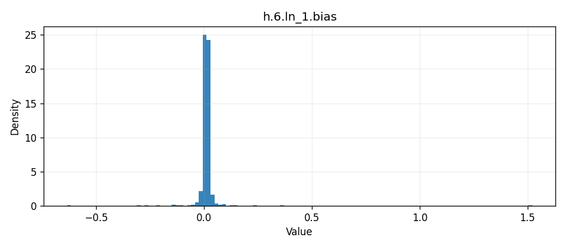

### `h.6.ln_1.weight`

- Shape: `(768,)`
- Dtype: `torch.float32`
- Numel: `768`
- Min: `0.063720`
- Max: `0.779648`
- Mean: `0.345598`
- Std: `0.044142`

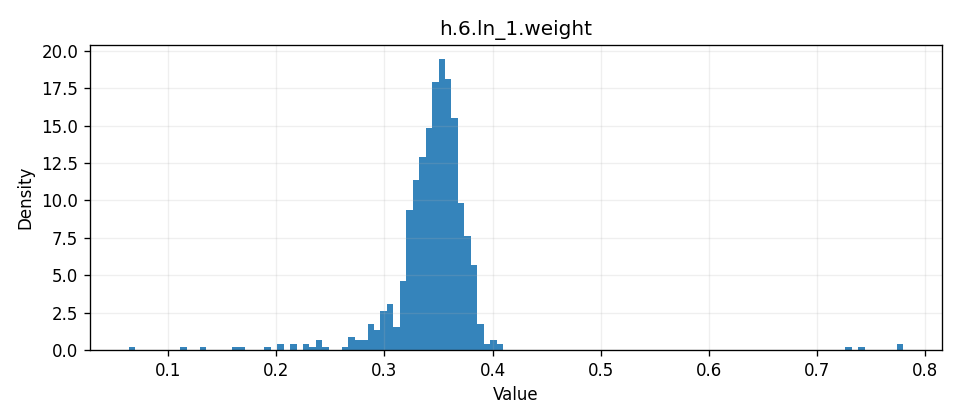

### `h.6.ln_2.bias`

- Shape: `(768,)`
- Dtype: `torch.float32`
- Numel: `768`
- Min: `-0.272564`
- Max: `0.452123`
- Mean: `0.004331`
- Std: `0.033800`

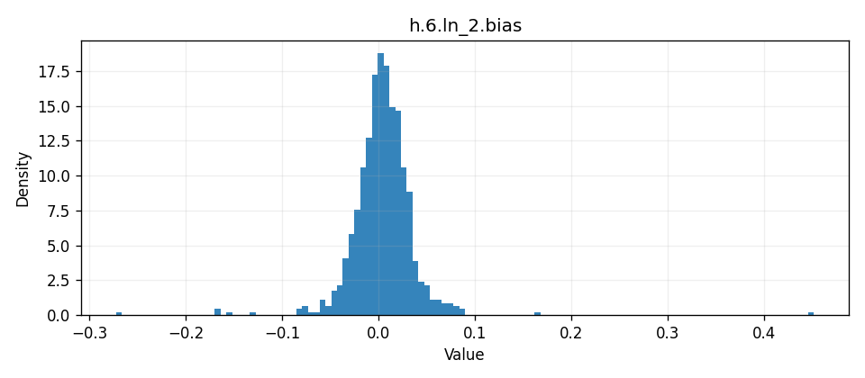

### `h.6.ln_2.weight`

- Shape: `(768,)`
- Dtype: `torch.float32`
- Numel: `768`
- Min: `0.042360`
- Max: `1.339843`
- Mean: `0.259469`
- Std: `0.047369`

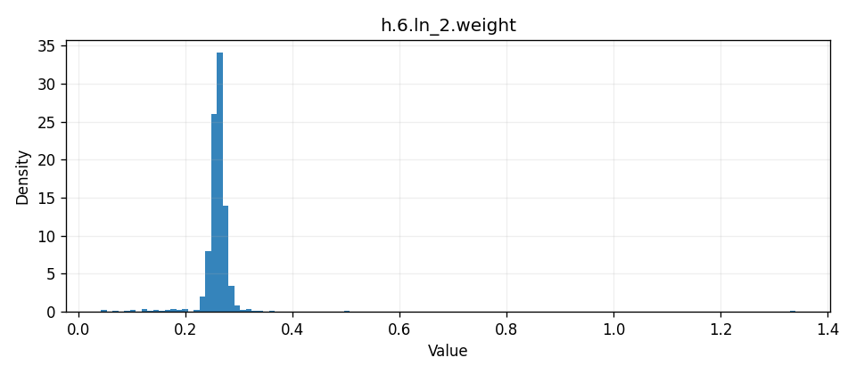

### `h.6.mlp.c_fc.bias`

- Shape: `(3072,)`
- Dtype: `torch.float32`
- Numel: `3072`
- Min: `-0.431047`
- Max: `0.682374`
- Mean: `-0.085702`
- Std: `0.090547`

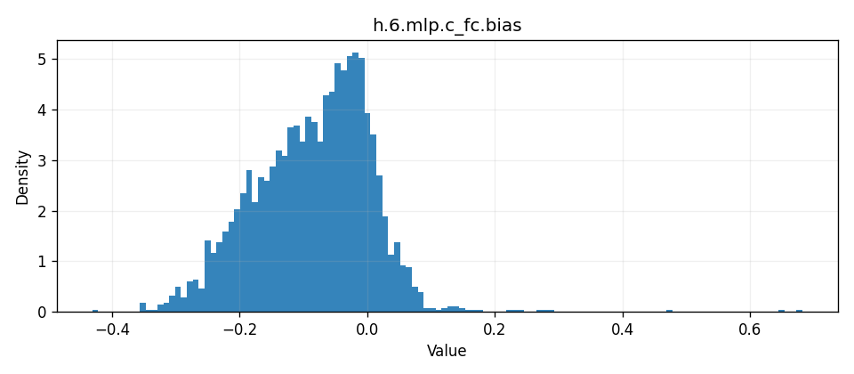

### `h.6.mlp.c_fc.weight`

- Shape: `(768, 3072)`
- Dtype: `torch.float32`
- Numel: `2359296`
- Min: `-1.229534`
- Max: `2.132810`
- Mean: `-0.002819`
- Std: `0.126356`

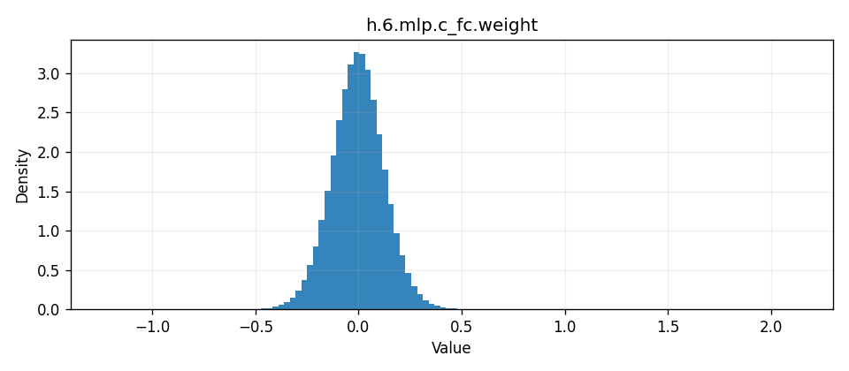

### `h.6.mlp.c_proj.bias`

- Shape: `(768,)`
- Dtype: `torch.float32`
- Numel: `768`
- Min: `-0.675734`
- Max: `1.045948`
- Mean: `0.001563`
- Std: `0.120977`

### `h.6.mlp.c_proj.weight`

- Shape: `(3072, 768)`
- Dtype: `torch.float32`
- Numel: `2359296`
- Min: `-2.244051`
- Max: `2.769946`
- Mean: `0.000095`
- Std: `0.107332`

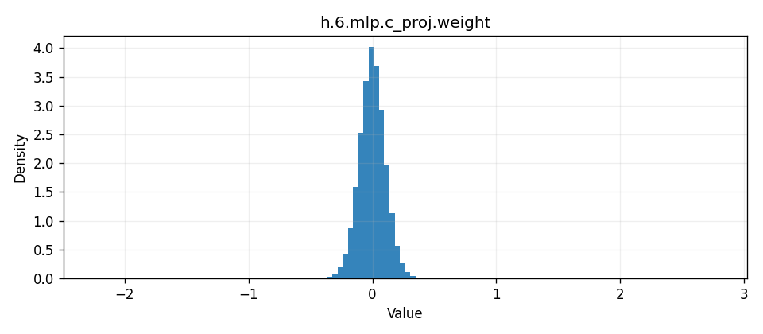

### `h.7.attn.bias`

- Shape: `(1, 1, 1024, 1024)`
- Dtype: `torch.float32`
- Numel: `1048576`
- Min: `0.000000`
- Max: `1.000000`
- Mean: `0.500488`
- Std: `0.500000`

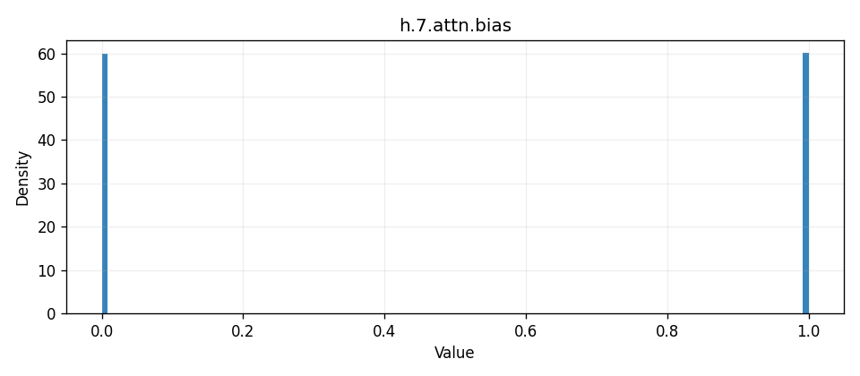

### `h.7.attn.c_attn.bias`

- Shape: `(2304,)`
- Dtype: `torch.float32`
- Numel: `2304`
- Min: `-0.756746`
- Max: `0.727455`
- Mean: `-0.004283`
- Std: `0.138054`

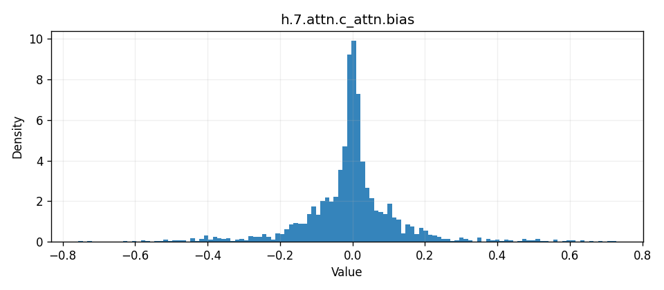

### `h.7.attn.c_attn.weight`

- Shape: `(768, 2304)`
- Dtype: `torch.float32`
- Numel: `1769472`
- Min: `-1.682971`
- Max: `1.805177`
- Mean: `-0.000091`
- Std: `0.128986`

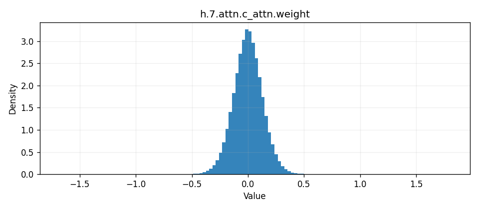

### `h.7.attn.c_proj.bias`

- Shape: `(768,)`
- Dtype: `torch.float32`
- Numel: `768`
- Min: `-0.459812`
- Max: `0.518133`
- Mean: `-0.000134`
- Std: `0.145026`

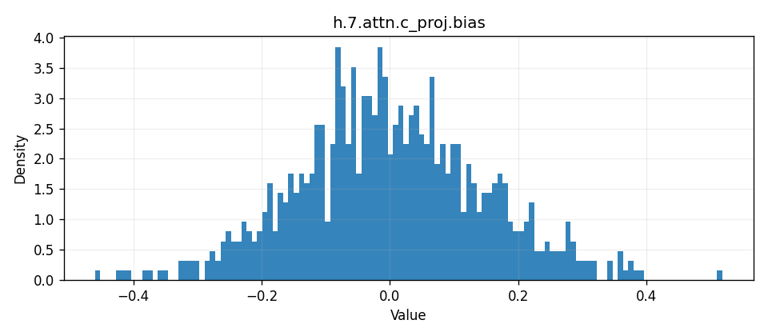

### `h.7.attn.c_proj.weight`

- Shape: `(768, 768)`
- Dtype: `torch.float32`
- Numel: `589824`
- Min: `-2.234390`
- Max: `1.916892`
- Mean: `0.000024`
- Std: `0.113917`

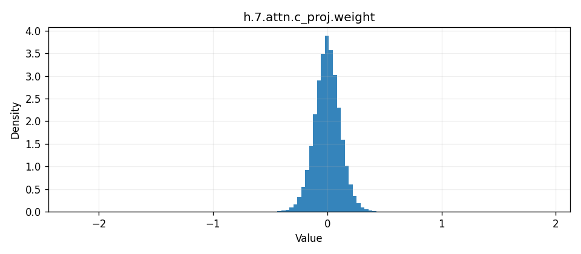

### `h.7.ln_1.bias`

- Shape: `(768,)`
- Dtype: `torch.float32`
- Numel: `768`
- Min: `-0.790280`
- Max: `1.196378`
- Mean: `0.014344`
- Std: `0.059108`

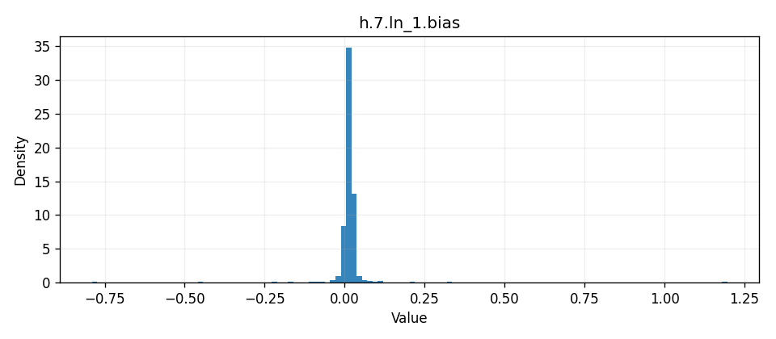

### `h.7.ln_1.weight`

- Shape: `(768,)`
- Dtype: `torch.float32`
- Numel: `768`
- Min: `0.074604`
- Max: `0.818254`
- Mean: `0.356572`
- Std: `0.043757`

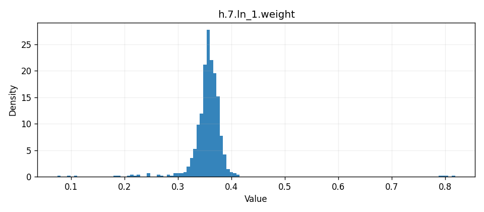

### `h.7.ln_2.bias`

- Shape: `(768,)`
- Dtype: `torch.float32`
- Numel: `768`
- Min: `-0.466620`
- Max: `0.627203`
- Mean: `0.009184`
- Std: `0.045680`

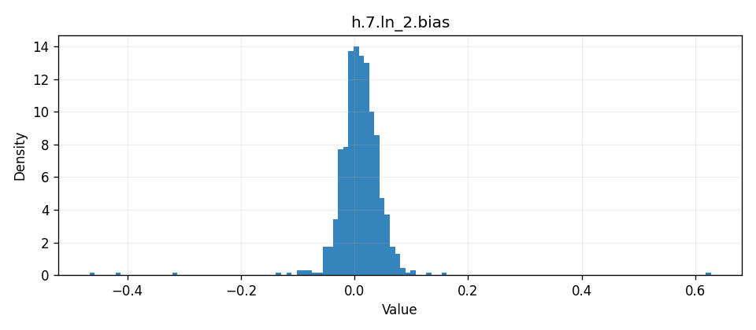

### `h.7.ln_2.weight`

- Shape: `(768,)`
- Dtype: `torch.float32`
- Numel: `768`
- Min: `0.014923`
- Max: `1.292971`
- Mean: `0.256014`
- Std: `0.047025`

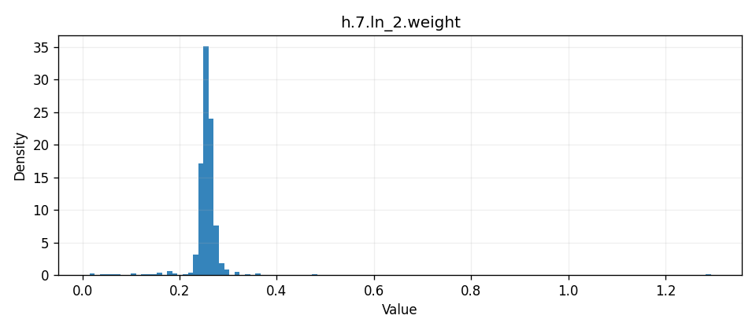

### `h.7.mlp.c_fc.bias`

- Shape: `(3072,)`
- Dtype: `torch.float32`
- Numel: `3072`
- Min: `-0.727739`
- Max: `0.832007`
- Mean: `-0.088472`
- Std: `0.090628`

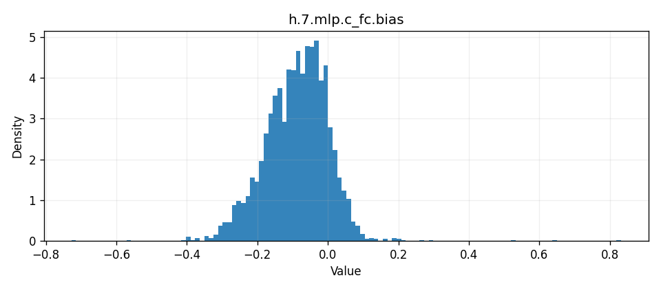

### `h.7.mlp.c_fc.weight`

- Shape: `(768, 3072)`
- Dtype: `torch.float32`
- Numel: `2359296`
- Min: `-0.850210`
- Max: `1.232183`
- Mean: `-0.003523`
- Std: `0.126423`

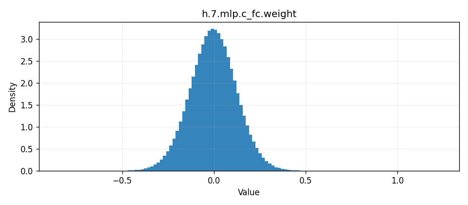

### `h.7.mlp.c_proj.bias`

- Shape: `(768,)`
- Dtype: `torch.float32`
- Numel: `768`
- Min: `-0.725577`
- Max: `1.177007`
- Mean: `0.001193`
- Std: `0.128728`

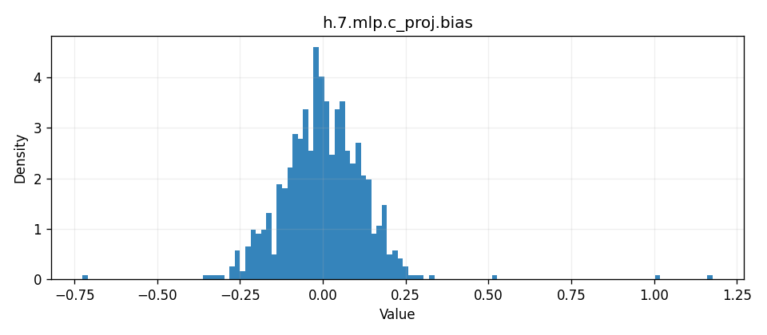

### `h.7.mlp.c_proj.weight`

- Shape: `(3072, 768)`
- Dtype: `torch.float32`
- Numel: `2359296`
- Min: `-4.532768`
- Max: `4.285163`
- Mean: `0.000086`
- Std: `0.118735`

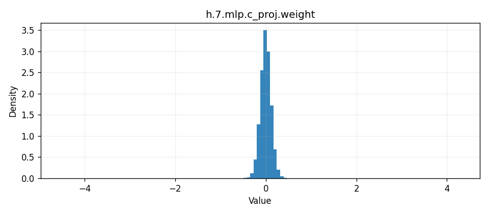

### `h.8.attn.bias`

- Shape: `(1, 1, 1024, 1024)`
- Dtype: `torch.float32`
- Numel: `1048576`
- Min: `0.000000`
- Max: `1.000000`
- Mean: `0.500488`
- Std: `0.500000`

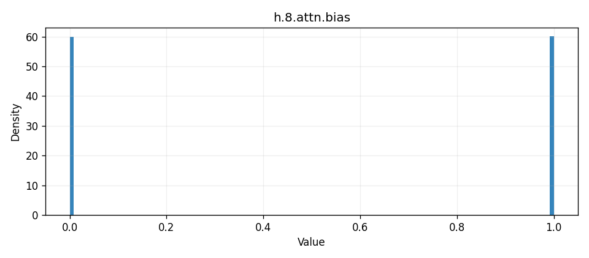

### `h.8.attn.c_attn.bias`

- Shape: `(2304,)`
- Dtype: `torch.float32`
- Numel: `2304`
- Min: `-0.869037`
- Max: `0.836953`
- Mean: `-0.005530`
- Std: `0.131370`

### `h.8.attn.c_attn.weight`

- Shape: `(768, 2304)`
- Dtype: `torch.float32`
- Numel: `1769472`
- Min: `-1.724232`
- Max: `1.948027`
- Mean: `-0.000170`
- Std: `0.126931`

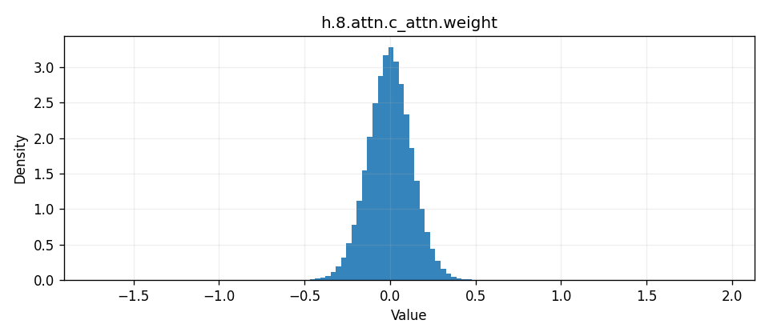

### `h.8.attn.c_proj.bias`

- Shape: `(768,)`
- Dtype: `torch.float32`
- Numel: `768`
- Min: `-0.467588`
- Max: `1.157381`
- Mean: `0.001086`
- Std: `0.139988`

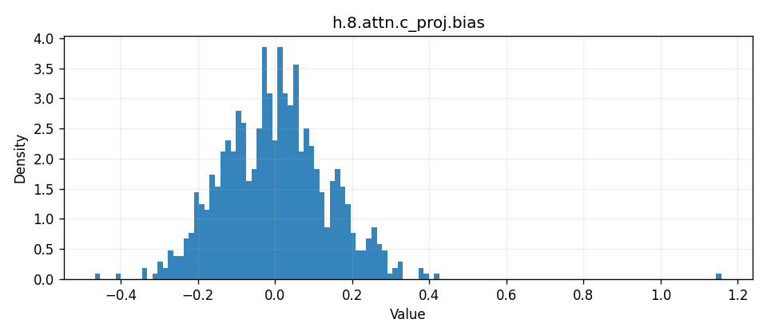

### `h.8.attn.c_proj.weight`

- Shape: `(768, 768)`
- Dtype: `torch.float32`
- Numel: `589824`
- Min: `-2.177476`
- Max: `2.939853`
- Mean: `0.000008`
- Std: `0.122364`

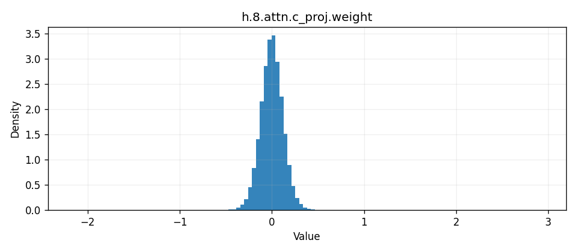

### `h.8.ln_1.bias`

- Shape: `(768,)`
- Dtype: `torch.float32`
- Numel: `768`
- Min: `-0.921227`
- Max: `1.454000`
- Mean: `0.013252`
- Std: `0.068664`

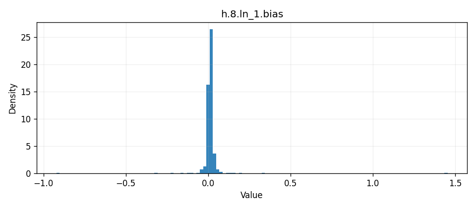

### `h.8.ln_1.weight`

- Shape: `(768,)`
- Dtype: `torch.float32`
- Numel: `768`
- Min: `0.065674`
- Max: `0.924786`
- Mean: `0.335226`
- Std: `0.044512`

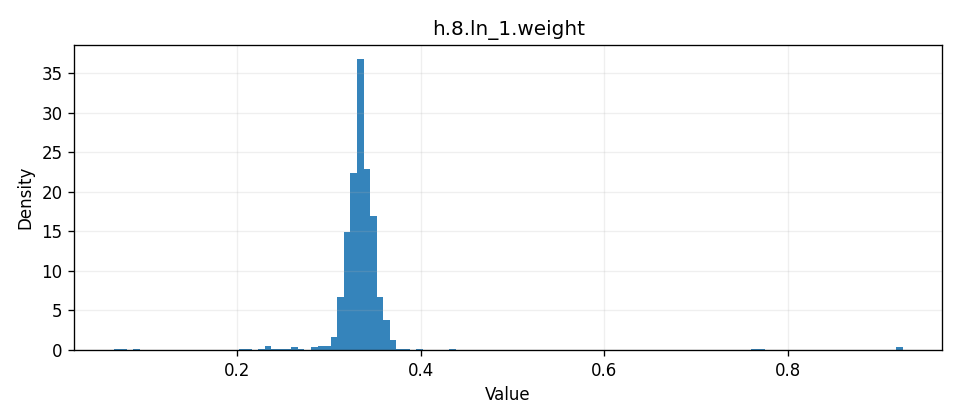

### `h.8.ln_2.bias`

- Shape: `(768,)`
- Dtype: `torch.float32`
- Numel: `768`
- Min: `-0.694954`
- Max: `0.452188`
- Mean: `0.000384`
- Std: `0.049337`

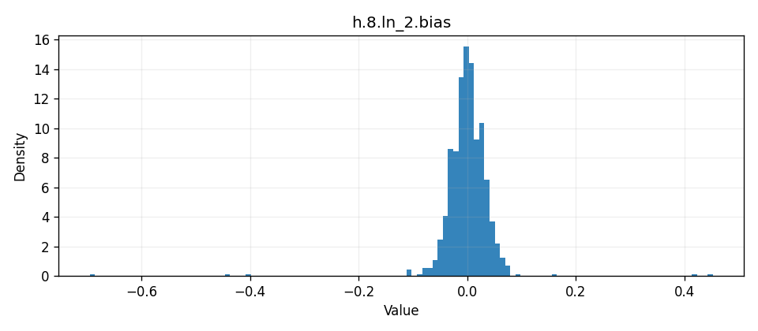

### `h.8.ln_2.weight`

- Shape: `(768,)`
- Dtype: `torch.float32`
- Numel: `768`
- Min: `0.018048`
- Max: `1.072196`
- Mean: `0.256656`
- Std: `0.041250`

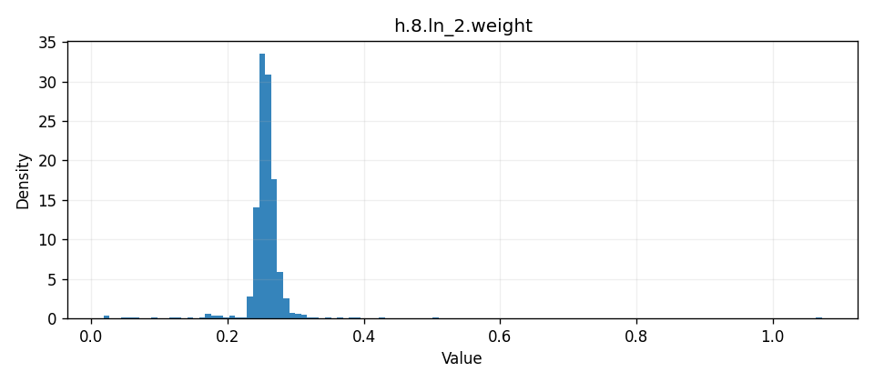

### `h.8.mlp.c_fc.bias`

- Shape: `(3072,)`
- Dtype: `torch.float32`
- Numel: `3072`
- Min: `-0.531748`
- Max: `0.993164`
- Mean: `-0.085058`
- Std: `0.093529`

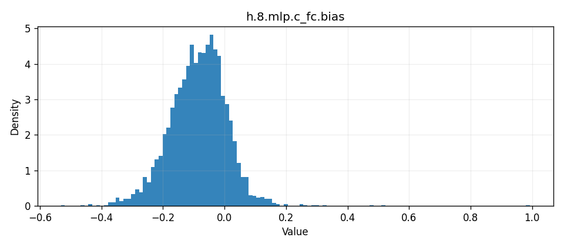

### `h.8.mlp.c_fc.weight`

- Shape: `(768, 3072)`
- Dtype: `torch.float32`
- Numel: `2359296`
- Min: `-1.222235`
- Max: `1.454446`
- Mean: `-0.002067`
- Std: `0.127281`

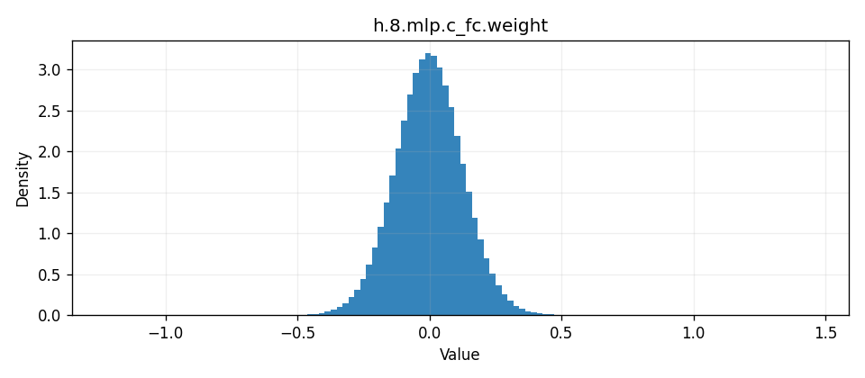

### `h.8.mlp.c_proj.bias`

- Shape: `(768,)`
- Dtype: `torch.float32`
- Numel: `768`
- Min: `-0.826779`
- Max: `1.220271`
- Mean: `0.001156`
- Std: `0.127275`

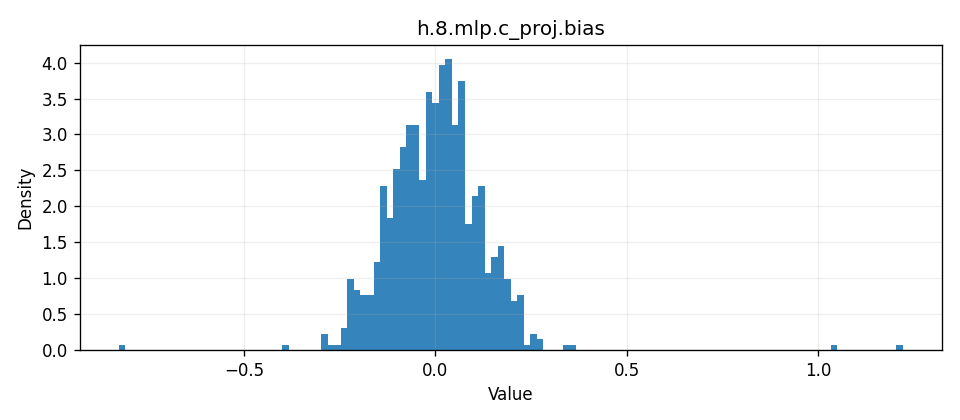

### `h.8.mlp.c_proj.weight`

- Shape: `(3072, 768)`
- Dtype: `torch.float32`
- Numel: `2359296`
- Min: `-3.650805`
- Max: `5.374008`
- Mean: `0.000047`
- Std: `0.135404`

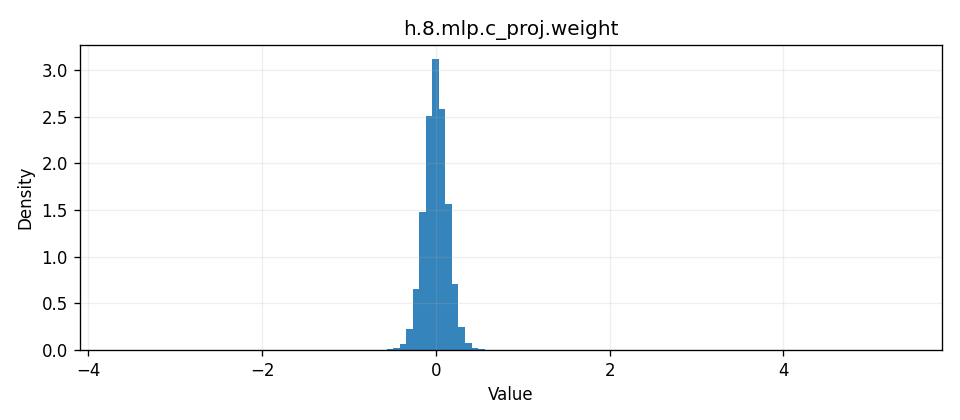

### `h.9.attn.bias`

- Shape: `(1, 1, 1024, 1024)`
- Dtype: `torch.float32`
- Numel: `1048576`
- Min: `0.000000`
- Max: `1.000000`
- Mean: `0.500488`
- Std: `0.500000`

### `h.9.attn.c_attn.bias`

- Shape: `(2304,)`
- Dtype: `torch.float32`
- Numel: `2304`
- Min: `-1.042450`
- Max: `0.803865`
- Mean: `0.000285`
- Std: `0.140495`

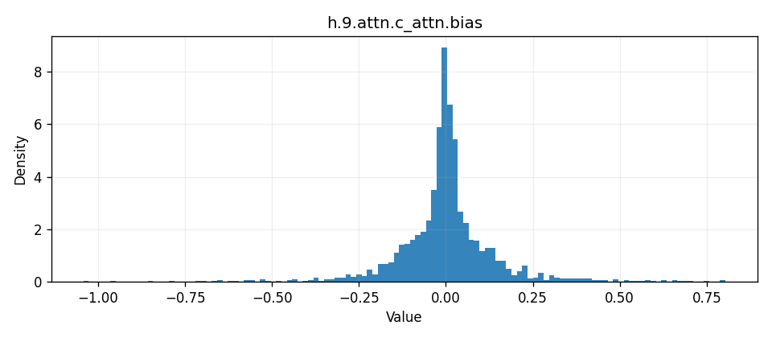

### `h.9.attn.c_attn.weight`

- Shape: `(768, 2304)`
- Dtype: `torch.float32`
- Numel: `1769472`
- Min: `-1.789063`
- Max: `1.986002`
- Mean: `-0.000070`
- Std: `0.126217`

### `h.9.attn.c_proj.bias`

- Shape: `(768,)`
- Dtype: `torch.float32`
- Numel: `768`
- Min: `-0.957508`
- Max: `1.896013`
- Mean: `0.002134`
- Std: `0.209354`

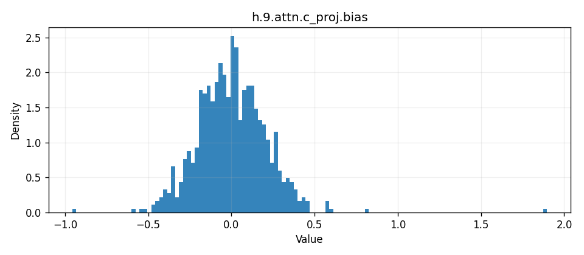

### `h.9.attn.c_proj.weight`

- Shape: `(768, 768)`
- Dtype: `torch.float32`
- Numel: `589824`
- Min: `-1.659629`
- Max: `1.986877`
- Mean: `-0.000028`
- Std: `0.136820`

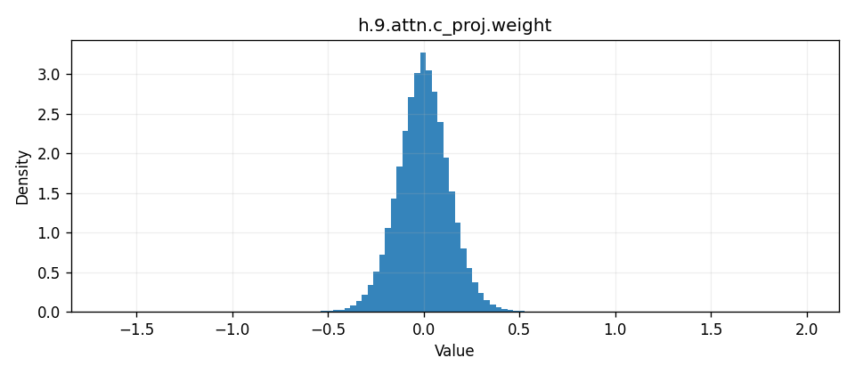

### `h.9.ln_1.bias`

- Shape: `(768,)`
- Dtype: `torch.float32`
- Numel: `768`
- Min: `-0.978511`
- Max: `1.263987`
- Mean: `0.015903`
- Std: `0.063827`

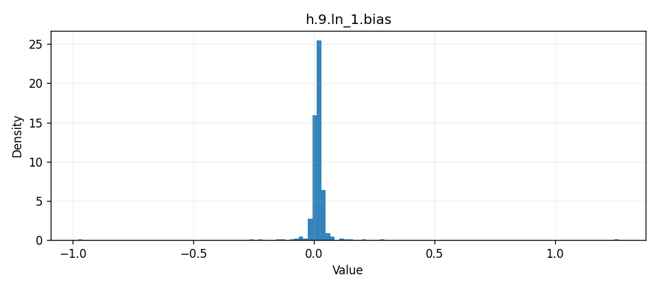

### `h.9.ln_1.weight`

- Shape: `(768,)`
- Dtype: `torch.float32`
- Numel: `768`
- Min: `0.069610`
- Max: `0.944995`
- Mean: `0.357556`
- Std: `0.046906`

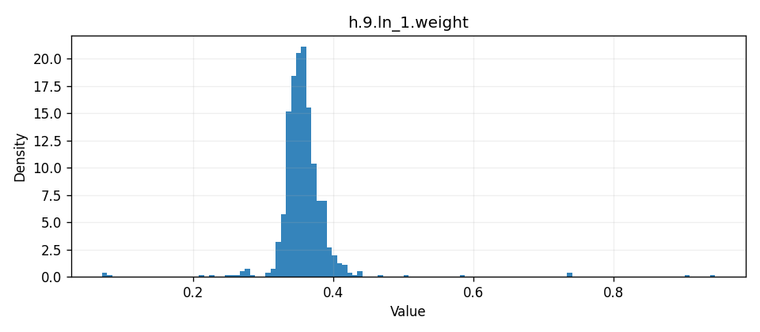

### `h.9.ln_2.bias`

- Shape: `(768,)`
- Dtype: `torch.float32`
- Numel: `768`
- Min: `-0.561008`
- Max: `0.513732`
- Mean: `0.006401`
- Std: `0.045681`

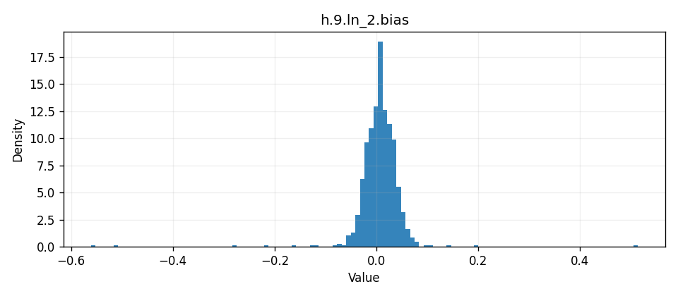

### `h.9.ln_2.weight`

- Shape: `(768,)`
- Dtype: `torch.float32`
- Numel: `768`
- Min: `0.017738`
- Max: `0.947594`
- Mean: `0.264975`
- Std: `0.041493`

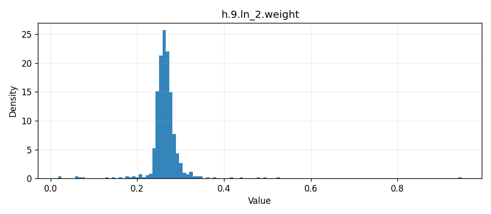

### `h.9.mlp.c_fc.bias`

- Shape: `(3072,)`
- Dtype: `torch.float32`
- Numel: `3072`
- Min: `-0.477637`
- Max: `0.610290`
- Mean: `-0.083667`
- Std: `0.092348`

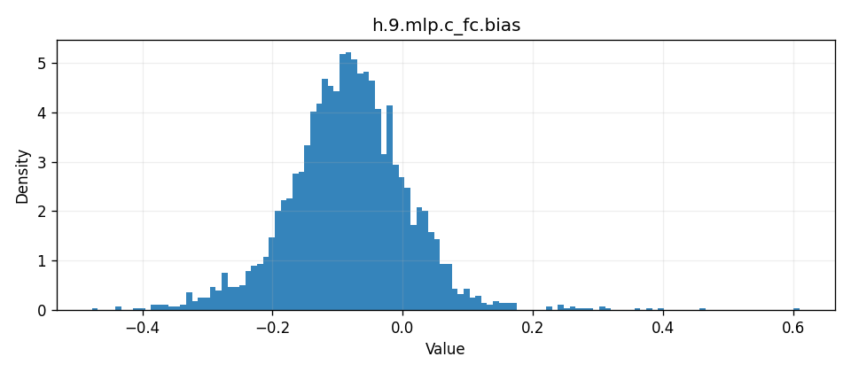

### `h.9.mlp.c_fc.weight`

- Shape: `(768, 3072)`
- Dtype: `torch.float32`
- Numel: `2359296`
- Min: `-2.781777`
- Max: `2.113970`
- Mean: `-0.002741`
- Std: `0.127619`

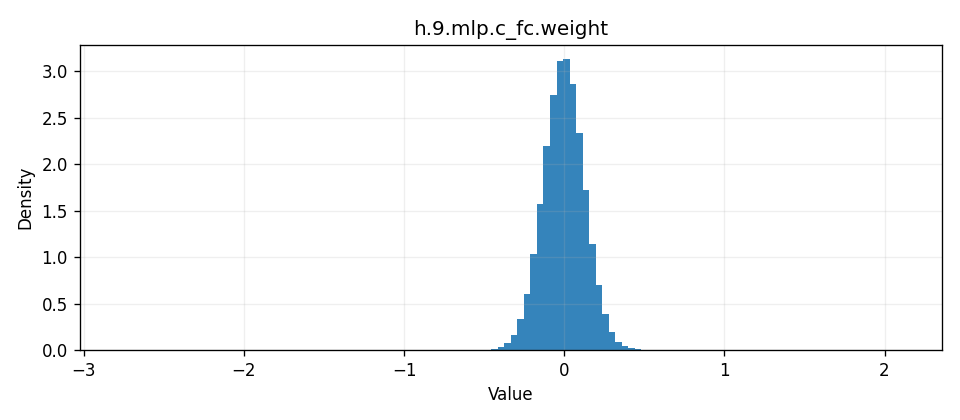

### `h.9.mlp.c_proj.bias`

- Shape: `(768,)`
- Dtype: `torch.float32`
- Numel: `768`
- Min: `-1.283000`
- Max: `1.489603`
- Mean: `0.000714`
- Std: `0.159079`

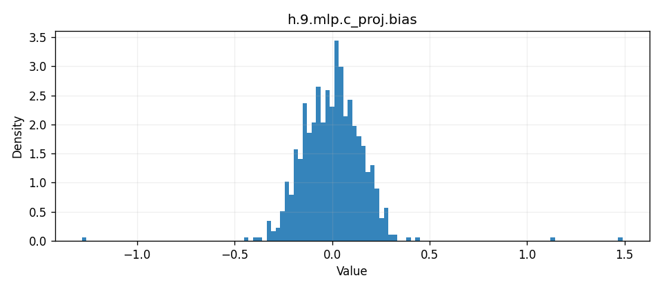

### `h.9.mlp.c_proj.weight`

- Shape: `(3072, 768)`
- Dtype: `torch.float32`
- Numel: `2359296`
- Min: `-5.487474`
- Max: `4.867183`
- Mean: `0.000035`
- Std: `0.155874`

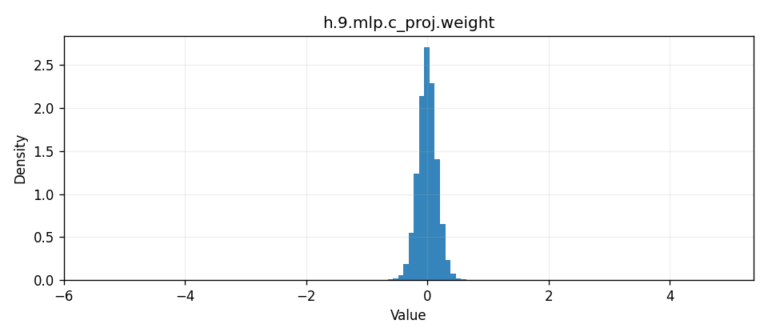

### `ln_f.bias`

- Shape: `(768,)`
- Dtype: `torch.float32`
- Numel: `768`
- Min: `-4.191765`
- Max: `7.368324`
- Mean: `-0.003138`
- Std: `0.419374`

### `ln_f.weight`

- Shape: `(768,)`
- Dtype: `torch.float32`
- Numel: `768`
- Min: `0.004427`
- Max: `17.419317`
- Mean: `1.507809`
- Std: `1.390172`

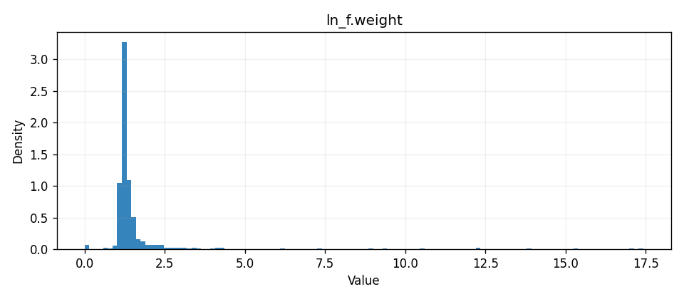

### `wpe.weight`

- Shape: `(1024, 768)`
- Dtype: `torch.float32`
- Numel: `786432`
- Min: `-4.538114`
- Max: `4.065311`
- Mean: `-0.000679`
- Std: `0.122691`

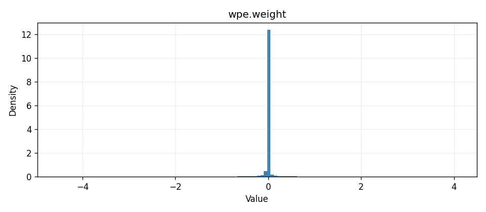

### `wte.weight`

- Shape: `(50257, 768)`
- Dtype: `torch.float32`
- Numel: `38597376`
- Min: `-1.269817`
- Max: `1.785156`
- Mean: `0.000380`
- Std: `0.143696`

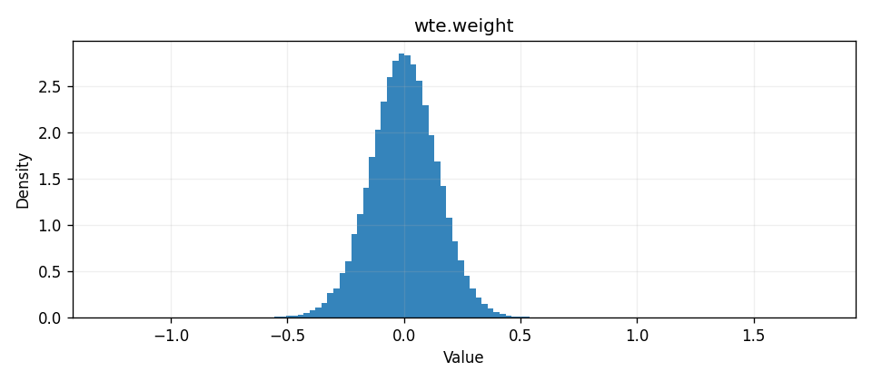
