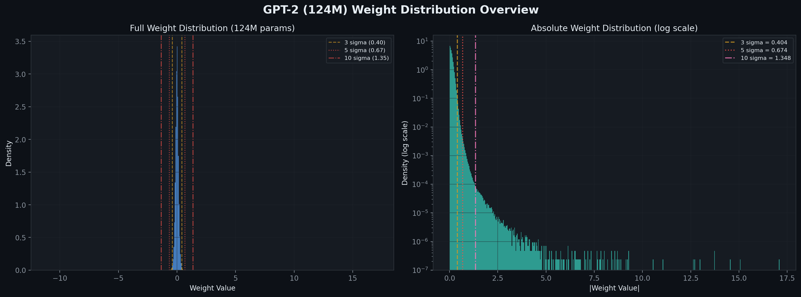
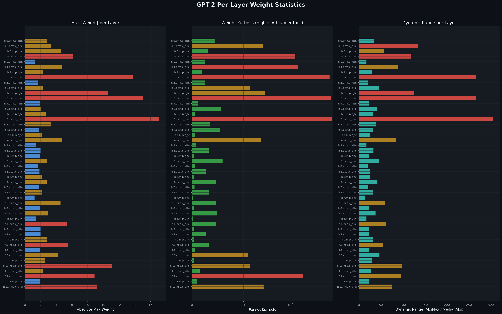
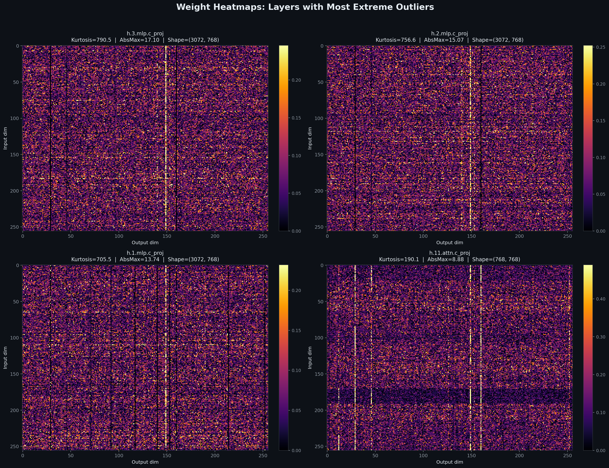
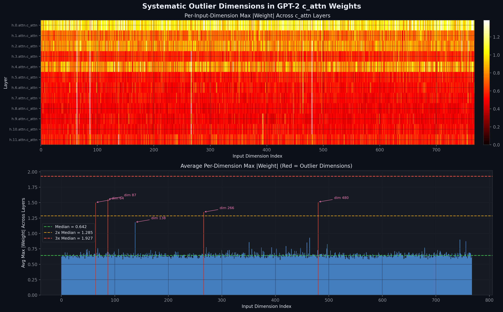
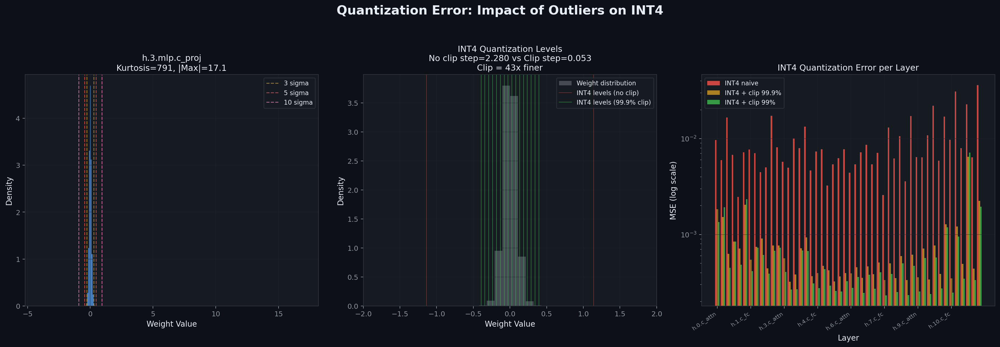
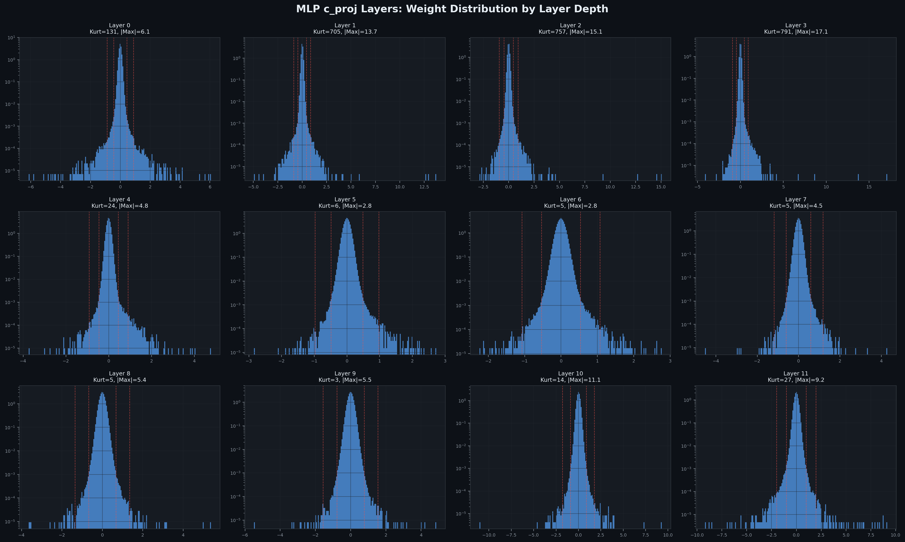

# Weight Outliers in LLMs: Empirical Analysis on GPT-2

An empirical study of weight outlier distributions in GPT-2 (124M), demonstrating why naive low-bit quantization fails and how outliers systematically cluster in specific dimensions and layer types.

Related: [[ai/llm/quantization/quantization_evolution]] · [[ai/llm/quantization/mxfp4_vs_nvfp4]] · [[ai/llm/quantization/deepseek_v3_fp4_quantization_notes]]

---

## Why This Matters

When you quantize a model to INT4 or FP4, you're mapping the full range of weight values into a tiny set of representable numbers (e.g., 16 levels for INT4). If a single outlier weight has magnitude 17 but 99.9% of weights are between -0.5 and 0.5, those 16 levels get spread across [-17, 17] — wasting almost all resolution on empty space. This is the central problem of quantization, and it's not a theoretical concern: it happens in every real transformer.

---

## Model & Methodology

- **Model:** GPT-2 (124M parameters, 12 layers, 768 hidden dim)
- **Scope:** All 2D weight matrices (50 tensors, 124.3M parameters total)
- **Outlier definition:** Values beyond Nσ from the layer mean (where σ = layer std)
- **Metrics:** Excess kurtosis (heavy-tailedness), dynamic range (AbsMax / MedianAbs), per-channel and per-dimension outlier clustering
- **Quantization simulation:** Symmetric uniform INT4/INT8 with and without percentile clipping

GPT-2 is small by modern standards, but the outlier patterns it exhibits are consistent with what's observed in larger models (6.7B+). In larger models, the effects are even more extreme.

---

## 1. Global Weight Distribution

### Key numbers

| Metric | Value |
|---|---|
| Total weight parameters | 124,318,464 |
| Global mean | -0.0005 |
| Global std (σ) | 0.135 |
| Global abs max | 17.10 |
| Abs max / σ | **127×** |

### Outlier prevalence by threshold

| Threshold | Count | Percentage |
|---|---|---|
| Beyond 3σ | 936,585 | 0.753% |
| Beyond 5σ | 75,299 | 0.061% |
| Beyond 8σ | 9,817 | 0.008% |
| Beyond 10σ | 4,653 | 0.004% |

**Takeaway:** The distribution is extremely heavy-tailed. In a true Gaussian, beyond 5σ you'd expect ~0.00006% — we observe 0.061%, which is **1000× more** than Gaussian. The right-side log-scale plot makes this visible: the tail extends far beyond what any normal distribution would produce.

---

## 2. Per-Layer Statistics

Three metrics per layer, color-coded by severity:

- **Max |Weight|:** How extreme is the single largest value?
- **Excess Kurtosis:** How heavy-tailed is the distribution? (Gaussian = 0, higher = heavier tails)
- **Dynamic Range:** AbsMax / MedianAbs — how much range is "wasted" on outliers?

### The MLP c_proj layers are the worst offenders

| Layer | Abs Max | Kurtosis | Dynamic Range |
|---|---|---|---|
| h.3.mlp.c_proj | 17.10 | **791** | 305 |
| h.2.mlp.c_proj | 15.07 | **757** | 266 |
| h.1.mlp.c_proj | 13.74 | **705** | 266 |
| h.1.attn.c_proj | 4.73 | **150** | 90 |
| h.0.mlp.c_proj | 6.14 | **131** | 119 |

Compare to well-behaved layers:

| Layer | Abs Max | Kurtosis | Dynamic Range |
|---|---|---|---|
| h.7.mlp.c_fc | 1.23 | 0.21 | 15 |
| h.8.mlp.c_fc | 1.45 | 0.20 | 17 |
| h.5.attn.c_attn | 1.39 | 0.76 | 17 |

**Takeaway:** Outlier severity varies by **3-4 orders of magnitude** across layers. The MLP projection layers (c_proj) in early-to-mid layers are dramatically worse. This is why uniform quantization across all layers is suboptimal — mixed-precision approaches that keep the worst layers at higher precision make sense.

---

## 3. Where Outliers Live: Weight Heatmaps

These heatmaps show |weight| for the 4 layers with highest kurtosis. The bright vertical lines are the key observation: **outliers concentrate in specific output channels**, not randomly scattered.

- `h.3.mlp.c_proj` (3072×768): ~206 channels (6.7%) are outlier channels
- `h.1.mlp.c_proj` (3072×768): ~288 channels (9.4%) are outlier channels
- `h.11.attn.c_proj` (768×768): ~111 channels (14.5%) are outlier channels

This channel-wise clustering is why **per-channel quantization** is so much better than per-tensor quantization — it isolates the impact of each channel's outliers from the rest.

---

## 4. Systematic Outlier Dimensions

This is the most important finding. Looking at the `c_attn` (QKV projection) weights across all 12 layers:

- **Top plot:** Heatmap of per-input-dimension max |weight| across all layers. Bright vertical stripes = dimensions that are consistently large.
- **Bottom plot:** Average max |weight| per dimension. Red bars = outlier dimensions.

### Persistent outlier dimensions

| Dimension | Appears in N/12 layers | Frequency |
|---|---|---|
| dim 87 | 6/12 | 50% |
| dim 64 | 5/12 | 42% |
| dim 480 | 4/12 | 33% |
| dim 266 | 3/12 | 25% |
| dim 138 | 2/12 | 17% |

**Takeaway:** The same handful of input dimensions are outliers across multiple layers. This matches Tim Dettmers' finding (LLM.int8(), 2022) that transformers use a small number of fixed "feature dimensions" for implicit scaling — in 6.7B+ models, he found only ~6 dimensions responsible for 150,000+ outliers per sequence. GPT-2 shows this pattern emerging even at 124M scale.

This systematic structure is what makes rotation-based methods (QuaRot, SpinQuant) effective: a Hadamard rotation can spread the energy of these few extreme dimensions across all dimensions, eliminating the outlier pattern entirely.

---

## 5. Impact on INT4 Quantization

### Left: The distribution problem
`h.3.mlp.c_proj` has 99.9% of its weights between -1 and 1, but a max of 17.1. The entire usable range is invisible at this scale.

### Middle: How outliers waste quantization levels
With naive INT4 (no clipping):
- Range: [-17.1, 17.1], step size = **2.28**
- Almost all 16 quantization levels fall in regions with zero actual weights

With 99.9% clipping:
- Range: [-0.79, 0.79], step size = **0.053**
- **43× finer resolution** for the values that actually matter

### Right: Per-layer MSE comparison

| Strategy | Typical MSE | vs Naive |
|---|---|---|
| INT4 naive | 5e-3 to 3.6e-2 | baseline |
| INT4 + clip 99.9% | 3e-4 to 6.5e-3 | **~10× better** |
| INT4 + clip 99% | 3e-4 to 2.3e-3 | **~10-15× better** |

But clipping means those outlier values are permanently lost. This is the fundamental tradeoff, and why more sophisticated methods exist:
- **SmoothQuant:** Transfers outlier magnitude from activations to weights (or vice versa) via channel-wise scaling
- **AWQ:** Scales salient weights before quantization to reduce their quantization error
- **QuaRot/SpinQuant:** Rotates weight/activation matrices to spread outlier energy across all dimensions
- **Mixed-precision:** Keeps the worst layers/channels at higher precision (FP8/FP16)

---

## 6. MLP c_proj Evolution by Layer Depth

All 12 MLP c_proj layers on log-scale y-axis. The pattern:

- **Layers 1-3:** Extremely heavy-tailed (kurtosis 700-800), with abs max reaching 13-17. These are the layers where the model learns to create the large "feature removal" signals described by Dettmers.
- **Layers 4-9:** Much calmer distributions (kurtosis 3-6, abs max 2-5). These are the "well-behaved" layers that quantize easily.
- **Layers 10-11:** Kurtosis rises again (14-27), abs max increases to 9-11. The final layers sharpen features for prediction.

**Takeaway:** This U-shaped pattern (early layers bad → middle layers fine → late layers bad again) matches the classic finding that first and last transformer layers are most sensitive to quantization. The DeepSeek V3 community found the same pattern: `down_proj` in early layers had to be kept at minimum 3-bit to avoid quality collapse.

---

## Implications for Quantization Strategy

### What this data tells us about different approaches:

| Approach | How it handles outliers | Effectiveness given our findings |
|---|---|---|
| **Per-tensor INT4** | Single scale for entire tensor | Terrible — one outlier ruins all 2.3M values in c_proj |
| **Per-channel INT4** | Separate scale per output channel | Much better — isolates outlier channels |
| **Per-group INT4** (group=128) | Separate scale per 128 values | Even better — further localizes outlier impact |
| **Block-scaled FP4** (NVFP4, block=16) | FP8 scale per 16 values | Good — small blocks naturally handle local outliers |
| **Clipping + INT4** | Sacrifice outliers for resolution | 10-15× MSE reduction but permanently loses extreme values |
| **SmoothQuant** | Redistribute outlier difficulty | Effective for activation outliers; less direct for weight outliers |
| **Rotation (QuaRot/SpinQuant)** | Mathematically spread outlier energy | Very effective — eliminates systematic dim-wise outliers entirely |
| **Mixed-precision** | Keep worst layers at FP8/FP16 | Practical — our data shows clear layer-wise severity tiers |

### For your NVFP4/MXFP4 work:

NVFP4's block size of 16 with E4M3 scale already handles outliers reasonably well — each block of 16 values gets its own high-precision scale, so a single outlier only affects 15 neighbors. This is why the Four Over Six (4/6) paper found that NVFP4's small block size "neutralizes traditional outlier mitigation techniques" — the block scaling is already doing much of the work.

MXFP4 (block=32, E8M0 power-of-two scale) is weaker here: larger blocks mean more values affected per outlier, and power-of-two scales are less precise than E4M3.

---

## References

- Tim Dettmers, "LLM.int8() and Emergent Features" (2022) — discovery of systematic outlier dimensions in transformers
- Yongqi An et al., "Systematic Outliers in Large Language Models" (arXiv:2502.06415, 2025) — outliers emerge from softmax, act as implicit context-aware scaling factors
- Liu et al., "SpinQuant: LLM quantization with learned rotations" (ICLR 2025) — rotation matrices eliminate outliers before quantization
- Ashkboos et al., "QuaRot: Outlier-Free 4-Bit Inference in Rotated LLMs" (2024) — random Hadamard rotations for outlier removal
- Xiao et al., "SmoothQuant: Accurate and Efficient Post-Training Quantization for Large Language Models" (2023)
- Lin et al., "AWQ: Activation-Aware Weight Quantization" (2024)
- Chen et al., "Four Over Six: Accurate NVFP4 Quantization with Adaptive Block Scaling" (arXiv:2512.02010, 2026)
- CMPQ, "Channel-Wise Mixed-Precision Quantization for LLMs" (arXiv:2410.13056, 2024)
