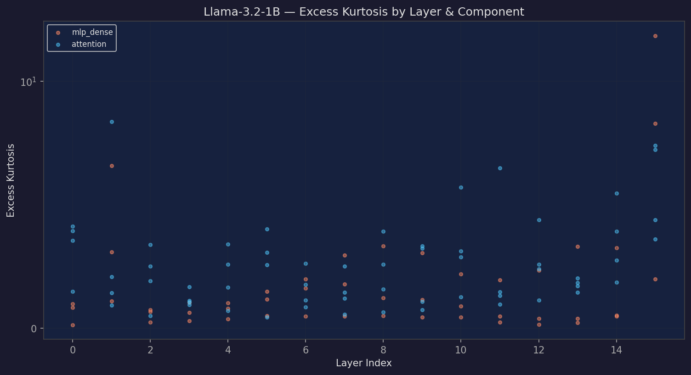
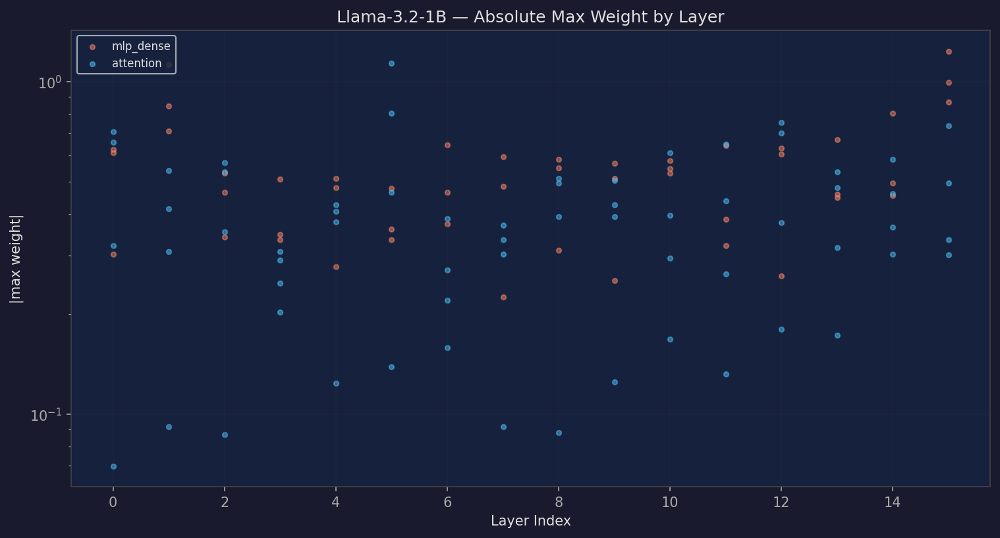
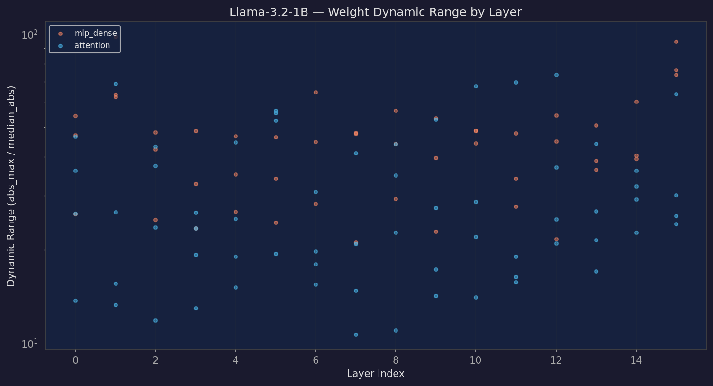
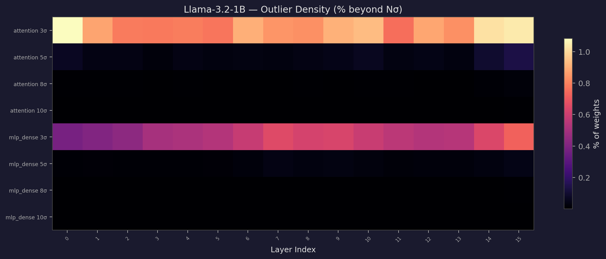
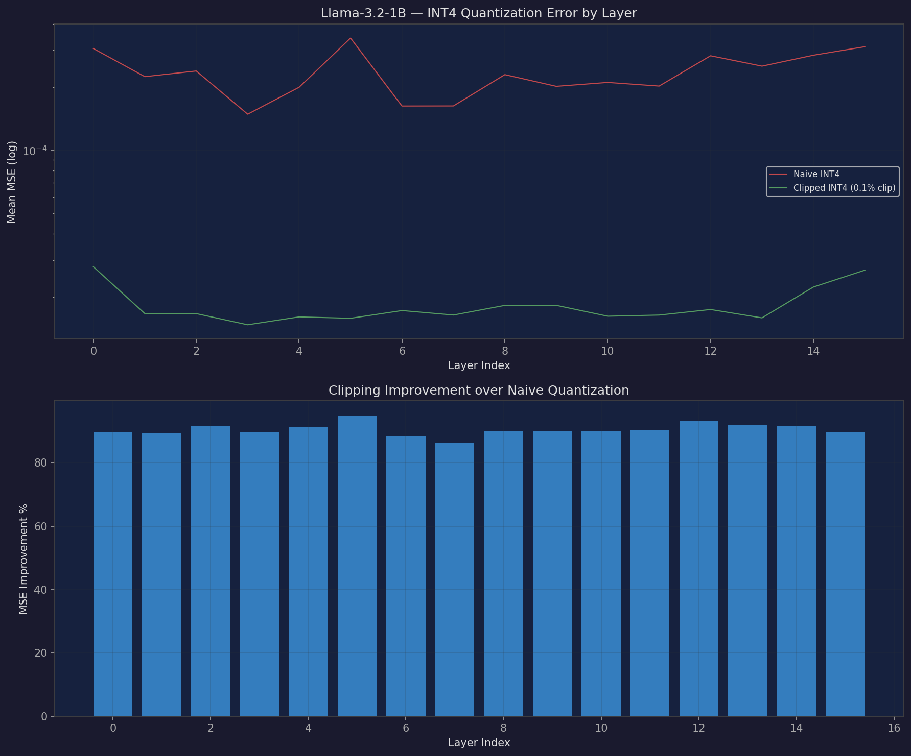
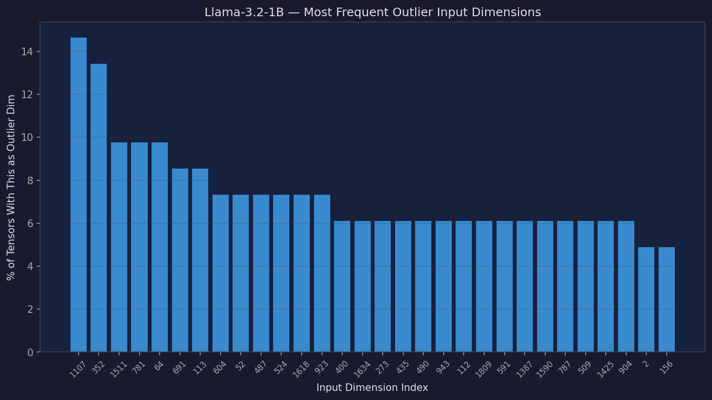
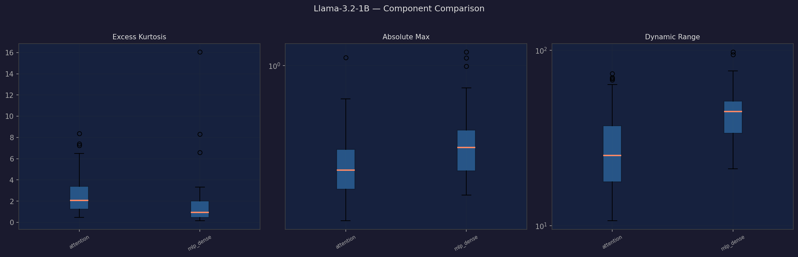
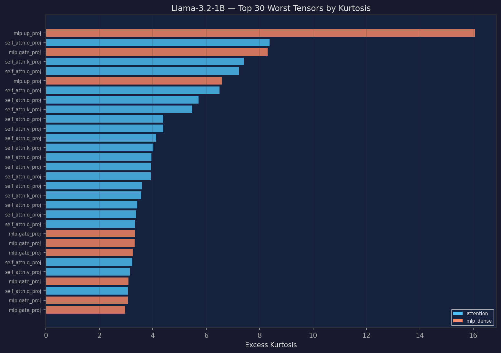

# Llama-3.2-1B — Weight Outlier Analysis

Generated: 2026-03-28 04:08
Tool: weight-outlier-analyzer

## Overview

- **Tensors analyzed**: 112
- **Parameters analyzed**: 973.1M
- **Components**: attention: 64, mlp_dense: 48
- **Global |max weight|**: 1.2344
- **Peak kurtosis**: 16.1
- **Mean INT4 clip improvement**: 90.4%

## Key Findings

**Near-Gaussian distributions**: Median kurtosis 1.61 suggests relatively well-behaved weight distributions.

**Worst component**: `mlp_dense` — max kurtosis 16.1, mean kurtosis 1.8 across 48 tensors.

**Systematic outlier dimensions**: dim 1107 (15%), dim 352 (13%), dim 1511 (10%), dim 781 (10%), dim 64 (10%) — these dimensions are outliers across many tensors, suggesting structural patterns in the weight space.

**Quantization**: Clipping to 99.9th percentile before INT4 quantization reduces MSE by up to 98% (mean 90.4%).

## Visualizations

### Kurtosis by Layer

Excess kurtosis per tensor, grouped by layer and component. Higher values indicate heavier tails / more outliers.

### Abs Max by Layer

Maximum absolute weight value per tensor. Spikes indicate tensors with extreme outlier values.

### Dynamic Range

Ratio of max absolute value to median absolute value. Higher ratios mean worse quantization behavior.

### Outlier Sigma Heatmap

Percentage of weights beyond Nσ thresholds, shown as a heatmap across layers and components.

### Quantization Error

INT4 quantization mean squared error — comparing naive quantization vs 99.9th percentile clipping.

### Outlier Dimensions

Input dimensions that are most frequently flagged as outliers. Systematic outlier dims affect many tensors.

### Component Summary

Box-plot comparison of kurtosis, absolute max, and dynamic range across component types.

### Worst Tensors

Top tensors ranked by excess kurtosis — the hardest to quantize.

## Component Breakdown

| Component | Count | Mean Kurtosis | Max Kurtosis | Mean |max| | Max |max| |
|-----------|------:|-------------:|------------:|----------:|--------:|
| attention | 64 | 2.6 | 8.4 | 0.3857 | 1.1328 |
| mlp_dense | 48 | 1.8 | 16.1 | 0.5345 | 1.2344 |

## Worst 10 Tensors (by Kurtosis)

| Tensor | Component | Kurtosis | |max| |
|--------|-----------|--------:|---------:|
| `model.layers.15.mlp.up_proj.weight` | mlp_dense | 16.1 | 1.2344 |
| `model.layers.1.self_attn.o_proj.weight` | attention | 8.4 | 0.5391 |
| `model.layers.15.mlp.gate_proj.weight` | mlp_dense | 8.3 | 0.9961 |
| `model.layers.15.self_attn.k_proj.weight` | attention | 7.4 | 0.4961 |
| `model.layers.15.self_attn.o_proj.weight` | attention | 7.2 | 0.7344 |
| `model.layers.1.mlp.up_proj.weight` | mlp_dense | 6.6 | 1.1250 |
| `model.layers.11.self_attn.o_proj.weight` | attention | 6.5 | 0.6484 |
| `model.layers.10.self_attn.o_proj.weight` | attention | 5.7 | 0.6094 |
| `model.layers.14.self_attn.k_proj.weight` | attention | 5.5 | 0.5820 |
| `model.layers.12.self_attn.o_proj.weight` | attention | 4.4 | 0.6992 |

## Systematic Outlier Dimensions

| Dimension | Frequency | % of Tensors |
|----------:|----------:|------------:|
| 1107 | 12 | 14.6% |
| 352 | 11 | 13.4% |
| 1511 | 8 | 9.8% |
| 781 | 8 | 9.8% |
| 64 | 8 | 9.8% |
| 691 | 7 | 8.5% |
| 113 | 7 | 8.5% |
| 604 | 6 | 7.3% |
| 52 | 6 | 7.3% |
| 487 | 6 | 7.3% |

## Sigma Outlier Density

| Threshold | Mean % Beyond |
|----------:|--------------:|
| 3σ | 0.7388% |
| 5σ | 0.0387% |
| 8σ | 0.0041% |
| 10σ | 0.0016% |

## Methodology

1. **Tensor selection**: Only 2D weight matrices (excluding embeddings, norms, biases, and routing gates)
2. **FP8 handling**: Models with FP8 weights are dequantized using `weight_scale_inv` block-wise scaling before analysis
3. **Outlier detection**: Both sigma-based (3/5/8/10σ) and channel/dimension-based
4. **Quantization simulation**: INT4 symmetric quantization with and without 99.9th percentile clipping
5. **Kurtosis**: Excess kurtosis (Fisher definition, = 0 for Gaussian). Higher values indicate heavier tails
