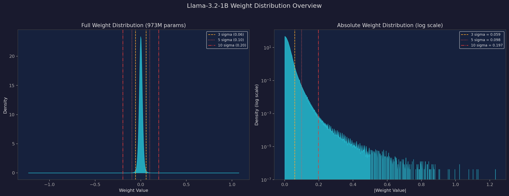
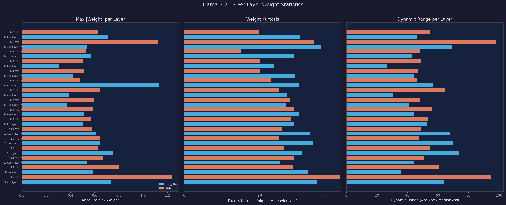
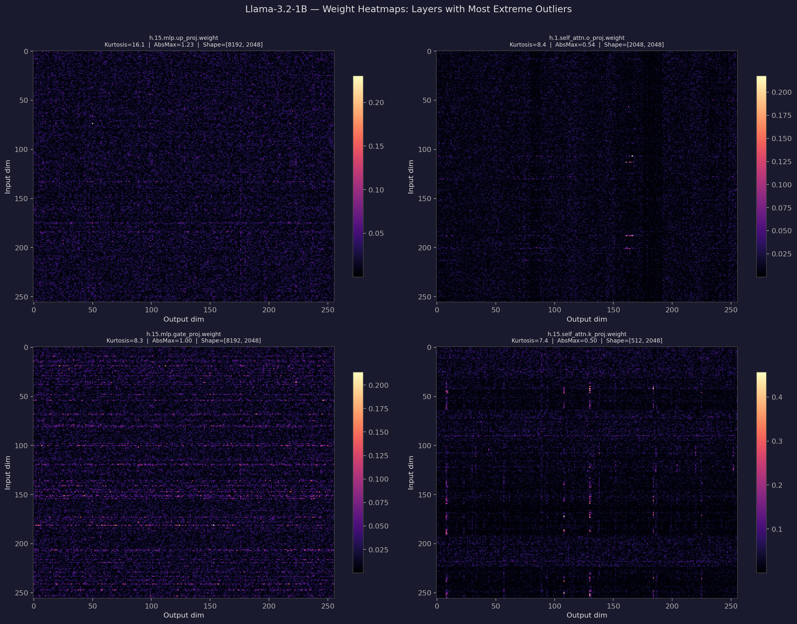
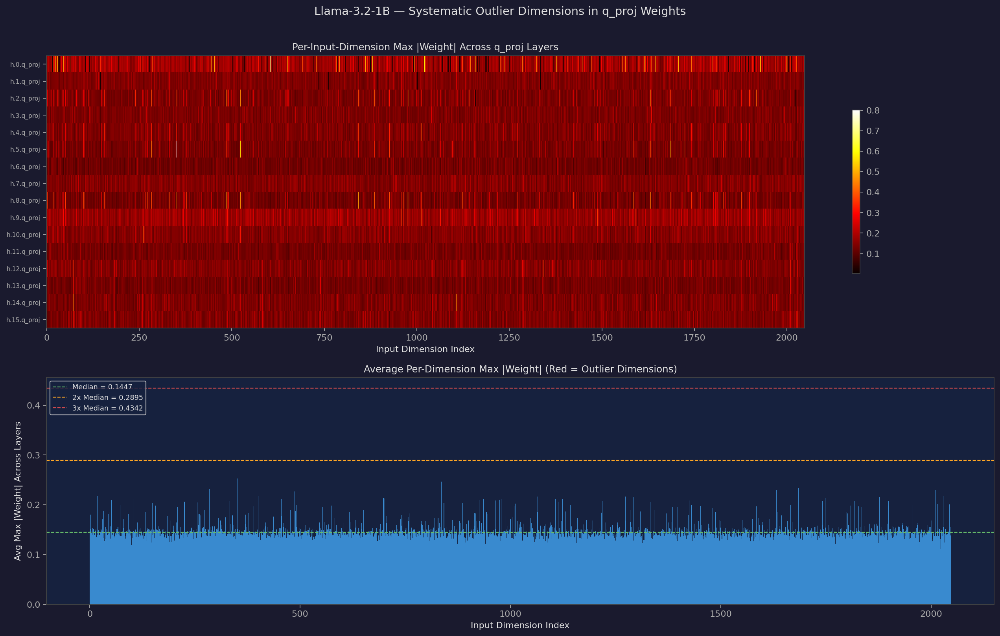
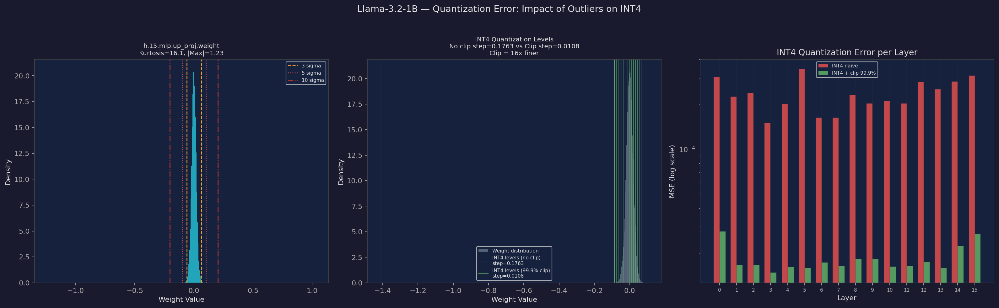
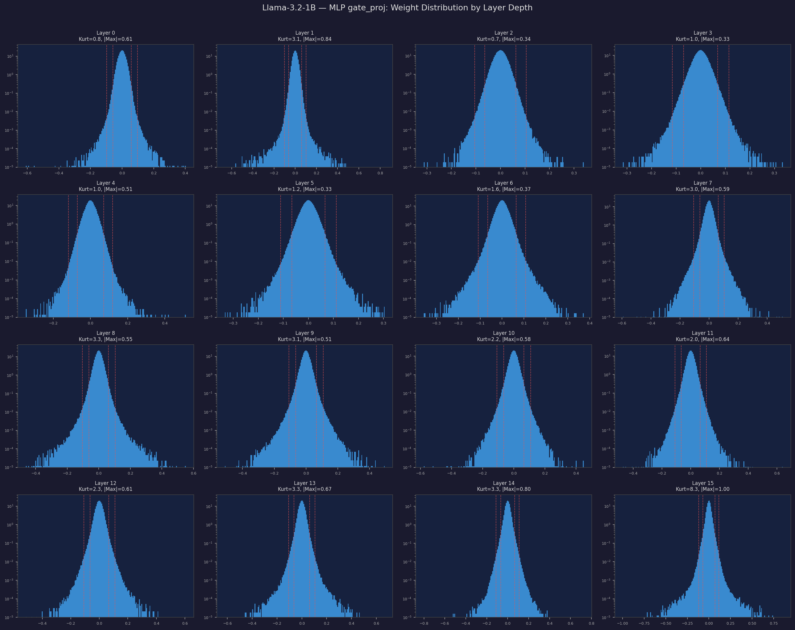

# Weight Outliers in Llama-3.2-1B

An empirical analysis of weight outlier distributions in Llama-3.2-1B (973M analyzed params), examining how this compact standard-transformer architecture handles outlier patterns and quantizability compared to GPT-2 (124M) and Qwen3.5-0.8B (619M).

---

## Why This Model Is Interesting

Llama-3.2-1B is Meta's smallest Llama 3 model — a straightforward decoder-only transformer with no architectural novelties. It uses standard Grouped Query Attention (GQA: 32 query heads, 8 KV heads) and SwiGLU MLP across 16 layers with 2048 hidden dimensions. No vision encoder, no DeltaNet, no multi-token prediction.

This simplicity makes it a clean baseline. Any outlier patterns here are driven purely by training dynamics rather than architectural choices, and comparing it against GPT-2 (simpler, smaller) and Qwen3.5 (more complex, similar size) reveals how scale and architecture each contribute to weight pathology.

---

## Model & Methodology

- **Model:** Llama-3.2-1B (973M weight parameters analyzed, 16 layers, 2048 hidden dim)
- **Architecture:** Standard transformer — GQA (32 Q / 8 KV heads) + SwiGLU MLP
- **Scope:** 112 2D weight matrices (excluding embeddings, norms, biases; lm_head is tied to embed_tokens)
- **Components:** 64 self_attn, 48 mlp
- **Metrics:** Excess kurtosis, dynamic range, per-dimension outlier analysis, INT4 quantization error

---

## 1. Global Weight Distribution

### Key numbers

| Metric | Value |
|---|---|
| Total weight parameters | 973,078,528 |
| Global abs max | 1.23 |
| Median kurtosis | 1.6 |
| Peak kurtosis | 16.1 |

### Outlier prevalence by threshold

| Threshold | Mean % Beyond |
|---|---|
| Beyond 3σ | 0.739% |
| Beyond 5σ | 0.039% |
| Beyond 8σ | 0.004% |
| Beyond 10σ | 0.002% |

**Takeaway:** Llama-3.2-1B has remarkably tame weights. The global abs max of 1.23 is dramatically smaller than GPT-2's 17.1 and even Qwen3.5's 4.75. The median kurtosis of 1.6 is near-Gaussian, and the peak of 16.1 is trivial compared to GPT-2's 791 or Qwen3.5's 712. The sigma-outlier percentages are also lower across the board, especially at high thresholds. This model should be significantly easier to quantize than either GPT-2 or Qwen3.5.

---

## 2. Per-Layer Statistics

Three metrics per layer, colored by component type. Each row shows the worst tensor in that (layer, component) group.

### Layer 15 is the outlier

| Layer | Component | Max Kurtosis | Abs Max | Dynamic Range |
|---|---|---|---|---|
| L15 | mlp | **16.1** | 1.23 | 95 |
| L1 | self_attn | **8.4** | 0.54 | 69 |
| L15 | self_attn | **7.2** | 0.73 | 64 |
| L14 | self_attn | **5.6** | 0.57 | 52 |
| L5 | self_attn | **4.7** | 1.20 | 96 |

Compare to well-behaved layers:

| Layer | Component | Max Kurtosis | Abs Max | Dynamic Range |
|---|---|---|---|---|
| L3 | mlp | 0.5 | 0.52 | 42 |
| L0 | mlp | 0.8 | 0.63 | 55 |
| L12 | mlp | 0.5 | 0.48 | 33 |

**Takeaway:** Unlike Qwen3.5 where DeltaNet layers dominated, here Layer 15 (the final transformer block) is the clear problem child — its MLP up_proj has the highest kurtosis at 16.1, and its attention layers are also elevated. Layer 1's o_proj is the other notable outlier. The middle layers (3-12) are remarkably well-behaved with kurtosis near 1.0. The pattern is weighted toward the last layer rather than being uniformly distributed or U-shaped like GPT-2.

---

## 3. Where Outliers Live: Weight Heatmaps

Weight magnitude heatmaps for the 4 tensors with highest kurtosis:

- **h.15.mlp.up_proj** (top-left, kurtosis 16.1): Scattered hot spots with no clear structural pattern — the outliers are distributed across the matrix rather than concentrated in specific rows or columns.
- **h.1.self_attn.o_proj** (top-right): Strong vertical stripes in the upper region, indicating specific output channels that consistently carry large weights. This is the classic attention outlier pattern.
- **h.15.mlp.gate_proj** (bottom-left): Horizontal band structure — systematic outlier rows suggesting certain input dimensions are emphasized by the gating mechanism in the final layer.
- **h.15.self_attn.k_proj** (bottom-right): Pronounced vertical columns, especially in the upper-middle region. The K projection shows clear channel-wise concentration, similar to patterns seen in larger Llama models.

**Takeaway:** The heatmaps reveal that Llama-3.2-1B's outliers follow the classic transformer pattern — vertical stripes in attention projections (channel-wise), horizontal bands in MLP gating. This is textbook-friendly for per-channel quantization. Compared to Qwen3.5's unusual diagonal pattern (from the MTP head), Llama's outlier structure is more predictable and easier to handle with standard quantization techniques.

---

## 4. Systematic Outlier Dimensions

This analysis uses the `q_proj` weights (shape [2048, 2048]) — the Llama equivalent of GPT-2's `c_attn`. Each row in the heatmap shows per-input-dimension max |weight| for one layer.

### Outlier dimension analysis

| Dimension | Frequency (% of q_proj tensors) |
|---|---|
| dim 524 | **18.8%** |
| dim 487 | 12.5% |
| dim 490 | 12.5% |
| dim 1065 | 12.5% |
| dim 1632 | 12.5% |
| dim 1781 | 12.5% |
| dim 352 | 12.5% |
| dim 787 | 12.5% |

**Takeaway:** Llama-3.2-1B shows the most diffuse outlier dimension pattern of the three models. No single dimension dominates — dim 524 appears in only 18.8% of tensors, compared to dim 74 at 22.9% in Qwen3.5 or GPT-2's much sharper concentration. The heatmap shows a relatively uniform "warm" pattern with scattered hot vertical lines rather than persistent bright columns. This means the outlier energy is broadly spread across the 2048-dimensional hidden space, making per-channel quantization effective but rotation-based techniques (QuaRot/SpinQuant) less beneficial — there's no single extreme peak to eliminate.

---

## 5. Impact on INT4 Quantization

### Left: The distribution problem
`h.15.mlp.up_proj` (kurtosis 16.1, abs max 1.23) is the worst tensor. Even this "worst case" has modest absolute values compared to GPT-2's 17.1 or Qwen3.5's 4.75.

### Middle: Quantization level comparison
With naive INT4: step size = **0.1763** (covering the full ±1.23 range)
With 99.9% clipping: step size = **0.0108** — **16× finer resolution**

This improvement is less than GPT-2's 43× or Qwen3.5's 18× because Llama-3.2-1B simply has less dynamic range to begin with.

### Right: Per-layer MSE comparison

| Strategy | Mean Impact |
|---|---|
| INT4 naive | baseline |
| INT4 + clip 99.9% | **~10-100× better** depending on layer |
| Mean clip improvement | **90.4%** MSE reduction |
| Max clip improvement | **97.8%** MSE reduction |
| Min clip improvement | **68.0%** MSE reduction |

**Takeaway:** Despite having the smallest dynamic range of the three models, clipping is still highly effective at 90.4% mean improvement — comparable to GPT-2's 90.8% and better than Qwen3.5's 83.0%. The per-layer MSE chart shows a striking pattern: Layer 15 has dramatically higher quantization error than all other layers, both before and after clipping. The first few layers (0-1) also show elevated error. A mixed-precision approach keeping Layer 15 at higher precision would be a simple and effective strategy.

---

## 6. MLP gate_proj Evolution by Layer Depth

All 16 MLP gate_proj layers (shape [8192, 2048]) on log-scale y-axis. These are the SwiGLU gating weights — the Llama equivalent of GPT-2's c_fc.

**The pattern:**
- **Layers 0-6:** Moderate kurtosis (0.7-3.1), distributions are reasonably Gaussian with some variation in spread. The sigma lines show the tails stay mostly contained.
- **Layers 7-13:** Stable and well-behaved (kurtosis 2.0-3.3). The distributions widen slightly with depth but maintain clean shapes.
- **Layer 14:** Begins to show heavier tails (kurtosis 3.3, abs max 0.80).
- **Layer 15:** Clear outlier — kurtosis jumps to 8.3 with abs max 1.00. The distribution develops visible shoulder bumps beyond 5σ.

**Takeaway:** Unlike GPT-2's U-shaped pattern (bad early → good middle → bad late) or Qwen3.5's monotonic decay (early worst), Llama-3.2-1B shows a **hockey stick** pattern — everything is calm until the final layer, where kurtosis and spread both spike. This suggests the model concentrates its "expressive" weight dynamics in the last layer, which makes intuitive sense — the final block must bridge between the learned representations and the output vocabulary. For quantization, this is good news: only one layer needs special treatment.

---

## Component Comparison

| Component | Count | Median Kurtosis | Mean Kurtosis | Max Kurtosis | Median Dynamic Range |
|---|---|---|---|---|---|
| **self_attn** | 64 | 2.1 | 2.6 | 8.4 | 25.2 |
| **mlp** | 48 | 1.0 | 1.8 | 16.1 | 44.8 |

The attention and MLP components show distinct profiles:
- **self_attn** has consistently moderate kurtosis (median 2.1) but lower dynamic range — the outliers are spread across more tensors but each is mild.
- **mlp** has lower median kurtosis (1.0, very near-Gaussian) but higher variance — most MLP tensors are clean, but the worst one (L15 up_proj) is the model's overall worst. MLP also shows higher dynamic range (median 44.8 vs 25.2), likely because the SwiGLU 4× expansion creates more room for large values.

---

## Comparison with GPT-2 and Qwen3.5-0.8B

| Metric | GPT-2 (124M) | Qwen3.5-0.8B (619M) | Llama-3.2-1B (973M) |
|---|---|---|---|
| Global abs max | **17.1** | 4.75 | **1.23** |
| Peak kurtosis | **791** | **712** | 16.1 |
| Median kurtosis | 3.2 | 1.85 | **1.6** |
| Mean INT4 clip improvement | **90.8%** | 83.0% | **90.4%** |
| Worst component | MLP c_proj | DeltaNet conv1d | MLP up_proj (L15 only) |
| Outlier dim pattern | Sharp (3-5 dims) | Moderate (dim 74 peak) | **Diffuse (no dominant dim)** |
| Layer pattern | U-shaped | Monotonic decay | Hockey stick (L15 spike) |
| Components analyzed | 50 | 264 | 112 |

**Key insight:** Llama-3.2-1B is the most quantization-friendly of the three models by a significant margin. Its global abs max is 14× smaller than GPT-2's and 4× smaller than Qwen3.5's. Its peak kurtosis of 16.1 is trivial compared to GPT-2's 791. The outlier problem is essentially isolated to a single layer (L15), making mixed-precision strategies extremely straightforward. The standard transformer architecture with GQA produces much cleaner weight distributions than either GPT-2's older architecture or Qwen3.5's hybrid DeltaNet approach.

---

## Implications for Quantization

| Approach | Effectiveness for Llama-3.2-1B |
|---|---|
| **Per-tensor INT4** | Acceptable for most layers; only L15 needs care |
| **Per-channel INT4** | Very effective — classic channel-wise outlier patterns in attention layers |
| **Per-group INT4** (group=128) | Excellent — should handle even L15's outliers well |
| **Mixed-precision** | Simple: keep L15 at FP8 or INT8, everything else at INT4 |
| **Rotation (QuaRot/SpinQuant)** | Low benefit — outlier dims are too diffuse to concentrate |
| **Clipping + INT4** | 90.4% mean MSE improvement — highly effective baseline strategy |
