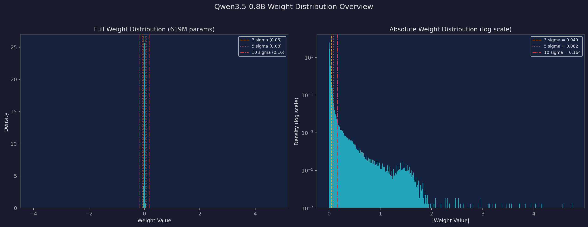
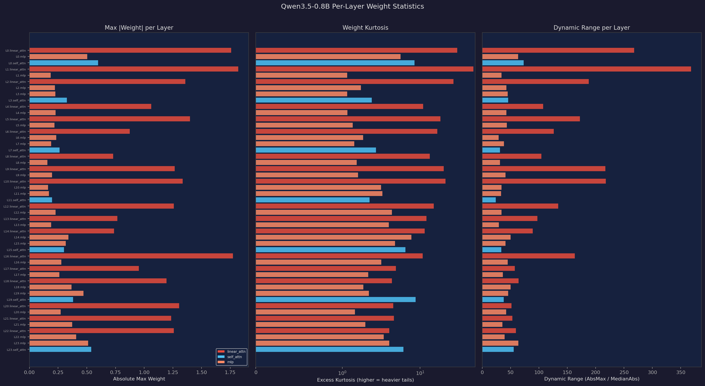
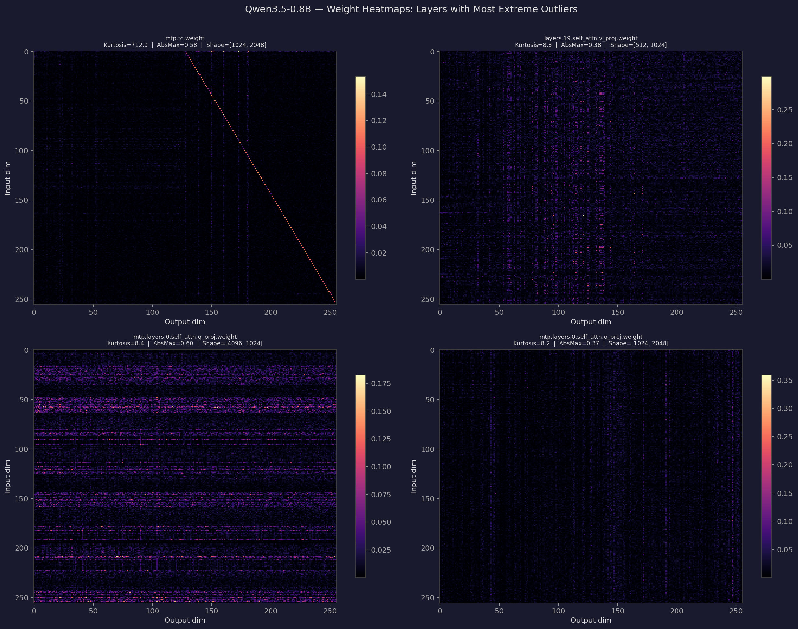
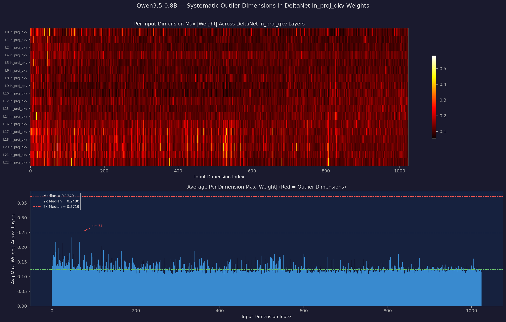
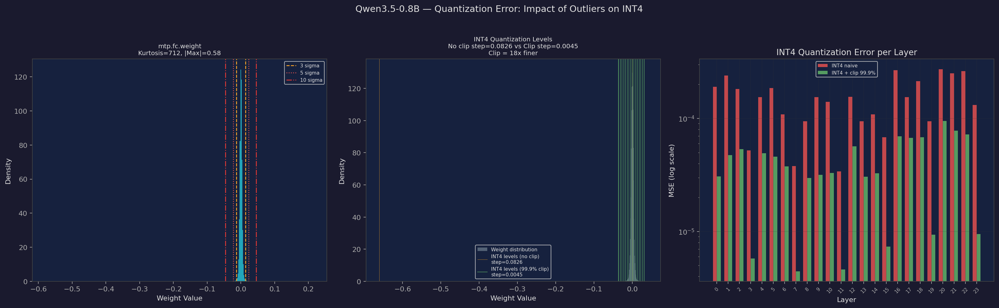
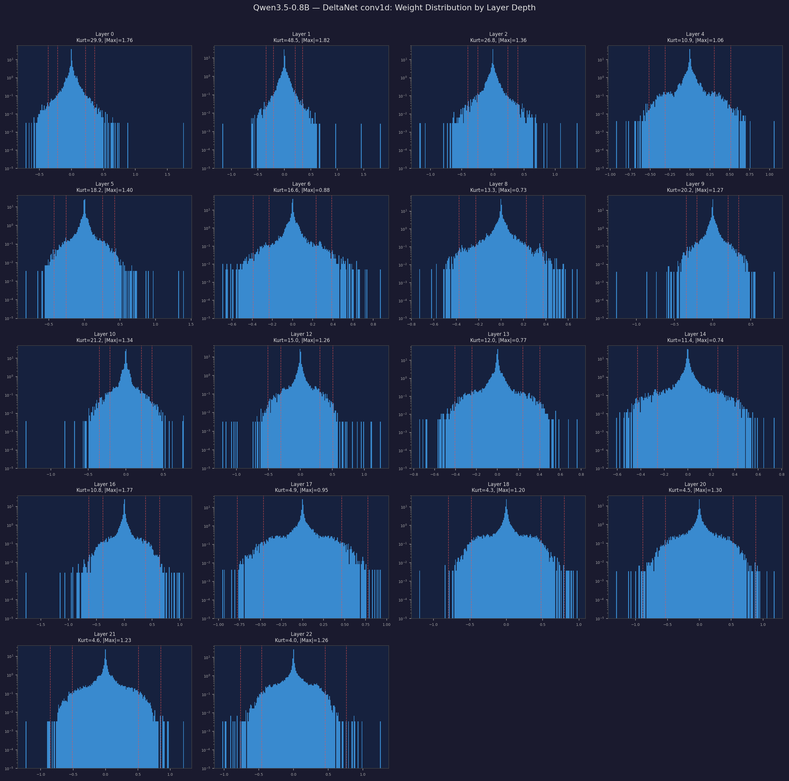

# Weight Outliers in Qwen3.5-0.8B

An empirical analysis of weight outlier distributions in Qwen3.5-0.8B (619M analyzed params), examining how its novel hybrid architecture — Gated DeltaNet + sparse Gated Attention — affects outlier patterns and quantizability compared to standard transformers like GPT-2.

---

## Why This Model Is Interesting

Qwen3.5-0.8B is not a vanilla transformer. Its architecture uses a repeating pattern of `6 × (3 × Gated DeltaNet → FFN → 1 × Gated Attention → FFN)`, meaning 75% of its "attention" layers are DeltaNet (linear attention with conv1d gating) rather than standard scaled dot-product attention. This creates a fundamentally different outlier landscape than GPT-2 or Llama.

Additionally, Qwen3.5 includes a vision encoder and a multi-token prediction (MTP) head, both of which contribute unique outlier signatures.

---

## Model & Methodology

- **Model:** Qwen3.5-0.8B (619M weight parameters analyzed, 24 layers, 1024 hidden dim)
- **Architecture:** Hybrid — Gated DeltaNet (linear_attn) + Gated Attention (self_attn) + SwiGLU MLP
- **Layout:** 6 × (3 × DeltaNet → FFN → 1 × Attention → FFN)
- **Scope:** 264 2D weight matrices (excluding embeddings, norms, biases)
- **Components:** 108 linear_attn, 75 mlp, 52 visual, 28 self_attn, 1 mtp
- **Metrics:** Excess kurtosis, dynamic range, per-dimension outlier analysis, INT4 quantization error

---

## 1. Global Weight Distribution

### Key numbers

| Metric | Value |
|---|---|
| Total weight parameters | 618,971,136 |
| Global abs max | 4.75 |
| Median kurtosis | 1.85 |
| Peak kurtosis | 712.0 |

### Outlier prevalence by threshold

| Threshold | Mean % Beyond |
|---|---|
| Beyond 3σ | 0.988% |
| Beyond 5σ | 0.080% |
| Beyond 8σ | 0.007% |
| Beyond 10σ | 0.003% |

**Takeaway:** Compared to GPT-2 (global abs max = 17.1), Qwen3.5's weight range is much tamer at 4.75. The median kurtosis of 1.85 is near-Gaussian, though the peak of 712 (from the MTP head) rivals GPT-2's worst. The sigma-outlier percentages are similar to GPT-2, suggesting that while individual extremes are smaller, the relative shape of the tails is comparable.

---

## 2. Per-Layer Statistics

Three metrics per layer, colored by component type. Each row shows the worst tensor in that (layer, component) group.

### DeltaNet layers are the worst offenders

| Layer | Component | Max Kurtosis | Abs Max | Dynamic Range |
|---|---|---|---|---|
| L1 | linear_attn | **48.5** | 1.82 | 297 |
| L0 | linear_attn | **29.9** | 1.76 | 285 |
| L2 | linear_attn | **26.8** | 1.36 | 191 |
| L10 | linear_attn | **21.2** | 1.34 | 159 |
| L9 | linear_attn | **20.2** | 1.27 | 201 |

Compare to well-behaved MLP layers:

| Layer | Component | Max Kurtosis | Abs Max | Dynamic Range |
|---|---|---|---|---|
| L3 | mlp | 1.0 | 0.26 | 31 |
| L7 | mlp | 1.1 | 0.18 | 22 |
| L11 | mlp | 0.9 | 0.16 | 22 |

**Takeaway:** The DeltaNet layers (red bars) consistently dominate both kurtosis and abs max. The conv1d gating weights in early layers (0-2) are especially problematic — these are the Gated DeltaNet's unique components with no equivalent in standard transformers. In contrast, the self_attn layers (blue, appearing every 4th layer) and MLP layers (orange) are relatively calm. This suggests mixed-precision quantization should prioritize the DeltaNet-specific weights.

---

## 3. Where Outliers Live: Weight Heatmaps

Weight magnitude heatmaps for the 4 tensors with highest kurtosis among language model components:

- **mtp.fc** (top-left, kurtosis 712): Shows a striking diagonal pattern — the MTP prediction head has learned a near-identity mapping with extremely sparse off-diagonal weights.
- **self_attn.v_proj L19** (top-right): Visible vertical stripes indicating per-channel outlier concentration, similar to GPT-2's pattern.
- **mtp self_attn.q_proj** (bottom-left): Prominent horizontal bands — systematic outlier rows in the query projection.
- **mtp self_attn.o_proj** (bottom-right): Column-wise outlier pattern consistent with specific output channels concentrating large weights.

**Takeaway:** The outlier structure varies significantly by component type. The MTP head's diagonal pattern is unique — it doesn't have the vertical-stripe pattern typical of transformers. The self_attn layers do show the familiar channel-wise clustering, suggesting per-channel quantization would be effective there, while the MTP head may need special treatment.

---

## 4. Systematic Outlier Dimensions

This analysis uses the DeltaNet `in_proj_qkv` weights (the QKV projection, shape [6144, 1024]) — the Qwen3.5 equivalent of GPT-2's `c_attn`. Each row in the heatmap shows per-input-dimension max |weight| for one layer.

### Persistent outlier dimensions

| Dimension | Frequency (% of tensors) |
|---|---|
| dim 74 | **22.9%** |
| dim 8 | 9.8% |
| dim 42 | 9.2% |
| dim 46 | 7.8% |
| dim 140 | 7.8% |
| dim 88 | 7.8% |
| dim 66 | 7.2% |
| dim 0 | 7.2% |

**Takeaway:** Dim 74 is the clear standout — it's an outlier in nearly 1 in 4 tensors. However, the pattern is more diffuse than GPT-2's sharp concentration on dims 87/64/480. GPT-2 had 3-5 dimensions that were dramatically larger; Qwen3.5 spreads the outlier energy across ~10 dimensions, each at a more modest level. This diffuse pattern may mean rotation-based methods (QuaRot/SpinQuant) are slightly less impactful here since there's no single extreme peak to eliminate, but per-channel quantization targeting dim 74 would still help.

---

## 5. Impact on INT4 Quantization

### Left: The distribution problem
`mtp.fc` (kurtosis 712) is the single worst tensor — but its abs max is only 0.58, much smaller than GPT-2's 17.1. The distribution is extremely peaked around 0 (the near-identity mapping).

### Middle: Quantization level comparison
With naive INT4: step size = **0.0826** (covering the full ±0.58 range)
With 99.9% clipping: step size = **0.0045** — **18× finer resolution**

This is less dramatic than GPT-2's 43× improvement because Qwen3.5's dynamic range is smaller. But the improvement is still substantial.

### Right: Per-layer MSE comparison

| Strategy | Mean Impact |
|---|---|
| INT4 naive | baseline |
| INT4 + clip 99.9% | **~10× better** for most layers |
| Mean clip improvement | **83.0%** MSE reduction |
| Max clip improvement | **97.8%** MSE reduction |

**Takeaway:** Clipping is highly effective across the board (83% mean improvement), but with smaller absolute magnitude than GPT-2 (where it was 90.8%). The early DeltaNet layers (L0-L2) show the largest gap between naive and clipped MSE, reinforcing that these are the quantization-sensitive layers.

---

## 6. DeltaNet conv1d Evolution by Layer Depth

All 18 DeltaNet conv1d layers (shape [6144, 1, 4]) on log-scale y-axis. These are the gating weights unique to Qwen3.5's hybrid architecture.

**The pattern:**
- **Layers 0-2:** Heavy-tailed (kurtosis 27-49), abs max 1.4-1.8. The model learns aggressive gating signals early.
- **Layers 4-14:** Moderate kurtosis (11-21), abs max 0.7-1.4. Still heavier-tailed than the MLP/attention components, but more manageable.
- **Layers 16-22:** Much calmer (kurtosis 4-5), abs max 0.9-1.3. The later DeltaNet layers settle into more Gaussian distributions.

**Takeaway:** Unlike GPT-2's U-shaped pattern (bad early → good middle → bad late), Qwen3.5's DeltaNet conv1d shows a monotonic decay — early layers are worst, middle layers moderate, late layers calm. This suggests the model front-loads its heavy gating decisions. For mixed-precision quantization, the first ~6 DeltaNet layers would benefit most from higher precision.

---

## Component Comparison

| Component | Count | Median Kurtosis | Mean Kurtosis | Max Kurtosis | Median Dynamic Range |
|---|---|---|---|---|---|
| **linear_attn** | 108 | 2.73 | 4.57 | 48.5 | 26.9 |
| **self_attn** | 28 | 2.37 | 3.25 | 8.8 | 23.8 |
| **mlp** | 75 | 1.09 | 1.53 | 7.7 | 27.3 |
| **visual** | 52 | 1.33 | 2.86 | 37.1 | 15.3 |
| **mtp** | 1 | 712.0 | 712.0 | 712.0 | — |

The clear hierarchy: MTP head (extreme outlier) > DeltaNet linear_attn > self_attn > visual > MLP.

---

## Comparison with GPT-2

| Metric | GPT-2 (124M) | Qwen3.5-0.8B (619M) |
|---|---|---|
| Global abs max | **17.1** | 4.75 |
| Peak kurtosis | **791** (h.3.mlp.c_proj) | **712** (mtp.fc) |
| Median kurtosis | 3.2 | **1.85** |
| Mean INT4 clip improvement | **90.8%** | 83.0% |
| Worst component | MLP c_proj (early layers) | DeltaNet conv1d (early layers) |
| Outlier dim pattern | Sharp (3-5 dims dominate) | Diffuse (~10 dims, dim 74 strongest) |
| Layer pattern | U-shaped (early/late bad) | Monotonic decay (early worst) |

Qwen3.5 is broadly better-behaved for quantization than GPT-2, with smaller dynamic range, lower median kurtosis, and no single tensor with the extreme abs max values seen in GPT-2. However, the DeltaNet-specific components (conv1d, in_proj) introduce a new category of quantization-sensitive weights that doesn't exist in standard transformers, and the MTP head is a singular extreme outlier.

---

## Implications for Quantization

| Approach | Effectiveness for Qwen3.5 |
|---|---|
| **Per-tensor INT4** | Poor for DeltaNet conv1d/in_proj, acceptable for MLP |
| **Per-channel INT4** | Good — channel-wise clustering visible in self_attn and visual tensors |
| **Per-group INT4** (group=128) | Effective — especially for DeltaNet layers with localized outliers |
| **Mixed-precision** | Most promising — keep DeltaNet conv1d L0-L5 and MTP at FP8, rest at INT4 |
| **Rotation (QuaRot/SpinQuant)** | Moderate benefit — outlier dims are more diffuse than GPT-2, less concentrated to eliminate |
| **Clipping + INT4** | 83% mean MSE improvement — effective as a baseline strategy |
