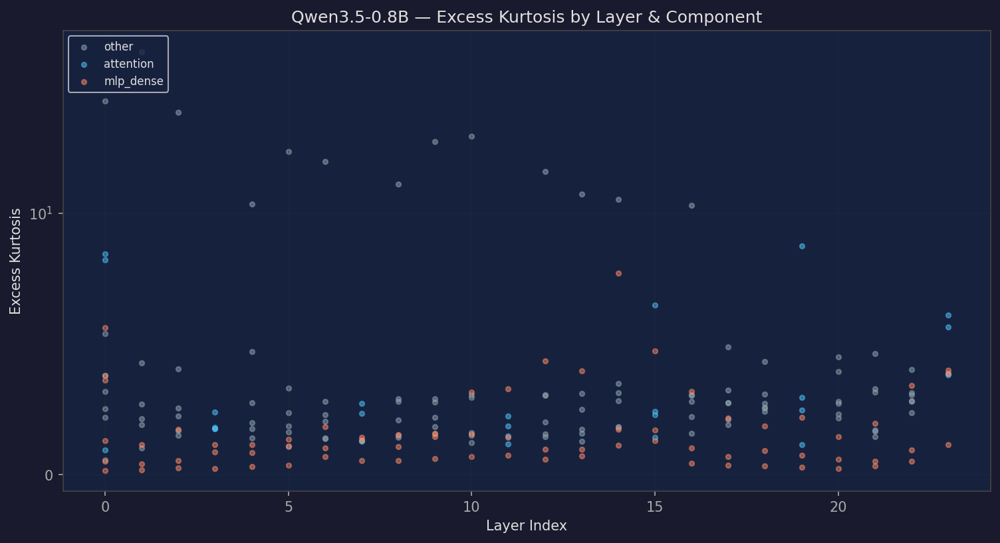
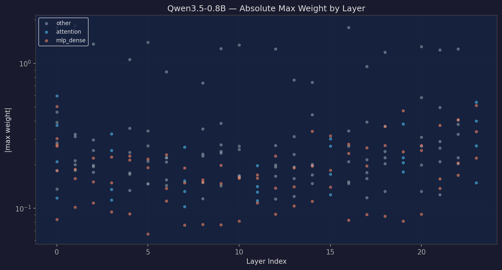
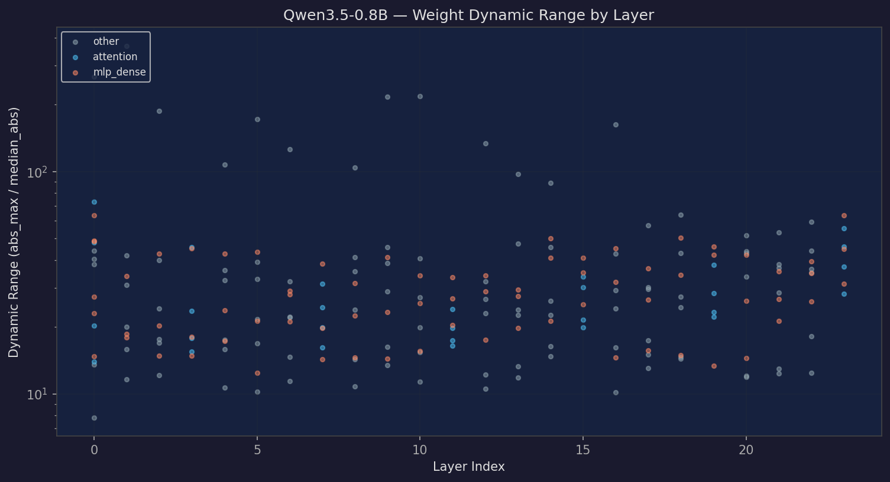
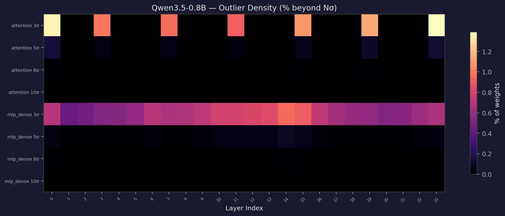
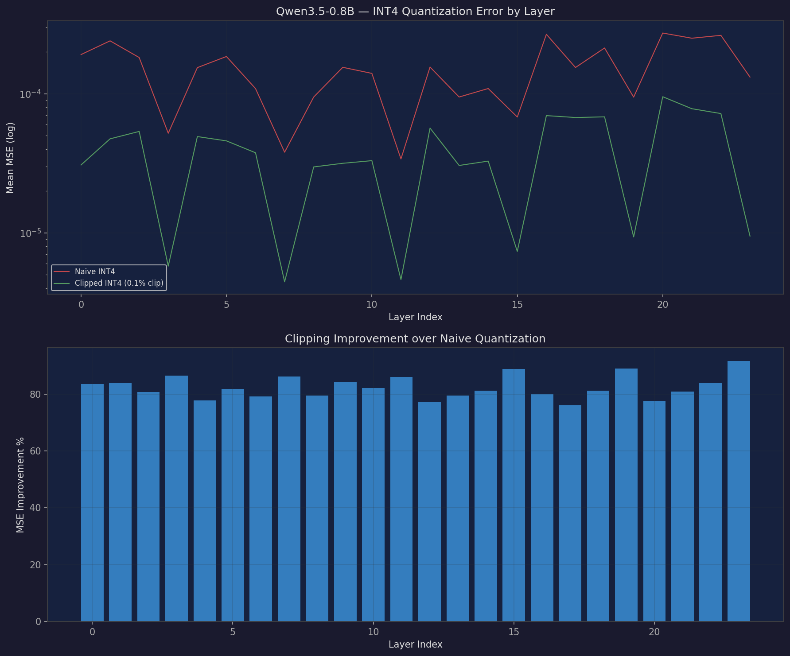
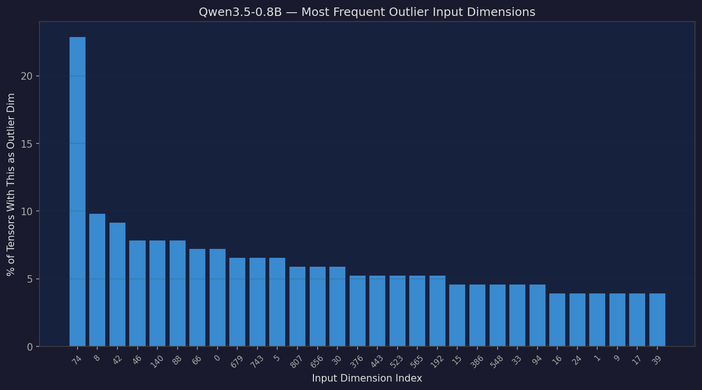
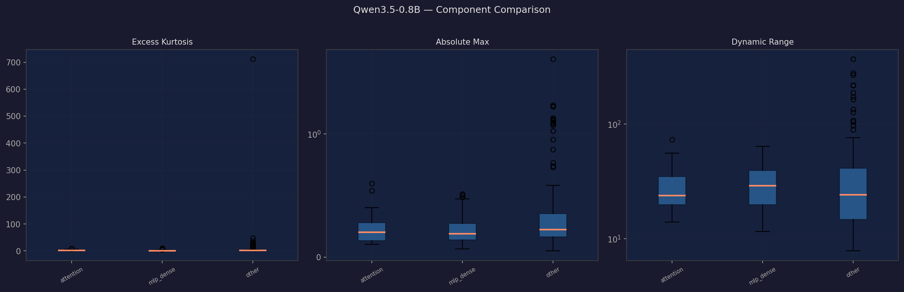
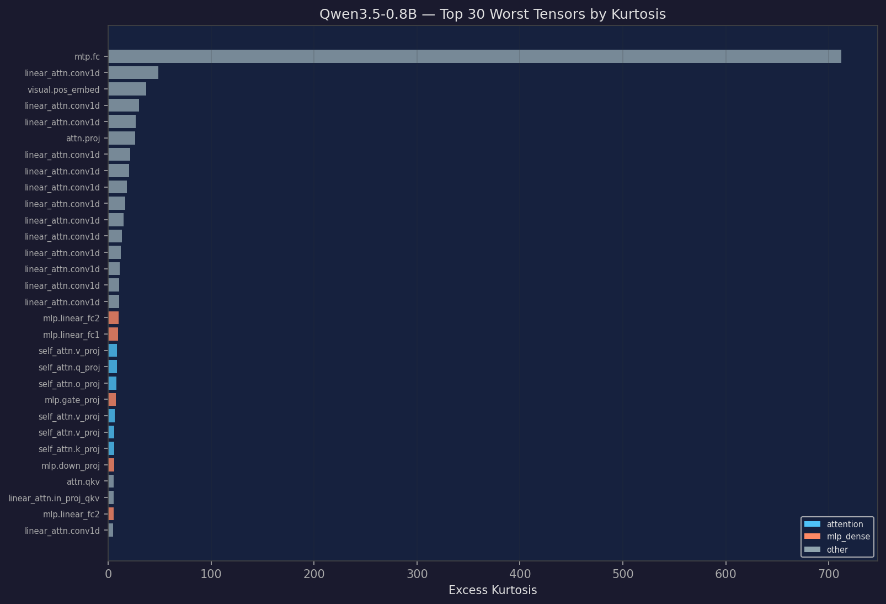

# Qwen3.5-0.8B — Weight Outlier Analysis

Generated: 2026-03-28 03:39
Tool: weight-outlier-analyzer

## Overview

- **Tensors analyzed**: 264
- **Parameters analyzed**: 619.0M
- **Components**: attention: 28, mlp_dense: 99, other: 137
- **Global |max weight|**: 4.7500
- **Peak kurtosis**: 712.0
- **Mean INT4 clip improvement**: 83.0%

## Key Findings

**Near-Gaussian distributions**: Median kurtosis 1.85 suggests relatively well-behaved weight distributions.

**Worst component**: `other` — max kurtosis 712.0, mean kurtosis 9.5 across 137 tensors.

**Systematic outlier dimensions**: dim 74 (23%), dim 8 (10%), dim 42 (9%), dim 46 (8%), dim 140 (8%) — these dimensions are outliers across many tensors, suggesting structural patterns in the weight space.

**Quantization**: Clipping to 99.9th percentile before INT4 quantization reduces MSE by up to 98% (mean 83.0%).

## Visualizations

### Kurtosis by Layer

Excess kurtosis per tensor, grouped by layer and component. Higher values indicate heavier tails / more outliers.

### Abs Max by Layer

Maximum absolute weight value per tensor. Spikes indicate tensors with extreme outlier values.

### Dynamic Range

Ratio of max absolute value to median absolute value. Higher ratios mean worse quantization behavior.

### Outlier Sigma Heatmap

Percentage of weights beyond Nσ thresholds, shown as a heatmap across layers and components.

### Quantization Error

INT4 quantization mean squared error — comparing naive quantization vs 99.9th percentile clipping.

### Outlier Dimensions

Input dimensions that are most frequently flagged as outliers. Systematic outlier dims affect many tensors.

### Component Summary

Box-plot comparison of kurtosis, absolute max, and dynamic range across component types.

### Worst Tensors

Top tensors ranked by excess kurtosis — the hardest to quantize.

## Component Breakdown

| Component | Count | Mean Kurtosis | Max Kurtosis | Mean |max| | Max |max| |
|-----------|------:|-------------:|------------:|----------:|--------:|
| attention | 28 | 3.2 | 8.8 | 0.2344 | 0.5977 |
| mlp_dense | 99 | 1.7 | 10.0 | 0.2098 | 0.5117 |
| other | 137 | 9.5 | 712.0 | 0.3939 | 4.7500 |

## Worst 10 Tensors (by Kurtosis)

| Tensor | Component | Kurtosis | |max| |
|--------|-----------|--------:|---------:|
| `mtp.fc.weight` | other | 712.0 | 0.5781 |
| `model.language_model.layers.1.linear_attn.conv1d.weight` | other | 48.5 | 1.8203 |
| `model.visual.pos_embed.weight` | other | 37.1 | 4.7500 |
| `model.language_model.layers.0.linear_attn.conv1d.weight` | other | 29.9 | 1.7578 |
| `model.language_model.layers.2.linear_attn.conv1d.weight` | other | 26.8 | 1.3594 |
| `model.visual.blocks.0.attn.proj.weight` | other | 26.2 | 0.4688 |
| `model.language_model.layers.10.linear_attn.conv1d.weight` | other | 21.2 | 1.3359 |
| `model.language_model.layers.9.linear_attn.conv1d.weight` | other | 20.2 | 1.2656 |
| `model.language_model.layers.5.linear_attn.conv1d.weight` | other | 18.2 | 1.3984 |
| `model.language_model.layers.6.linear_attn.conv1d.weight` | other | 16.6 | 0.8750 |

## Systematic Outlier Dimensions

| Dimension | Frequency | % of Tensors |
|----------:|----------:|------------:|
| 74 | 35 | 22.9% |
| 8 | 15 | 9.8% |
| 42 | 14 | 9.2% |
| 46 | 12 | 7.8% |
| 140 | 12 | 7.8% |
| 88 | 12 | 7.8% |
| 66 | 11 | 7.2% |
| 0 | 11 | 7.2% |
| 679 | 10 | 6.5% |
| 743 | 10 | 6.5% |

## Sigma Outlier Density

| Threshold | Mean % Beyond |
|----------:|--------------:|
| 3σ | 0.9881% |
| 5σ | 0.0801% |
| 8σ | 0.0071% |
| 10σ | 0.0025% |

## Methodology

1. **Tensor selection**: Only 2D weight matrices (excluding embeddings, norms, biases, and routing gates)
2. **FP8 handling**: Models with FP8 weights are dequantized using `weight_scale_inv` block-wise scaling before analysis
3. **Outlier detection**: Both sigma-based (3/5/8/10σ) and channel/dimension-based
4. **Quantization simulation**: INT4 symmetric quantization with and without 99.9th percentile clipping
5. **Kurtosis**: Excess kurtosis (Fisher definition, = 0 for Gaussian). Higher values indicate heavier tails
